```mermaid
graph TB
    Web["🌐 FamilyHub.Web<br/>(Blazor Server)"]
    Infra["🔧 FamilyHub.Infrastructure<br/>(EF Core, SQL Server)"]
    App["📋 FamilyHub.Application<br/>(Handlers, DTOs, Interfaces)"]
    Domain["💎 FamilyHub.Domain<br/>(Entites, Regles metier)"]

    Web --> App
    Web --> Infra
    Infra --> App
    Infra --> Domain
    App --> Domain

    style Domain fill:#4CAF50,stroke:#333,color:#fff
    style App fill:#2196F3,stroke:#333,color:#fff
    style Infra fill:#FF9800,stroke:#333,color:#fff
    style Web fill:#9C27B0,stroke:#333,color:#fff
```

# 🏗️ Exercice 01 - Creer FamilyHub en Clean Architecture

| | |
|---|---|
| **Difficulte** | ⭐⭐ Intermediaire |
| **Duree estimee** | ⏱️ 2h00 |
| **Prerequis** | C#, classes, interfaces, async/await |
| **Technos** | .NET 9, EF Core, Blazor Server |

---

## 🎯 Objectifs

A la fin de cet exercice, vous serez capables de :

- ✅ Creer une solution .NET structuree en Clean Architecture
- ✅ Definir des entites de domaine riches (avec logique metier)
- ✅ Creer des interfaces dans la couche Application
- ✅ Implementer ces interfaces dans la couche Infrastructure avec EF Core
- ✅ Creer une interface Blazor Server qui respecte la separation des couches

---

## 🔍 Ce que vous allez construire

Une application **FamilyHub** permettant de gerer des familles et leurs taches, structuree en 4 couches selon la Clean Architecture.

### Architecture du projet

```
┌─────────────────────────────────────────────────────┐
│                   FamilyHub.Web                      │
│              (Blazor Server - UI)                    │
├─────────────────────────────────────────────────────┤
│             FamilyHub.Infrastructure                 │
│         (EF Core, DbContext, SQL Server)             │
├─────────────────────────────────────────────────────┤
│              FamilyHub.Application                   │
│      (Handlers, DTOs, Interfaces, Queries)           │
├─────────────────────────────────────────────────────┤
│                FamilyHub.Domain                      │
│    (Entites, Enums, Regles metier - AUCUNE dep.)     │
└─────────────────────────────────────────────────────┘
          ▲ Les dependances pointent vers le bas ▲
```



---

## 📋 Prerequis

- .NET 9 SDK installe ([telecharger ici](https://dotnet.microsoft.com/download/dotnet/9.0))
- Un IDE : Visual Studio 2022, VS Code avec l'extension C# Dev Kit, ou JetBrains Rider
- SQL Server LocalDB (installe avec Visual Studio) ou SQL Server Express
- Connaissances de base en C# (classes, interfaces, async/await)

---

## 📖 Progression de l'exercice

| Etape | Partie | Duree | Description |
|:-----:|--------|:-----:|-------------|
| 1/7 | [Partie 1](#partie-1--creer-la-solution-et-les-projets-15-min) | 15 min | Creer la solution et les projets |
| 2/7 | [Partie 2](#partie-2--couche-domain---les-entites-30-min) | 30 min | Couche Domain - Les entites |
| 3/7 | [Partie 3](#partie-3--couche-application---interfaces-et-handlers-30-min) | 30 min | Couche Application - Interfaces et Handlers |
| 4/7 | [Partie 4](#partie-4--couche-infrastructure---ef-core-25-min) | 25 min | Couche Infrastructure - EF Core |
| 5/7 | [Partie 5](#partie-5--couche-presentation---blazor-server-30-min) | 30 min | Couche Presentation - Blazor Server |
| 6/7 | [Partie 6](#partie-6--verification-de-larchitecture-10-min) | 10 min | Verification de l'architecture |
| 7/7 | [Partie 7](#partie-7--pour-aller-plus-loin-bonus) | Bonus | Exercices supplementaires |

---

## Partie 1 : Creer la solution et les projets (15 min)

> **📌 Etape 1/7** - Mise en place de la structure du projet

### Etape 1.1 : Creer le dossier et la solution

- [ ] Ouvrir un terminal et executer les commandes suivantes :

```bash
# Creer le dossier du projet
mkdir FamilyHub
cd FamilyHub

# Creer la solution
dotnet new sln -n FamilyHub
```

### Etape 1.2 : Creer les 4 projets

- [ ] Creer chacun des 4 projets correspondant aux couches :

```bash
# Couche Domain (bibliotheque de classes)
dotnet new classlib -n FamilyHub.Domain -o src/FamilyHub.Domain

# Couche Application (bibliotheque de classes)
dotnet new classlib -n FamilyHub.Application -o src/FamilyHub.Application

# Couche Infrastructure (bibliotheque de classes)
dotnet new classlib -n FamilyHub.Infrastructure -o src/FamilyHub.Infrastructure

# Couche Presentation (Blazor Server)
dotnet new blazor -n FamilyHub.Web -o src/FamilyHub.Web --interactivity Server
```

> **💡 Note :** `classlib` cree une bibliotheque de classes (.dll), pas une application executable. Seul `FamilyHub.Web` est executable.

### Etape 1.3 : Ajouter les projets a la solution

- [ ] Ajouter les 4 projets a la solution :

```bash
dotnet sln add src/FamilyHub.Domain
dotnet sln add src/FamilyHub.Application
dotnet sln add src/FamilyHub.Infrastructure
dotnet sln add src/FamilyHub.Web
```

### Etape 1.4 : Configurer les references entre projets

- [ ] Configurer les references entre projets - C'est l'etape la plus importante ! Les references definissent la **Dependency Rule**.

```bash
# Application depend de Domain
dotnet add src/FamilyHub.Application reference src/FamilyHub.Domain

# Infrastructure depend de Application et Domain
dotnet add src/FamilyHub.Infrastructure reference src/FamilyHub.Application
dotnet add src/FamilyHub.Infrastructure reference src/FamilyHub.Domain

# Web (Presentation) depend de Application et Infrastructure
dotnet add src/FamilyHub.Web reference src/FamilyHub.Application
dotnet add src/FamilyHub.Web reference src/FamilyHub.Infrastructure
```

> **⚠️ Attention !** Le Domain ne reference AUCUN autre projet. C'est le coeur independant. Ne creez jamais de reference depuis le Domain vers Application, Infrastructure ou Web.


### Etape 1.5 : Verifier que ca compile

- [ ] Lancer la compilation :

```bash
dotnet build
```

#### 🟢 Resultat attendu

Vous devriez voir `Build succeeded` sans erreur. Si ce n'est pas le cas, verifiez vos commandes.

### Etape 1.6 : Nettoyer les fichiers generes

- [ ] Supprimer les fichiers `Class1.cs` generes automatiquement dans chaque classlib :

```bash
# Supprimer les fichiers Class1.cs par defaut
rm src/FamilyHub.Domain/Class1.cs
rm src/FamilyHub.Application/Class1.cs
rm src/FamilyHub.Infrastructure/Class1.cs
```

#### 🟢 Resultat attendu

Votre structure de dossiers devrait ressembler a ceci :

```
FamilyHub/
├── FamilyHub.sln
└── src/
    ├── FamilyHub.Domain/
    ├── FamilyHub.Application/
    ├── FamilyHub.Infrastructure/
    └── FamilyHub.Web/
```

---

## Partie 2 : Couche Domain - Les entites (30 min)

> **📌 Etape 2/7** - Le coeur de l'application, sans aucune dependance technique

La couche Domain contient les entites et la logique metier. **Aucune dependance technique** n'est autorisee.


### Etape 2.1 : L'enumeration MemberRole

- [ ] Creer le fichier `src/FamilyHub.Domain/Families/MemberRole.cs` :

```csharp
// File: src/FamilyHub.Domain/Families/MemberRole.cs
namespace FamilyHub.Domain.Families;

/// <summary>
/// Definit le role d'un membre dans une famille.
/// </summary>
public enum MemberRole
{
    /// <summary>Parent ou tuteur legal.</summary>
    Parent,

    /// <summary>Enfant de la famille.</summary>
    Child,

    /// <summary>Autre membre (grand-parent, oncle, etc.).</summary>
    Other
}
```

### Etape 2.2 : L'entite Member

- [ ] Creer le fichier `src/FamilyHub.Domain/Families/Member.cs` :

```csharp
// File: src/FamilyHub.Domain/Families/Member.cs
namespace FamilyHub.Domain.Families;

/// <summary>
/// Represente un membre d'une famille.
/// </summary>
public class Member
{
    public Guid Id { get; private set; }
    public string FirstName { get; private set; }
    public string LastName { get; private set; }
    public string Email { get; private set; }
    public MemberRole Role { get; private set; }
    public Guid FamilyId { get; private set; }

    /// <summary>
    /// Constructeur sans parametre requis par Entity Framework Core.
    /// Il est prive pour empecher la creation d'un membre invalide.
    /// </summary>
    private Member() { }

    /// <summary>
    /// Cree un nouveau membre avec validation.
    /// </summary>
    public Member(string firstName, string lastName, string email, MemberRole role)
    {
        if (string.IsNullOrWhiteSpace(firstName))
            throw new ArgumentException("Le prenom est requis.", nameof(firstName));

        if (string.IsNullOrWhiteSpace(lastName))
            throw new ArgumentException("Le nom est requis.", nameof(lastName));

        if (string.IsNullOrWhiteSpace(email))
            throw new ArgumentException("L'email est requis.", nameof(email));

        Id = Guid.NewGuid();
        FirstName = firstName;
        LastName = lastName;
        Email = email;
        Role = role;
    }

    /// <summary>
    /// Retourne le nom complet du membre.
    /// </summary>
    public string FullName => $"{FirstName} {LastName}";
}
```

> **💡 Points importants :**
> - Les setters sont `private` : on ne peut pas modifier un membre de l'exterieur sans passer par une methode
> - Le constructeur sans parametre est `private` : EF Core en a besoin, mais le code applicatif doit utiliser le constructeur avec parametres
> - La validation est dans le constructeur : on ne peut pas creer un membre invalide

### Etape 2.3 : L'entite Family

- [ ] Creer le fichier `src/FamilyHub.Domain/Families/Family.cs` :

```csharp
// File: src/FamilyHub.Domain/Families/Family.cs
namespace FamilyHub.Domain.Families;

/// <summary>
/// Represente une famille.
/// C'est l'agregat racine : on accede aux membres uniquement via la famille.
/// </summary>
public class Family
{
    public Guid Id { get; private set; }
    public string Name { get; private set; }
    public DateTime CreatedAt { get; private set; }

    // Collection privee avec exposition en lecture seule
    private readonly List<Member> _members = new();
    public IReadOnlyCollection<Member> Members => _members.AsReadOnly();

    /// <summary>
    /// Constructeur prive pour EF Core.
    /// </summary>
    private Family() { }

    /// <summary>
    /// Cree une nouvelle famille avec un nom.
    /// </summary>
    public Family(string name)
    {
        if (string.IsNullOrWhiteSpace(name))
            throw new ArgumentException(
                "Le nom de la famille ne peut pas etre vide.", nameof(name));

        if (name.Length > 100)
            throw new ArgumentException(
                "Le nom de la famille ne peut pas depasser 100 caracteres.", nameof(name));

        Id = Guid.NewGuid();
        Name = name;
        CreatedAt = DateTime.UtcNow;
    }

    /// <summary>
    /// Ajoute un membre a la famille.
    /// Regle metier : un membre avec le meme email ne peut pas etre ajoute deux fois.
    /// </summary>
    public void AddMember(Member member)
    {
        if (member is null)
            throw new ArgumentNullException(nameof(member));

        if (_members.Any(m => m.Email.Equals(member.Email, StringComparison.OrdinalIgnoreCase)))
            throw new InvalidOperationException(
                $"Un membre avec l'email '{member.Email}' existe deja dans cette famille.");

        _members.Add(member);
    }

    /// <summary>
    /// Renomme la famille.
    /// </summary>
    public void Rename(string newName)
    {
        if (string.IsNullOrWhiteSpace(newName))
            throw new ArgumentException(
                "Le nouveau nom ne peut pas etre vide.", nameof(newName));

        if (newName.Length > 100)
            throw new ArgumentException(
                "Le nouveau nom ne peut pas depasser 100 caracteres.", nameof(newName));

        Name = newName;
    }
}
```

> **💡 Points importants :**
> - `_members` est un champ prive, `Members` est une propriete en lecture seule
> - `AddMember` contient une regle metier : pas de doublon d'email
> - `Rename` valide le nouveau nom avant de l'appliquer

### Etape 2.4 : L'enumeration TaskPriority

- [ ] Creer le fichier `src/FamilyHub.Domain/Tasks/TaskPriority.cs` :

```csharp
// File: src/FamilyHub.Domain/Tasks/TaskPriority.cs
namespace FamilyHub.Domain.Tasks;

/// <summary>
/// Definit le niveau de priorite d'une tache.
/// </summary>
public enum TaskPriority
{
    Low,
    Medium,
    High
}
```

### Etape 2.5 : L'entite FamilyTask

- [ ] Creer le fichier `src/FamilyHub.Domain/Tasks/FamilyTask.cs` :

```csharp
// File: src/FamilyHub.Domain/Tasks/FamilyTask.cs
namespace FamilyHub.Domain.Tasks;

/// <summary>
/// Represente une tache familiale (menage, courses, etc.).
/// </summary>
public class FamilyTask
{
    public Guid Id { get; private set; }
    public string Title { get; private set; }
    public string? Description { get; private set; }
    public DateTime? DueDate { get; private set; }
    public TaskPriority Priority { get; private set; }
    public bool IsCompleted { get; private set; }
    public DateTime CreatedAt { get; private set; }
    public DateTime? CompletedAt { get; private set; }

    // Relations
    public Guid FamilyId { get; private set; }
    public Guid? AssignedToId { get; private set; }

    private FamilyTask() { }

    /// <summary>
    /// Cree une nouvelle tache.
    /// </summary>
    public FamilyTask(string title, Guid familyId, TaskPriority priority = TaskPriority.Medium)
    {
        if (string.IsNullOrWhiteSpace(title))
            throw new ArgumentException("Le titre de la tache est requis.", nameof(title));

        if (title.Length > 200)
            throw new ArgumentException(
                "Le titre ne peut pas depasser 200 caracteres.", nameof(title));

        Id = Guid.NewGuid();
        Title = title;
        FamilyId = familyId;
        Priority = priority;
        IsCompleted = false;
        CreatedAt = DateTime.UtcNow;
    }

    /// <summary>
    /// Ajoute une description a la tache.
    /// </summary>
    public void SetDescription(string? description)
    {
        if (description is not null && description.Length > 1000)
            throw new ArgumentException(
                "La description ne peut pas depasser 1000 caracteres.", nameof(description));

        Description = description;
    }

    /// <summary>
    /// Definit la date d'echeance.
    /// Regle metier : la date doit etre dans le futur.
    /// </summary>
    public void SetDueDate(DateTime? dueDate)
    {
        if (dueDate.HasValue && dueDate.Value < DateTime.UtcNow)
            throw new ArgumentException(
                "La date d'echeance doit etre dans le futur.", nameof(dueDate));

        DueDate = dueDate;
    }

    /// <summary>
    /// Assigne la tache a un membre.
    /// </summary>
    public void AssignTo(Guid? memberId)
    {
        AssignedToId = memberId;
    }

    /// <summary>
    /// Marque la tache comme terminee.
    /// Regle metier : une tache deja terminee ne peut pas etre terminee a nouveau.
    /// </summary>
    public void Complete()
    {
        if (IsCompleted)
            throw new InvalidOperationException(
                "Cette tache est deja terminee.");

        IsCompleted = true;
        CompletedAt = DateTime.UtcNow;
    }

    /// <summary>
    /// Reouvre une tache terminee.
    /// Regle metier : seule une tache terminee peut etre reouverte.
    /// </summary>
    public void Reopen()
    {
        if (!IsCompleted)
            throw new InvalidOperationException(
                "Cette tache n'est pas terminee.");

        IsCompleted = false;
        CompletedAt = null;
    }

    /// <summary>
    /// Change la priorite de la tache.
    /// Regle metier : on ne peut pas changer la priorite d'une tache terminee.
    /// </summary>
    public void SetPriority(TaskPriority priority)
    {
        if (IsCompleted)
            throw new InvalidOperationException(
                "Impossible de changer la priorite d'une tache terminee.");

        Priority = priority;
    }
}
```

### Etape 2.6 : Verifier la compilation

- [ ] Compiler la couche Domain :

```bash
dotnet build src/FamilyHub.Domain
```

#### 🟢 Resultat attendu

Le Domain doit compiler sans erreur. Verifiez qu'il n'y a **aucun** `using` vers un namespace externe (pas de `Microsoft.EntityFrameworkCore`, pas de `System.ComponentModel.DataAnnotations`).

---

## Partie 3 : Couche Application - Interfaces et Handlers (30 min)

> **📌 Etape 3/7** - Definir les contrats et les cas d'utilisation


### Etape 3.1 : Ajouter le package EF Core (pour DbSet&lt;T&gt;)

- [ ] Ajouter le package :

```bash
dotnet add src/FamilyHub.Application package Microsoft.EntityFrameworkCore --version 9.0.0
```

> **💡 Pourquoi EF Core dans Application ?** On utilise `DbSet<T>` dans l'interface `IApplicationDbContext`. C'est un compromis pragmatique : on utilise uniquement le type `DbSet<T>` comme abstraction, pas l'implementation d'EF Core. On approfondit cette question dans le Module 03 (Pragmatic Architecture).

### Etape 3.2 : L'interface IApplicationDbContext

- [ ] Creer le fichier `src/FamilyHub.Application/IApplicationDbContext.cs` :

```csharp
// File: src/FamilyHub.Application/IApplicationDbContext.cs
using FamilyHub.Domain.Families;
using FamilyHub.Domain.Tasks;
using Microsoft.EntityFrameworkCore;

namespace FamilyHub.Application;

/// <summary>
/// Contrat que la couche Infrastructure devra implementer.
/// Definit les acces aux donnees dont l'Application a besoin.
/// </summary>
public interface IApplicationDbContext
{
    /// <summary>Acces aux familles.</summary>
    DbSet<Family> Families { get; }

    /// <summary>Acces aux membres.</summary>
    DbSet<Member> Members { get; }

    /// <summary>Acces aux taches.</summary>
    DbSet<FamilyTask> Tasks { get; }

    /// <summary>Sauvegarde les changements en base de donnees.</summary>
    Task<int> SaveChangesAsync(CancellationToken cancellationToken = default);
}
```

### Etape 3.3 : Les DTOs pour les familles

- [ ] Creer le fichier `src/FamilyHub.Application/Features/Families/FamilyDtos.cs` :

```csharp
// File: src/FamilyHub.Application/Features/Families/FamilyDtos.cs
namespace FamilyHub.Application.Features.Families;

/// <summary>
/// DTO pour afficher une famille dans une liste.
/// </summary>
public record FamilySummaryDto(
    Guid Id,
    string Name,
    int MemberCount,
    DateTime CreatedAt
);

/// <summary>
/// DTO pour afficher le detail d'une famille avec ses membres.
/// </summary>
public record FamilyDetailDto(
    Guid Id,
    string Name,
    DateTime CreatedAt,
    IReadOnlyList<MemberDto> Members
);

/// <summary>
/// DTO pour un membre.
/// </summary>
public record MemberDto(
    Guid Id,
    string FirstName,
    string LastName,
    string Email,
    string Role
);
```

> **💡 Astuce :** Les DTOs (Data Transfer Objects) sont des `record` : immutables, avec comparaison par valeur et deconstruction automatique. Ils servent a transporter des donnees entre les couches sans exposer les entites du domaine.

### Etape 3.4 : Query - GetFamilies

- [ ] Creer le fichier `src/FamilyHub.Application/Features/Families/GetFamilies.cs` :

```csharp
// File: src/FamilyHub.Application/Features/Families/GetFamilies.cs
using Microsoft.EntityFrameworkCore;

namespace FamilyHub.Application.Features.Families;

/// <summary>
/// Requete pour obtenir la liste de toutes les familles.
/// </summary>
public record GetFamiliesQuery;

/// <summary>
/// Handler qui execute la requete GetFamilies.
/// </summary>
public class GetFamiliesHandler
{
    private readonly IApplicationDbContext _context;

    public GetFamiliesHandler(IApplicationDbContext context)
    {
        _context = context;
    }

    public async Task<IReadOnlyList<FamilySummaryDto>> HandleAsync(
        CancellationToken cancellationToken = default)
    {
        return await _context.Families
            .AsNoTracking()
            .Select(f => new FamilySummaryDto(
                f.Id,
                f.Name,
                f.Members.Count,
                f.CreatedAt
            ))
            .OrderBy(f => f.Name)
            .ToListAsync(cancellationToken);
    }
}
```

### Etape 3.5 : Query - GetFamilyById

- [ ] Creer le fichier `src/FamilyHub.Application/Features/Families/GetFamilyById.cs` :

```csharp
// File: src/FamilyHub.Application/Features/Families/GetFamilyById.cs
using FamilyHub.Domain.Families;
using Microsoft.EntityFrameworkCore;

namespace FamilyHub.Application.Features.Families;

/// <summary>
/// Requete pour obtenir le detail d'une famille par son ID.
/// </summary>
public record GetFamilyByIdQuery(Guid FamilyId);

/// <summary>
/// Handler pour GetFamilyById.
/// </summary>
public class GetFamilyByIdHandler
{
    private readonly IApplicationDbContext _context;

    public GetFamilyByIdHandler(IApplicationDbContext context)
    {
        _context = context;
    }

    public async Task<FamilyDetailDto?> HandleAsync(
        GetFamilyByIdQuery query,
        CancellationToken cancellationToken = default)
    {
        var family = await _context.Families
            .AsNoTracking()
            .Include(f => f.Members)
            .FirstOrDefaultAsync(f => f.Id == query.FamilyId, cancellationToken);

        if (family is null)
            return null;

        return new FamilyDetailDto(
            family.Id,
            family.Name,
            family.CreatedAt,
            family.Members.Select(m => new MemberDto(
                m.Id,
                m.FirstName,
                m.LastName,
                m.Email,
                m.Role.ToString()
            )).ToList()
        );
    }
}
```

### Etape 3.6 : Command - CreateFamily

- [ ] Creer le fichier `src/FamilyHub.Application/Features/Families/CreateFamily.cs` :

```csharp
// File: src/FamilyHub.Application/Features/Families/CreateFamily.cs
using FamilyHub.Domain.Families;

namespace FamilyHub.Application.Features.Families;

/// <summary>
/// Commande pour creer une nouvelle famille.
/// </summary>
public record CreateFamilyCommand(string Name);

/// <summary>
/// Handler pour creer une famille.
/// </summary>
public class CreateFamilyHandler
{
    private readonly IApplicationDbContext _context;

    public CreateFamilyHandler(IApplicationDbContext context)
    {
        _context = context;
    }

    public async Task<Guid> HandleAsync(
        CreateFamilyCommand command,
        CancellationToken cancellationToken = default)
    {
        // La validation est dans le constructeur de l'entite Family
        var family = new Family(command.Name);

        await _context.Families.AddAsync(family, cancellationToken);
        await _context.SaveChangesAsync(cancellationToken);

        return family.Id;
    }
}
```

### Etape 3.7 : Les DTOs pour les taches

- [ ] Creer le fichier `src/FamilyHub.Application/Features/Tasks/TaskDtos.cs` :

```csharp
// File: src/FamilyHub.Application/Features/Tasks/TaskDtos.cs
using FamilyHub.Domain.Tasks;

namespace FamilyHub.Application.Features.Tasks;

/// <summary>
/// DTO pour afficher une tache dans une liste.
/// </summary>
public record FamilyTaskSummaryDto(
    Guid Id,
    string Title,
    TaskPriority Priority,
    bool IsCompleted,
    DateTime? DueDate,
    DateTime CreatedAt
);
```

### Etape 3.8 : Query - GetFamilyTasks

- [ ] Creer le fichier `src/FamilyHub.Application/Features/Tasks/GetFamilyTasks.cs` :

```csharp
// File: src/FamilyHub.Application/Features/Tasks/GetFamilyTasks.cs
using Microsoft.EntityFrameworkCore;

namespace FamilyHub.Application.Features.Tasks;

/// <summary>
/// Requete pour obtenir les taches d'une famille.
/// </summary>
public record GetFamilyTasksQuery(Guid FamilyId);

/// <summary>
/// Handler pour obtenir les taches d'une famille.
/// </summary>
public class GetFamilyTasksHandler
{
    private readonly IApplicationDbContext _context;

    public GetFamilyTasksHandler(IApplicationDbContext context)
    {
        _context = context;
    }

    public async Task<IReadOnlyList<FamilyTaskSummaryDto>> HandleAsync(
        GetFamilyTasksQuery query,
        CancellationToken cancellationToken = default)
    {
        return await _context.Tasks
            .AsNoTracking()
            .Where(t => t.FamilyId == query.FamilyId)
            .OrderByDescending(t => t.CreatedAt)
            .Select(t => new FamilyTaskSummaryDto(
                t.Id,
                t.Title,
                t.Priority,
                t.IsCompleted,
                t.DueDate,
                t.CreatedAt
            ))
            .ToListAsync(cancellationToken);
    }
}
```

### Etape 3.9 : Command - CreateFamilyTask

- [ ] Creer le fichier `src/FamilyHub.Application/Features/Tasks/CreateFamilyTask.cs` :

```csharp
// File: src/FamilyHub.Application/Features/Tasks/CreateFamilyTask.cs
using FamilyHub.Domain.Tasks;

namespace FamilyHub.Application.Features.Tasks;

/// <summary>
/// Commande pour creer une nouvelle tache.
/// </summary>
public record CreateFamilyTaskCommand(
    string Title,
    string? Description,
    Guid FamilyId,
    TaskPriority Priority = TaskPriority.Medium
);

/// <summary>
/// Handler pour creer une tache.
/// </summary>
public class CreateFamilyTaskHandler
{
    private readonly IApplicationDbContext _context;

    public CreateFamilyTaskHandler(IApplicationDbContext context)
    {
        _context = context;
    }

    public async Task<Guid> HandleAsync(
        CreateFamilyTaskCommand command,
        CancellationToken cancellationToken = default)
    {
        var task = new FamilyTask(command.Title, command.FamilyId, command.Priority);

        if (!string.IsNullOrWhiteSpace(command.Description))
            task.SetDescription(command.Description);

        await _context.Tasks.AddAsync(task, cancellationToken);
        await _context.SaveChangesAsync(cancellationToken);

        return task.Id;
    }
}
```

### Etape 3.10 : Command - CompleteTask

- [ ] Creer le fichier `src/FamilyHub.Application/Features/Tasks/CompleteTask.cs` :

```csharp
// File: src/FamilyHub.Application/Features/Tasks/CompleteTask.cs
using Microsoft.EntityFrameworkCore;

namespace FamilyHub.Application.Features.Tasks;

/// <summary>
/// Commande pour marquer une tache comme terminee.
/// </summary>
public record CompleteTaskCommand(Guid TaskId);

/// <summary>
/// Handler pour completer une tache.
/// </summary>
public class CompleteTaskHandler
{
    private readonly IApplicationDbContext _context;

    public CompleteTaskHandler(IApplicationDbContext context)
    {
        _context = context;
    }

    public async Task HandleAsync(
        CompleteTaskCommand command,
        CancellationToken cancellationToken = default)
    {
        var task = await _context.Tasks
            .FirstOrDefaultAsync(t => t.Id == command.TaskId, cancellationToken);

        if (task is null)
            throw new InvalidOperationException(
                $"La tache avec l'ID '{command.TaskId}' n'existe pas.");

        // La regle metier est dans l'entite FamilyTask.Complete()
        task.Complete();

        await _context.SaveChangesAsync(cancellationToken);
    }
}
```

### Etape 3.11 : Verifier la compilation

- [ ] Compiler la couche Application :

```bash
dotnet build src/FamilyHub.Application
```

#### 🟢 Resultat attendu

L'Application doit compiler. Elle reference uniquement le Domain et le package EF Core (pour `DbSet<T>`).

---

## Partie 4 : Couche Infrastructure - EF Core (25 min)

> **📌 Etape 4/7** - Implementer les acces aux donnees


### Etape 4.1 : Ajouter les packages NuGet

- [ ] Ajouter les packages EF Core :

```bash
dotnet add src/FamilyHub.Infrastructure package Microsoft.EntityFrameworkCore.SqlServer --version 9.0.0
dotnet add src/FamilyHub.Infrastructure package Microsoft.EntityFrameworkCore.Tools --version 9.0.0
```

### Etape 4.2 : Le DbContext

- [ ] Creer le fichier `src/FamilyHub.Infrastructure/Database/ApplicationDbContext.cs` :

```csharp
// File: src/FamilyHub.Infrastructure/Database/ApplicationDbContext.cs
using System.Reflection;
using FamilyHub.Application;
using FamilyHub.Domain.Families;
using FamilyHub.Domain.Tasks;
using Microsoft.EntityFrameworkCore;

namespace FamilyHub.Infrastructure.Database;

/// <summary>
/// Implementation concrete de IApplicationDbContext avec Entity Framework Core.
/// </summary>
public class ApplicationDbContext : DbContext, IApplicationDbContext
{
    public ApplicationDbContext(DbContextOptions<ApplicationDbContext> options)
        : base(options)
    {
    }

    public DbSet<Family> Families { get; set; } = null!;
    public DbSet<Member> Members { get; set; } = null!;
    public DbSet<FamilyTask> Tasks { get; set; } = null!;

    protected override void OnModelCreating(ModelBuilder modelBuilder)
    {
        base.OnModelCreating(modelBuilder);

        // Applique automatiquement toutes les configurations
        // trouvees dans cet assembly (les classes IEntityTypeConfiguration<T>)
        modelBuilder.ApplyConfigurationsFromAssembly(Assembly.GetExecutingAssembly());
    }
}
```

### Etape 4.3 : Configuration de Family

- [ ] Creer le fichier `src/FamilyHub.Infrastructure/Database/Configurations/FamilyConfiguration.cs` :

```csharp
// File: src/FamilyHub.Infrastructure/Database/Configurations/FamilyConfiguration.cs
using FamilyHub.Domain.Families;
using Microsoft.EntityFrameworkCore;
using Microsoft.EntityFrameworkCore.Metadata.Builders;

namespace FamilyHub.Infrastructure.Database.Configurations;

public class FamilyConfiguration : IEntityTypeConfiguration<Family>
{
    public void Configure(EntityTypeBuilder<Family> builder)
    {
        builder.ToTable("Families");

        builder.HasKey(f => f.Id);

        builder.Property(f => f.Name)
            .IsRequired()
            .HasMaxLength(100);

        builder.Property(f => f.CreatedAt)
            .IsRequired();

        // Relation one-to-many : Family -> Members
        builder.HasMany(f => f.Members)
            .WithOne()
            .HasForeignKey(m => m.FamilyId)
            .OnDelete(DeleteBehavior.Cascade);

        // EF Core doit utiliser le champ prive _members
        // pour materialiser la collection
        builder.Navigation(f => f.Members)
            .UsePropertyAccessMode(PropertyAccessMode.Field);
    }
}
```

### Etape 4.4 : Configuration de Member

- [ ] Creer le fichier `src/FamilyHub.Infrastructure/Database/Configurations/MemberConfiguration.cs` :

```csharp
// File: src/FamilyHub.Infrastructure/Database/Configurations/MemberConfiguration.cs
using FamilyHub.Domain.Families;
using Microsoft.EntityFrameworkCore;
using Microsoft.EntityFrameworkCore.Metadata.Builders;

namespace FamilyHub.Infrastructure.Database.Configurations;

public class MemberConfiguration : IEntityTypeConfiguration<Member>
{
    public void Configure(EntityTypeBuilder<Member> builder)
    {
        builder.ToTable("Members");

        builder.HasKey(m => m.Id);

        builder.Property(m => m.FirstName)
            .IsRequired()
            .HasMaxLength(100);

        builder.Property(m => m.LastName)
            .IsRequired()
            .HasMaxLength(100);

        builder.Property(m => m.Email)
            .IsRequired()
            .HasMaxLength(200);

        builder.Property(m => m.Role)
            .IsRequired()
            .HasConversion<string>()  // Stocke l'enum en tant que texte
            .HasMaxLength(20);

        // Index unique sur Email + FamilyId
        // (un email est unique au sein d'une famille)
        builder.HasIndex(m => new { m.Email, m.FamilyId })
            .IsUnique();
    }
}
```

### Etape 4.5 : Configuration de FamilyTask

- [ ] Creer le fichier `src/FamilyHub.Infrastructure/Database/Configurations/FamilyTaskConfiguration.cs` :

```csharp
// File: src/FamilyHub.Infrastructure/Database/Configurations/FamilyTaskConfiguration.cs
using FamilyHub.Domain.Tasks;
using Microsoft.EntityFrameworkCore;
using Microsoft.EntityFrameworkCore.Metadata.Builders;

namespace FamilyHub.Infrastructure.Database.Configurations;

public class FamilyTaskConfiguration : IEntityTypeConfiguration<FamilyTask>
{
    public void Configure(EntityTypeBuilder<FamilyTask> builder)
    {
        builder.ToTable("Tasks");

        builder.HasKey(t => t.Id);

        builder.Property(t => t.Title)
            .IsRequired()
            .HasMaxLength(200);

        builder.Property(t => t.Description)
            .HasMaxLength(1000);

        builder.Property(t => t.Priority)
            .IsRequired()
            .HasConversion<string>()
            .HasMaxLength(20);

        builder.Property(t => t.IsCompleted)
            .IsRequired()
            .HasDefaultValue(false);

        builder.Property(t => t.CreatedAt)
            .IsRequired();

        // Index pour les requetes frequentes
        builder.HasIndex(t => t.FamilyId);
        builder.HasIndex(t => t.IsCompleted);
    }
}
```

### Etape 4.6 : Enregistrement des services

- [ ] Creer le fichier `src/FamilyHub.Infrastructure/ServiceCollectionExtensions.cs` :

```csharp
// File: src/FamilyHub.Infrastructure/ServiceCollectionExtensions.cs
using FamilyHub.Application;
using FamilyHub.Infrastructure.Database;
using Microsoft.EntityFrameworkCore;
using Microsoft.Extensions.Configuration;
using Microsoft.Extensions.DependencyInjection;

namespace FamilyHub.Infrastructure;

/// <summary>
/// Methode d'extension pour enregistrer les services de l'Infrastructure.
/// </summary>
public static class ServiceCollectionExtensions
{
    public static IServiceCollection AddInfrastructure(
        this IServiceCollection services,
        IConfiguration configuration)
    {
        // Enregistrer Entity Framework Core avec SQL Server
        services.AddDbContext<ApplicationDbContext>(options =>
            options.UseSqlServer(
                configuration.GetConnectionString("DefaultConnection"),
                sqlOptions =>
                {
                    // L'assembly des migrations est dans Infrastructure
                    sqlOptions.MigrationsAssembly(
                        typeof(ApplicationDbContext).Assembly.FullName);
                }
            ));

        // Enregistrer IApplicationDbContext -> ApplicationDbContext
        // Quand quelqu'un demande IApplicationDbContext,
        // le conteneur DI fournit ApplicationDbContext
        services.AddScoped<IApplicationDbContext>(provider =>
            provider.GetRequiredService<ApplicationDbContext>());

        return services;
    }
}
```

### Etape 4.7 : Verifier la compilation

- [ ] Compiler la couche Infrastructure :

```bash
dotnet build src/FamilyHub.Infrastructure
```

#### 🟢 Resultat attendu

L'Infrastructure compile et reference Application + Domain.

---

## Partie 5 : Couche Presentation - Blazor Server (30 min)

> **📌 Etape 5/7** - L'interface utilisateur


### Etape 5.1 : Configurer Program.cs

- [ ] Modifier le fichier `src/FamilyHub.Web/Program.cs` :

```csharp
// File: src/FamilyHub.Web/Program.cs
using FamilyHub.Application.Features.Families;
using FamilyHub.Application.Features.Tasks;
using FamilyHub.Infrastructure;
using FamilyHub.Infrastructure.Database;
using FamilyHub.Web.Components;
using Microsoft.EntityFrameworkCore;

var builder = WebApplication.CreateBuilder(args);

// Ajouter les services Blazor
builder.Services.AddRazorComponents()
    .AddInteractiveServerComponents();

// Ajouter l'Infrastructure (EF Core, DbContext)
builder.Services.AddInfrastructure(builder.Configuration);

// Enregistrer les handlers de l'Application
builder.Services.AddScoped<GetFamiliesHandler>();
builder.Services.AddScoped<GetFamilyByIdHandler>();
builder.Services.AddScoped<CreateFamilyHandler>();
builder.Services.AddScoped<GetFamilyTasksHandler>();
builder.Services.AddScoped<CreateFamilyTaskHandler>();
builder.Services.AddScoped<CompleteTaskHandler>();

var app = builder.Build();

// Creer la base de donnees automatiquement en developpement
if (app.Environment.IsDevelopment())
{
    using var scope = app.Services.CreateScope();
    var context = scope.ServiceProvider.GetRequiredService<ApplicationDbContext>();
    await context.Database.EnsureCreatedAsync();
}

if (!app.Environment.IsDevelopment())
{
    app.UseExceptionHandler("/Error");
    app.UseHsts();
}

app.UseHttpsRedirection();
app.UseStaticFiles();
app.UseAntiforgery();

app.MapRazorComponents<App>()
    .AddInteractiveServerRenderMode();

app.Run();
```

### Etape 5.2 : Configurer la chaine de connexion

- [ ] Modifier le fichier `src/FamilyHub.Web/appsettings.json` :

```json
{
  "Logging": {
    "LogLevel": {
      "Default": "Information",
      "Microsoft.AspNetCore": "Warning"
    }
  },
  "AllowedHosts": "*",
  "ConnectionStrings": {
    "DefaultConnection": "Server=(localdb)\\mssqllocaldb;Database=FamilyHub;Trusted_Connection=True;MultipleActiveResultSets=true"
  }
}
```

### Etape 5.3 : Modifier le NavMenu

- [ ] Modifier le fichier `src/FamilyHub.Web/Components/Layout/NavMenu.razor` :

```razor
@* File: src/FamilyHub.Web/Components/Layout/NavMenu.razor *@
<div class="top-row ps-3 navbar navbar-dark">
    <div class="container-fluid">
        <a class="navbar-brand" href="">FamilyHub</a>
    </div>
</div>

<input type="checkbox" title="Navigation menu" class="navbar-toggler" />

<div class="nav-scrollable" onclick="document.querySelector('.navbar-toggler').click()">
    <nav class="flex-column">
        <div class="nav-item px-3">
            <NavLink class="nav-link" href="" Match="NavLinkMatch.All">
                <span class="bi bi-house-door-fill-nav-menu" aria-hidden="true"></span> Accueil
            </NavLink>
        </div>
        <div class="nav-item px-3">
            <NavLink class="nav-link" href="families">
                <span class="bi bi-people-fill" aria-hidden="true"></span> Familles
            </NavLink>
        </div>
    </nav>
</div>
```

### Etape 5.4 : Page d'accueil

- [ ] Modifier le fichier `src/FamilyHub.Web/Components/Pages/Home.razor` :

```razor
@* File: src/FamilyHub.Web/Components/Pages/Home.razor *@
@page "/"

<PageTitle>FamilyHub - Accueil</PageTitle>

<h1>Bienvenue sur FamilyHub</h1>

<p class="lead">
    L'application de gestion familiale pour organiser vos taches,
    vos courses et vos evenements.
</p>

<div class="row mt-4">
    <div class="col-md-4">
        <div class="card">
            <div class="card-body">
                <h5 class="card-title">Familles</h5>
                <p class="card-text">
                    Gerez les membres de votre famille et leurs roles.
                </p>
                <a href="/families" class="btn btn-primary">Voir les familles</a>
            </div>
        </div>
    </div>
    <div class="col-md-4">
        <div class="card">
            <div class="card-body">
                <h5 class="card-title">Taches</h5>
                <p class="card-text">
                    Creez et assignez des taches menageres aux membres.
                </p>
                <a href="/families" class="btn btn-primary">Gerer les taches</a>
            </div>
        </div>
    </div>
</div>
```

#### 🟢 Resultat attendu

La page d'accueil affiche un titre "Bienvenue sur FamilyHub" avec deux cartes : "Familles" et "Taches".

### Etape 5.5 : Page liste des familles

- [ ] Creer le fichier `src/FamilyHub.Web/Components/Pages/Families/FamilyList.razor` :

```razor
@* File: src/FamilyHub.Web/Components/Pages/Families/FamilyList.razor *@
@page "/families"
@inject GetFamiliesHandler FamiliesHandler
@inject CreateFamilyHandler CreateHandler
@rendermode InteractiveServer

@using FamilyHub.Application.Features.Families

<PageTitle>FamilyHub - Familles</PageTitle>

<h1>Familles</h1>

@* Formulaire de creation *@
<div class="card mb-4">
    <div class="card-body">
        <h5 class="card-title">Creer une nouvelle famille</h5>
        <div class="row">
            <div class="col-md-8">
                <input type="text"
                       class="form-control"
                       placeholder="Nom de la famille"
                       @bind="_newFamilyName"
                       @bind:event="oninput" />
            </div>
            <div class="col-md-4">
                <button class="btn btn-primary"
                        @onclick="CreateFamily"
                        disabled="@string.IsNullOrWhiteSpace(_newFamilyName)">
                    Creer
                </button>
            </div>
        </div>
        @if (!string.IsNullOrEmpty(_errorMessage))
        {
            <div class="alert alert-danger mt-2">@_errorMessage</div>
        }
    </div>
</div>

@* Liste des familles *@
@if (_families is null)
{
    <p><em>Chargement...</em></p>
}
else if (!_families.Any())
{
    <div class="alert alert-info">
        Aucune famille pour le moment. Creez-en une ci-dessus !
    </div>
}
else
{
    <div class="row">
        @foreach (var family in _families)
        {
            <div class="col-md-4 mb-3">
                <div class="card">
                    <div class="card-body">
                        <h5 class="card-title">@family.Name</h5>
                        <p class="card-text">
                            <strong>@family.MemberCount</strong> membre(s)
                        </p>
                        <p class="card-text">
                            <small class="text-muted">
                                Creee le @family.CreatedAt.ToString("dd/MM/yyyy")
                            </small>
                        </p>
                        <a href="/families/@family.Id"
                           class="btn btn-outline-primary btn-sm">
                            Voir les details
                        </a>
                    </div>
                </div>
            </div>
        }
    </div>
}

@code {
    private IReadOnlyList<FamilySummaryDto>? _families;
    private string _newFamilyName = "";
    private string? _errorMessage;

    protected override async Task OnInitializedAsync()
    {
        await LoadFamilies();
    }

    private async Task LoadFamilies()
    {
        _families = await FamiliesHandler.HandleAsync();
    }

    private async Task CreateFamily()
    {
        try
        {
            _errorMessage = null;
            var command = new CreateFamilyCommand(_newFamilyName.Trim());
            await CreateHandler.HandleAsync(command);
            _newFamilyName = "";
            await LoadFamilies();
        }
        catch (ArgumentException ex)
        {
            _errorMessage = ex.Message;
        }
    }
}
```

#### 🟢 Resultat attendu

La page `/families` affiche un formulaire de creation et la liste des familles existantes sous forme de cartes.

### Etape 5.6 : Page detail d'une famille (avec taches)

- [ ] Creer le fichier `src/FamilyHub.Web/Components/Pages/Families/FamilyDetail.razor` :

```razor
@* File: src/FamilyHub.Web/Components/Pages/Families/FamilyDetail.razor *@
@page "/families/{FamilyId:guid}"
@inject GetFamilyByIdHandler FamilyHandler
@inject GetFamilyTasksHandler TasksHandler
@inject CreateFamilyTaskHandler CreateTaskHandler
@inject CompleteTaskHandler CompleteHandler
@rendermode InteractiveServer

@using FamilyHub.Application.Features.Families
@using FamilyHub.Application.Features.Tasks
@using FamilyHub.Domain.Tasks

<PageTitle>FamilyHub - Detail famille</PageTitle>

@if (_family is null)
{
    <p><em>Chargement...</em></p>
}
else
{
    <nav aria-label="breadcrumb">
        <ol class="breadcrumb">
            <li class="breadcrumb-item"><a href="/families">Familles</a></li>
            <li class="breadcrumb-item active">@_family.Name</li>
        </ol>
    </nav>

    <h1>@_family.Name</h1>
    <p class="text-muted">
        Creee le @_family.CreatedAt.ToString("dd MMMM yyyy")
        - @_family.Members.Count membre(s)
    </p>

    @* Section Membres *@
    <div class="card mb-4">
        <div class="card-header">
            <h5 class="mb-0">Membres</h5>
        </div>
        <div class="card-body">
            @if (_family.Members.Any())
            {
                <table class="table table-sm">
                    <thead>
                        <tr>
                            <th>Nom</th>
                            <th>Email</th>
                            <th>Role</th>
                        </tr>
                    </thead>
                    <tbody>
                        @foreach (var member in _family.Members)
                        {
                            <tr>
                                <td>@member.FirstName @member.LastName</td>
                                <td>@member.Email</td>
                                <td><span class="badge bg-info">@member.Role</span></td>
                            </tr>
                        }
                    </tbody>
                </table>
            }
            else
            {
                <p class="text-muted">Aucun membre pour le moment.</p>
            }
        </div>
    </div>

    @* Section Taches *@
    <div class="card mb-4">
        <div class="card-header">
            <h5 class="mb-0">Taches</h5>
        </div>
        <div class="card-body">
            @* Formulaire d'ajout de tache *@
            <div class="row mb-3">
                <div class="col-md-6">
                    <input type="text"
                           class="form-control"
                           placeholder="Titre de la tache"
                           @bind="_newTaskTitle"
                           @bind:event="oninput" />
                </div>
                <div class="col-md-3">
                    <select class="form-select" @bind="_newTaskPriority">
                        <option value="@TaskPriority.Low">Basse</option>
                        <option value="@TaskPriority.Medium">Moyenne</option>
                        <option value="@TaskPriority.High">Haute</option>
                    </select>
                </div>
                <div class="col-md-3">
                    <button class="btn btn-success"
                            @onclick="CreateTask"
                            disabled="@string.IsNullOrWhiteSpace(_newTaskTitle)">
                        Ajouter
                    </button>
                </div>
            </div>

            @if (!string.IsNullOrEmpty(_taskErrorMessage))
            {
                <div class="alert alert-danger">@_taskErrorMessage</div>
            }

            @* Liste des taches *@
            @if (_tasks is not null && _tasks.Any())
            {
                <table class="table">
                    <thead>
                        <tr>
                            <th>Titre</th>
                            <th>Priorite</th>
                            <th>Echeance</th>
                            <th>Statut</th>
                            <th>Actions</th>
                        </tr>
                    </thead>
                    <tbody>
                        @foreach (var task in _tasks)
                        {
                            <tr class="@(task.IsCompleted ? "table-success" : "")">
                                <td>
                                    @if (task.IsCompleted)
                                    {
                                        <s>@task.Title</s>
                                    }
                                    else
                                    {
                                        @task.Title
                                    }
                                </td>
                                <td>
                                    <span class="badge @GetPriorityBadgeClass(task.Priority)">
                                        @GetPriorityLabel(task.Priority)
                                    </span>
                                </td>
                                <td>
                                    @(task.DueDate?.ToString("dd/MM/yyyy") ?? "-")
                                </td>
                                <td>
                                    @(task.IsCompleted ? "Terminee" : "En cours")
                                </td>
                                <td>
                                    @if (!task.IsCompleted)
                                    {
                                        <button class="btn btn-sm btn-outline-success"
                                                @onclick="() => CompleteTask(task.Id)">
                                            Terminer
                                        </button>
                                    }
                                </td>
                            </tr>
                        }
                    </tbody>
                </table>
            }
            else
            {
                <p class="text-muted">Aucune tache pour le moment.</p>
            }
        </div>
    </div>
}

@code {
    [Parameter] public Guid FamilyId { get; set; }

    private FamilyDetailDto? _family;
    private IReadOnlyList<FamilyTaskSummaryDto>? _tasks;

    private string _newTaskTitle = "";
    private TaskPriority _newTaskPriority = TaskPriority.Medium;
    private string? _taskErrorMessage;

    protected override async Task OnInitializedAsync()
    {
        await LoadData();
    }

    private async Task LoadData()
    {
        _family = await FamilyHandler.HandleAsync(
            new GetFamilyByIdQuery(FamilyId));
        _tasks = await TasksHandler.HandleAsync(
            new GetFamilyTasksQuery(FamilyId));
    }

    private async Task CreateTask()
    {
        try
        {
            _taskErrorMessage = null;
            var command = new CreateFamilyTaskCommand(
                _newTaskTitle.Trim(),
                null,
                FamilyId,
                _newTaskPriority);

            await CreateTaskHandler.HandleAsync(command);
            _newTaskTitle = "";
            _newTaskPriority = TaskPriority.Medium;
            await LoadData();
        }
        catch (Exception ex)
        {
            _taskErrorMessage = ex.Message;
        }
    }

    private async Task CompleteTask(Guid taskId)
    {
        try
        {
            _taskErrorMessage = null;
            await CompleteHandler.HandleAsync(new CompleteTaskCommand(taskId));
            await LoadData();
        }
        catch (Exception ex)
        {
            _taskErrorMessage = ex.Message;
        }
    }

    private string GetPriorityBadgeClass(TaskPriority priority) => priority switch
    {
        TaskPriority.Low => "bg-secondary",
        TaskPriority.Medium => "bg-warning text-dark",
        TaskPriority.High => "bg-danger",
        _ => "bg-secondary"
    };

    private string GetPriorityLabel(TaskPriority priority) => priority switch
    {
        TaskPriority.Low => "Basse",
        TaskPriority.Medium => "Moyenne",
        TaskPriority.High => "Haute",
        _ => "Inconnue"
    };
}
```

### Etape 5.7 : Verifier la compilation et lancer

- [ ] Compiler et lancer l'application :

```bash
dotnet build
dotnet run --project src/FamilyHub.Web
```

Ouvrez votre navigateur a l'adresse indiquee (par defaut `https://localhost:5001` ou `http://localhost:5000`).

#### 🟢 Resultat attendu

Vous devriez pouvoir :
1. ✅ Voir la page d'accueil
2. ✅ Naviguer vers la page "Familles"
3. ✅ Creer une nouvelle famille
4. ✅ Voir le detail d'une famille
5. ✅ Ajouter des taches a une famille
6. ✅ Marquer des taches comme terminees

---

## Partie 6 : Verification de l'architecture (10 min)

> **📌 Etape 6/7** - S'assurer que la Clean Architecture est respectee

Avant de terminer, verifiez que votre architecture est correcte en repondant a ces questions :

### Checklist d'architecture

- [ ] **Domain** : le fichier `.csproj` n'a AUCUNE `<ProjectReference>` vers d'autres projets ?
- [ ] **Domain** : aucun fichier ne contient `using Microsoft.EntityFrameworkCore` ?
- [ ] **Domain** : aucun fichier ne contient `using Microsoft.AspNetCore` ?
- [ ] **Domain** : les setters des entites sont-ils `private` ?
- [ ] **Domain** : les constructeurs sans parametre sont-ils `private` ?
- [ ] **Application** : l'interface `IApplicationDbContext` est-elle dans cette couche ?
- [ ] **Application** : les references sont uniquement vers Domain ?
- [ ] **Infrastructure** : elle implemente `IApplicationDbContext` ?
- [ ] **Infrastructure** : les references sont vers Application ET Domain ?
- [ ] **Web** : les composants Blazor utilisent les handlers, pas le DbContext directement ?
- [ ] **Web** : aucune logique metier dans les composants (pas de validation metier dans `@code`) ?

> **⚠️ Attention :** Si un seul de ces points n'est pas respecte, votre architecture est cassee ! La Dependency Rule doit etre strictement respectee.

### Structure finale attendue

```
FamilyHub/
├── FamilyHub.sln
└── src/
    ├── FamilyHub.Domain/             💎 Aucune dependance
    │   ├── FamilyHub.Domain.csproj
    │   ├── Families/
    │   │   ├── Family.cs
    │   │   ├── Member.cs
    │   │   └── MemberRole.cs
    │   └── Tasks/
    │       ├── FamilyTask.cs
    │       └── TaskPriority.cs
    │
    ├── FamilyHub.Application/        📋 Depend de : Domain
    │   ├── FamilyHub.Application.csproj
    │   ├── IApplicationDbContext.cs
    │   └── Features/
    │       ├── Families/
    │       │   ├── FamilyDtos.cs
    │       │   ├── GetFamilies.cs
    │       │   ├── GetFamilyById.cs
    │       │   └── CreateFamily.cs
    │       └── Tasks/
    │           ├── TaskDtos.cs
    │           ├── GetFamilyTasks.cs
    │           ├── CreateFamilyTask.cs
    │           └── CompleteTask.cs
    │
    ├── FamilyHub.Infrastructure/     🔧 Depend de : Application, Domain
    │   ├── FamilyHub.Infrastructure.csproj
    │   ├── ServiceCollectionExtensions.cs
    │   └── Database/
    │       ├── ApplicationDbContext.cs
    │       └── Configurations/
    │           ├── FamilyConfiguration.cs
    │           ├── MemberConfiguration.cs
    │           └── FamilyTaskConfiguration.cs
    │
    └── FamilyHub.Web/                🌐 Depend de : Application, Infrastructure
        ├── FamilyHub.Web.csproj
        ├── Program.cs
        ├── appsettings.json
        └── Components/
            ├── App.razor
            ├── Pages/
            │   ├── Home.razor
            │   └── Families/
            │       ├── FamilyList.razor
            │       └── FamilyDetail.razor
            └── Layout/
                ├── MainLayout.razor
                └── NavMenu.razor
```

---

## Partie 7 : Pour aller plus loin (bonus)

> **📌 Etape 7/7** - Exercices supplementaires pour ceux qui ont termine

Si vous avez termine avant les autres, voici des exercices supplementaires :

### Bonus 1 : Ajouter des membres a une famille

Creez un formulaire dans `FamilyDetail.razor` pour ajouter des membres. Vous devrez :

1. Creer un `AddMemberCommand` et un `AddMemberHandler` dans Application
2. Ajouter le formulaire dans le composant Blazor

<details>
<summary>💡 Indice : structure du handler</summary>

Le handler doit charger la famille avec `Include(f => f.Members)`, puis appeler `family.AddMember(member)`, et enfin sauvegarder.

```csharp
// File: src/FamilyHub.Application/Features/Families/AddMember.cs
public class AddMemberHandler
{
    private readonly IApplicationDbContext _context;

    public AddMemberHandler(IApplicationDbContext context)
        => _context = context;

    public async Task HandleAsync(AddMemberCommand command, CancellationToken ct)
    {
        var family = await _context.Families
            .Include(f => f.Members)
            .FirstOrDefaultAsync(f => f.Id == command.FamilyId, ct);

        if (family is null)
            throw new InvalidOperationException("Famille introuvable.");

        var member = new Member(
            command.FirstName,
            command.LastName,
            command.Email,
            command.Role);

        family.AddMember(member); // La regle metier est dans l'entite !

        await _context.SaveChangesAsync(ct);
    }
}
```

</details>

### Bonus 2 : Ajouter un filtre sur les taches

Ajoutez un filtre pour afficher uniquement les taches "En cours" ou "Terminees" dans la page de detail de la famille. Modifiez le handler ou filtrez cote client.

<details>
<summary>💡 Indice</summary>

Ajoutez un `bool? IsCompleted` au `GetFamilyTasksQuery` et filtrez dans le handler :

```csharp
var query = _context.Tasks.AsNoTracking().Where(t => t.FamilyId == query.FamilyId);

if (query.IsCompleted.HasValue)
    query = query.Where(t => t.IsCompleted == query.IsCompleted.Value);
```

Ou plus simplement, filtrez directement dans le composant Blazor avec un bouton toggle.

</details>

### Bonus 3 : Supprimer une tache

Creez un `DeleteTaskCommand` et un `DeleteTaskHandler`. Ajoutez un bouton "Supprimer" dans la liste des taches.

<details>
<summary>💡 Indice</summary>

Reflechissez aux regles metier : peut-on supprimer une tache terminee ? Faut-il une methode dans l'entite ou directement dans le handler ?

En general, la suppression est geree dans le handler car ce n'est pas une regle metier de l'entite mais une operation du cycle de vie.

</details>

### Bonus 4 : Ajouter une date d'echeance

Ajoutez un champ date dans le formulaire de creation de tache. Utilisez la methode `SetDueDate` de l'entite dans le handler.

<details>
<summary>💡 Indice</summary>

Utilisez un `<input type="date">` dans Blazor :

```razor
<input type="date" class="form-control" @bind="_newTaskDueDate" />
```

Et dans le handler, apres avoir cree la tache :

```csharp
if (command.DueDate.HasValue)
    task.SetDueDate(command.DueDate.Value);
```

</details>

---

## 🔧 Erreurs courantes et solutions

### "Cannot create an instance of an abstract class" ou problemes avec le constructeur prive

> **💡 Astuce :** EF Core a besoin de pouvoir creer des instances de vos entites. Assurez-vous que le constructeur sans parametre existe (meme s'il est `private`).

### "The entity type 'Family' requires a primary key to be defined"

> **💡 Astuce :** Verifiez que votre configuration EF Core definit bien `builder.HasKey(f => f.Id)`.

### "Unable to resolve service for type 'IApplicationDbContext'"

> **💡 Astuce :** Verifiez que vous avez bien appele `services.AddInfrastructure(configuration)` dans `Program.cs` et que la methode d'extension enregistre bien `IApplicationDbContext`.

### "No database provider has been configured"

> **💡 Astuce :** Verifiez votre chaine de connexion dans `appsettings.json` et que le package `Microsoft.EntityFrameworkCore.SqlServer` est installe dans le projet Infrastructure.

### La navigation privee `_members` ne fonctionne pas avec EF Core

> **💡 Astuce :** Ajoutez cette ligne dans la configuration de Family :

```csharp
builder.Navigation(f => f.Members)
    .UsePropertyAccessMode(PropertyAccessMode.Field);
```

Cela dit a EF Core d'utiliser le champ prive `_members` au lieu de la propriete publique `Members`.

---

## 🏆 Recapitulatif - Ce que vous avez accompli

Bravo ! Vous avez cree une application structuree en Clean Architecture. Voici ce que vous avez accompli :

### Tableau recapitulatif des couches

| Couche | Contenu | Depend de |
|--------|---------|-----------|
| **💎 Domain** | Entites, Enums, Regles metier | Rien |
| **📋 Application** | Interfaces, Handlers, DTOs | Domain |
| **🔧 Infrastructure** | DbContext, Configurations | Application, Domain |
| **🌐 Presentation** | Blazor, Pages, Program.cs | Application, Infrastructure |

### Checklist finale

- [ ] ✅ Solution .NET avec 4 projets en Clean Architecture
- [ ] ✅ Entites de domaine riches avec regles metier (Family, Member, FamilyTask)
- [ ] ✅ Interface `IApplicationDbContext` dans la couche Application
- [ ] ✅ Implementation EF Core dans la couche Infrastructure
- [ ] ✅ Interface Blazor Server fonctionnelle
- [ ] ✅ Dependency Rule respectee (les dependances pointent vers l'interieur)
- [ ] ✅ Injection de dependances correctement configuree

### Les concepts cles a retenir


> **📌 Prochain module :** Nous ajouterons le pattern CQRS et le Mediator pour decoupler encore plus nos couches et automatiser la validation avec FluentValidation.
