```mermaid
flowchart TB
    API["🌐 API Endpoint<br/>POST /tasks"]
    -->|"ISender.Send(command)"| Pipeline

    subgraph Pipeline["⚙️ Pipeline Mediator"]
        direction LR
        Log["📝 Logging"] --> Val["✅ Validation"]
        Val --> Tx["🔄 Transaction"]
        Tx --> UoW["💾 UnitOfWork"]
    end

    Pipeline -->|"Command"| Handler["📋 Handler"]
    Handler -->|"Appelle methode metier"| Entity["💎 Entite Domain<br/>Result Pattern"]
    Handler -->|"Persiste via"| DbCtx["🗄️ DbContext"]

    style API fill:#9C27B0,stroke:#333,color:#fff
    style Pipeline fill:#FF9800,stroke:#333,color:#000
    style Handler fill:#2196F3,stroke:#333,color:#fff
    style Entity fill:#4CAF50,stroke:#333,color:#fff
    style DbCtx fill:#607D8B,stroke:#333,color:#fff
```

# 🔀 Module 02 - Exercice Pratique : CQRS & Mediator dans FamilyHub

| | |
|---|---|
| **Difficulte** | ⭐⭐⭐ Avance |
| **Duree estimee** | ⏱️ 2h30 |
| **Prerequis** | Module 01 termine, FamilyHub fonctionnel |
| **Technos** | .NET 9, Mediator, FluentValidation, Ardalis.Result |

---

## 🎯 Objectif

Transformer le projet **FamilyHub** du Module 01 en utilisant les patterns **CQRS** et **Mediator**. Vous allez :

- ✅ Remplacer les services monolithiques par des Commands et Queries independantes
- ✅ Ajouter un pipeline de validation, logging et transactions
- ✅ Utiliser le Result Pattern pour gerer les erreurs sans exceptions
- ✅ Creer des Endpoints Minimal API propres

---

## 🔍 Ce que vous allez construire

### Vue d'ensemble de l'architecture CQRS + Mediator

```
┌──────────────────────────────────────────────────────────────┐
│                        API Endpoints                          │
│              (ISender.Send → Command/Query)                    │
├──────────────────────────────────────────────────────────────┤
│                      Pipeline Mediator                         │
│  ┌──────────┐ ┌────────────┐ ┌─────────────┐ ┌────────────┐ │
│  │ Logging  │→│ Validation │→│ Transaction │→│ UnitOfWork │ │
│  └──────────┘ └────────────┘ └─────────────┘ └────────────┘ │
├──────────────────────────────────────────────────────────────┤
│                   Command / Query Handlers                     │
│         ┌─────────────┐        ┌──────────────┐              │
│         │  Commands    │        │   Queries     │              │
│         │ (ecriture)   │        │  (lecture)     │              │
│         └──────┬──────┘        └──────┬───────┘              │
│                │                       │                       │
│         ┌──────▼──────┐        ┌──────▼───────┐              │
│         │  EF Core     │        │ EF Core      │              │
│         │ (tracking)   │        │ (NoTracking) │              │
│         └─────────────┘        └──────────────┘              │
├──────────────────────────────────────────────────────────────┤
│                      Domain Entities                          │
│              (Result Pattern, Regles metier)                   │
└──────────────────────────────────────────────────────────────┘
```



---

## 📋 Prerequis

- Avoir complete le Module 01 et avoir un projet FamilyHub fonctionnel
- Visual Studio 2022 (ou VS Code avec C# Dev Kit)
- .NET 9 SDK installe
- SQL Server (LocalDB suffit)

---

## 📖 Progression de l'exercice

| Etape | Description | Duree |
|:-----:|-------------|:-----:|
| 1/10 | [Ajouter les packages NuGet](#etape-1--ajouter-les-packages-nuget) | 10 min |
| 2/10 | [Adapter le domaine avec le Result Pattern](#etape-2--adapter-le-domaine-avec-le-result-pattern) | 15 min |
| 3/10 | [Creer les interfaces dans Application](#etape-3--creer-les-interfaces-dans-application) | 10 min |
| 4/10 | [Creer les Features (Commands et Queries)](#etape-4--creer-les-features-commands-et-queries) | 30 min |
| 5/10 | [Creer les Pipeline Behaviors](#etape-5--creer-les-pipeline-behaviors) | 25 min |
| 6/10 | [Configurer l'injection de dependances](#etape-6--configurer-linjection-de-dependances) | 10 min |
| 7/10 | [Creer les Endpoints](#etape-7--creer-les-endpoints) | 15 min |
| 8/10 | [Compiler et tester](#etape-8--compiler-et-tester) | 15 min |
| 9/10 | [Bonus : Feature ShoppingList](#etape-9-bonus--ajouter-une-feature-shoppinglist) | Bonus |
| 10/10 | [Bonus : CacheBehavior](#etape-10-bonus--creer-un-cachebehavior-pour-les-queries) | Bonus |

---

## Structure finale attendue

A la fin de cet exercice, votre projet devrait ressembler a ceci :

```
FamilyHub/
├── src/
│   ├── FamilyHub.Domain/                💎 Entites + Result Pattern
│   │   ├── Tasks/
│   │   │   ├── TaskItem.cs              (entite avec Result pattern)
│   │   │   ├── TaskPriority.cs          (enum)
│   │   │   ├── Errors.cs               (erreurs metier centralisees)
│   │   │   └── Events/
│   │   │       ├── TaskItemCreated.cs
│   │   │       └── TaskItemCompleted.cs
│   │   └── Users/
│   │       ├── User.cs
│   │       └── IUserContext.cs
│   │
│   ├── FamilyHub.Application/           📋 Commands + Queries + Validators
│   │   ├── Features/
│   │   │   ├── Tasks/
│   │   │   │   ├── CreateTaskItem.cs    (Command + Validator + Handler)
│   │   │   │   ├── CompleteTaskItem.cs  (Command + Handler)
│   │   │   │   ├── DeleteTaskItem.cs    (Command + Handler)
│   │   │   │   ├── IncreasePriority.cs  (Command + Handler)
│   │   │   │   ├── DecreasePriority.cs  (Command + Handler)
│   │   │   │   ├── SetTaskDueDate.cs    (Command + Handler)
│   │   │   │   ├── GetTasks.cs          (Query + DTO + Handler)
│   │   │   │   └── GetTaskDetail.cs     (Query + DTO + Handler)
│   │   │   └── ShoppingLists/
│   │   │       ├── CreateShoppingList.cs
│   │   │       ├── AddItemToList.cs
│   │   │       └── GetShoppingLists.cs
│   │   ├── IApplicationDbContext.cs
│   │   └── IDbConnectionFactory.cs
│   │
│   ├── FamilyHub.Infrastructure/        🔧 Behaviors + EF Core + DI
│   │   ├── Behaviors/
│   │   │   ├── LoggingBehavior.cs
│   │   │   ├── ValidationBehavior.cs
│   │   │   ├── TransactionBehavior.cs
│   │   │   └── UnitOfWorkBehavior.cs
│   │   ├── Database/
│   │   │   └── ApplicationDbContext.cs
│   │   └── ServiceCollectionExtensions.cs
│   │
│   └── FamilyHub.Api/                   🌐 Endpoints Minimal API
│       ├── Endpoints/
│       │   ├── TasksEndpoint.cs
│       │   └── ShoppingListsEndpoint.cs
│       ├── Infrastructure/
│       │   └── GlobalExceptionHandler.cs
│       └── Program.cs
```

---

## Etape 1 : Ajouter les packages NuGet

> **📌 Etape 1/10** - Installation des dependances

### 1.1 Projet Domain

- [ ] Ajouter le package Result pour utiliser le Result Pattern dans vos entites :

```bash
cd src/FamilyHub.Domain
dotnet add package Ardalis.Result --version 10.1.0
```

#### 🟢 Resultat attendu

Votre `Domain.csproj` devrait contenir :

```xml
<ItemGroup>
  <PackageReference Include="Ardalis.Result" Version="10.1.0" />
</ItemGroup>
```

### 1.2 Projet Application

- [ ] Ajouter les abstractions Mediator et FluentValidation :

```bash
cd src/FamilyHub.Application
dotnet add package Mediator.Abstractions --version 3.0.1
dotnet add package FluentValidation --version 12.0.0
```

#### 🟢 Resultat attendu

Votre `Application.csproj` devrait contenir :

```xml
<ItemGroup>
  <PackageReference Include="FluentValidation" Version="12.0.0" />
  <PackageReference Include="Mediator.Abstractions" Version="3.0.1" />
</ItemGroup>
```

> **⚠️ Attention :** On n'ajoute que les **abstractions** dans Application, pas le source generator. C'est conforme a la Clean Architecture : Application ne depend pas des details d'implementation.

### 1.3 Projet Infrastructure

- [ ] Ajouter le source generator Mediator et Serilog pour le logging :

```bash
cd src/FamilyHub.Infrastructure
dotnet add package Mediator.SourceGenerator --version 3.0.1
dotnet add package Serilog --version 4.3.0
```

- [ ] Dans votre `Infrastructure.csproj`, configurer le SourceGenerator correctement :

```xml
<ItemGroup>
  <PackageReference Include="Mediator.SourceGenerator" Version="3.0.1">
    <PrivateAssets>all</PrivateAssets>
    <IncludeAssets>runtime; build; native; contentfiles; analyzers; buildtransitive</IncludeAssets>
  </PackageReference>
  <PackageReference Include="Serilog" Version="4.3.0" />
</ItemGroup>
```

### 1.4 Projet Api

- [ ] Ajouter les packages de conversion Result vers HTTP :

```bash
cd src/FamilyHub.Api
dotnet add package Ardalis.Result.AspNetCore --version 10.1.0
dotnet add package Ardalis.Result.FluentValidation --version 10.1.0
```

### 1.5 Verification

- [ ] Compiler pour verifier que tout est en ordre :

```bash
dotnet build
```

#### 🟢 Resultat attendu

Vous devriez avoir 0 erreur et 0 warning (ou seulement des warnings pre-existants).

```mermaid
graph LR
    subgraph "Packages par projet"
        D["💎 Domain<br/>Ardalis.Result"]
        A["📋 Application<br/>Mediator.Abstractions<br/>FluentValidation"]
        I["🔧 Infrastructure<br/>Mediator.SourceGenerator<br/>Serilog"]
        API["🌐 Api<br/>Ardalis.Result.AspNetCore<br/>Ardalis.Result.FluentValidation"]
    end

    style D fill:#4CAF50,stroke:#333,color:#fff
    style A fill:#2196F3,stroke:#333,color:#fff
    style I fill:#FF9800,stroke:#333,color:#fff
    style API fill:#9C27B0,stroke:#333,color:#fff
```



---

## Etape 2 : Adapter le domaine avec le Result Pattern

> **📌 Etape 2/10** - Remplacer les exceptions par des Result

```mermaid
flowchart LR
    subgraph "❌ Avant (Exceptions)"
        A1["Complete()"] -->|"throw"| E1["InvalidOperationException"]
    end

    subgraph "✅ Apres (Result Pattern)"
        A2["Complete()"] -->|"return"| R1["Result.Success()"]
        A2 -->|"return"| R2["Result.Invalid(error)"]
    end

    style E1 fill:#f44336,stroke:#333,color:#fff
    style R1 fill:#4CAF50,stroke:#333,color:#fff
    style R2 fill:#FF9800,stroke:#333,color:#fff
```



### 2.1 Creer les erreurs centralisees

- [ ] Creer un fichier `Errors.cs` dans `Domain/Tasks/` :

```csharp
// File: src/FamilyHub.Domain/Tasks/Errors.cs
using Ardalis.Result;

namespace FamilyHub.Domain.Tasks;

public static class Errors
{
    public static Result AlreadyCompleted(Guid id) =>
        Result.Invalid(new ValidationError(
            id.ToString(),
            "La tache est deja terminee",
            "Tasks.AlreadyCompleted",
            ValidationSeverity.Error));

    public static Result HighestPriority(Guid id) =>
        Result.Invalid(new ValidationError(
            id.ToString(),
            "La tache a deja la priorite maximale",
            "Tasks.HighestPriority",
            ValidationSeverity.Error));

    public static Result LowestPriority(Guid id) =>
        Result.Invalid(new ValidationError(
            id.ToString(),
            "La tache a deja la priorite minimale",
            "Tasks.LowestPriority",
            ValidationSeverity.Error));
}
```

> **💡 Astuce :** Centraliser les erreurs dans une classe dediee rend le code plus lisible et facilite la maintenance. Chaque erreur a un identifiant unique (ex: `Tasks.AlreadyCompleted`) qui peut etre utilise cote client pour afficher des messages localises.

### 2.2 Modifier l'entite TaskItem pour utiliser Result

- [ ] Modifier votre entite `TaskItem` pour que ses methodes retournent `Result` au lieu de lancer des exceptions :

```csharp
// File: src/FamilyHub.Domain/Tasks/TaskItem.cs
using Ardalis.Result;

namespace FamilyHub.Domain.Tasks;

public class TaskItem
{
    public Guid Id { get; set; }
    public string Title { get; set; } = string.Empty;
    public DateTime? DueDate { get; set; }
    public TaskPriority Priority { get; set; }
    public bool IsCompleted { get; set; }
    public DateTime CreatedAt { get; set; }

    // Constructeur par defaut (requis par EF Core)
    public TaskItem() { }

    // Constructeur metier
    public TaskItem(Guid id, string title)
    {
        Id = id;
        Title = title;
        Priority = TaskPriority.Medium;
        DueDate = DateTime.UtcNow.AddDays(1);
        IsCompleted = false;
        CreatedAt = DateTime.UtcNow;
    }

    // Les methodes metier retournent Result au lieu de lancer des exceptions
    public Result Complete()
    {
        if (IsCompleted)
            return Errors.AlreadyCompleted(Id);

        IsCompleted = true;
        return Result.Success();
    }

    public Result IncreasePriority()
    {
        if (IsCompleted)
            return Errors.AlreadyCompleted(Id);

        switch (Priority)
        {
            case TaskPriority.Low:
                Priority = TaskPriority.Medium;
                break;
            case TaskPriority.Medium:
                Priority = TaskPriority.High;
                break;
            case TaskPriority.High:
                return Errors.HighestPriority(Id);
        }

        return Result.Success();
    }

    public Result DecreasePriority()
    {
        if (IsCompleted)
            return Errors.AlreadyCompleted(Id);

        switch (Priority)
        {
            case TaskPriority.Low:
                return Errors.LowestPriority(Id);
            case TaskPriority.Medium:
                Priority = TaskPriority.Low;
                break;
            case TaskPriority.High:
                Priority = TaskPriority.Medium;
                break;
        }

        return Result.Success();
    }

    public Result SetDueDate(DateTime dateTime)
    {
        DueDate = dateTime;
        return Result.Success();
    }
}
```

- [ ] Verifier que votre `TaskPriority` enum existe dans `Domain/Tasks/TaskPriority.cs` :

```csharp
// File: src/FamilyHub.Domain/Tasks/TaskPriority.cs
namespace FamilyHub.Domain.Tasks;

public enum TaskPriority
{
    Low = 1,
    Medium = 2,
    High = 3,
}
```

#### 🟢 Resultat attendu

Apres compilation de `FamilyHub.Domain`, aucune methode metier ne devrait lancer d'exception. Toutes retournent un `Result`.

---

## Etape 3 : Creer les interfaces dans Application

> **📌 Etape 3/10** - Definir les contrats d'acces aux donnees

### 3.1 Interface IApplicationDbContext

- [ ] Creer ou modifier le fichier :

```csharp
// File: src/FamilyHub.Application/IApplicationDbContext.cs
using Microsoft.EntityFrameworkCore;
using FamilyHub.Domain.Tasks;

namespace FamilyHub.Application;

public interface IApplicationDbContext
{
    DbSet<TaskItem> Tasks { get; }
    Task<int> SaveChangesAsync(CancellationToken cancellationToken);
}
```

### 3.2 Interface IDbConnectionFactory (pour Dapper plus tard)

- [ ] Creer le fichier :

```csharp
// File: src/FamilyHub.Application/IDbConnectionFactory.cs
using System.Data.Common;

namespace FamilyHub.Application;

public interface IDbConnectionFactory
{
    DbConnection GetConnection();
}
```

> **💡 Astuce :** Cette interface sera utile dans les modules suivants si vous utilisez Dapper pour des queries de lecture complexes (dashboards, rapports, etc.).

#### 🟢 Resultat attendu

La couche Application compile avec deux interfaces definies, sans aucune implementation concrete.

---

## Etape 4 : Creer les Features (Commands et Queries)

> **📌 Etape 4/10** - Le coeur du pattern CQRS


### 4.1 Creer le dossier Features

- [ ] Creer la structure suivante dans le projet Application :

```
Application/
  Features/
    Tasks/
```

### 4.2 Command : CreateTaskItem

- [ ] Creer le fichier `Application/Features/Tasks/CreateTaskItem.cs` :

```csharp
// File: src/FamilyHub.Application/Features/Tasks/CreateTaskItem.cs
using Ardalis.Result;
using FluentValidation;
using Mediator;
using FamilyHub.Domain.Tasks;

namespace FamilyHub.Application.Features.Tasks;

// 1. La Command
public record CreateTaskItem(Guid TaskId, string Title) : ICommand<Result>
{
}

// 2. Le Validator
public class CreateTaskItemValidator : AbstractValidator<CreateTaskItem>
{
    public CreateTaskItemValidator()
    {
        RuleFor(x => x.TaskId)
            .NotEmpty()
            .WithMessage("L'identifiant de la tache est requis");

        RuleFor(x => x.Title)
            .NotEmpty()
            .WithMessage("Le titre est requis")
            .Length(1, 100)
            .WithMessage("Le titre doit contenir entre 1 et 100 caracteres");
    }
}

// 3. Le Handler
public class CreateTaskItemHandler(IApplicationDbContext context)
    : ICommandHandler<CreateTaskItem, Result>
{
    public async ValueTask<Result> Handle(
        CreateTaskItem command,
        CancellationToken cancellationToken)
    {
        var task = new TaskItem(command.TaskId, command.Title);
        await context.Tasks.AddAsync(task, cancellationToken);

        // PAS de SaveChangesAsync ici !
        // Le UnitOfWorkBehavior s'en chargera

        return Result.Success();
    }
}
```

> **⚠️ Attention :** Remarquez que le handler n'appelle **pas** `SaveChangesAsync()`. C'est le `UnitOfWorkBehavior` du pipeline qui s'en charge automatiquement. Cela garantit que le save se fait dans la transaction.

### 4.3 Command : CompleteTaskItem

- [ ] Creer `Application/Features/Tasks/CompleteTaskItem.cs` :

```csharp
// File: src/FamilyHub.Application/Features/Tasks/CompleteTaskItem.cs
using Ardalis.Result;
using Mediator;

namespace FamilyHub.Application.Features.Tasks;

public record CompleteTaskItem(Guid TaskId) : ICommand<Result>
{
}

public class CompleteTaskItemHandler(IApplicationDbContext context)
    : ICommandHandler<CompleteTaskItem, Result>
{
    public async ValueTask<Result> Handle(
        CompleteTaskItem command,
        CancellationToken cancellationToken)
    {
        var task = await context.Tasks.FindAsync(
            [command.TaskId], cancellationToken);

        if (task is null)
            return Result.NotFound();

        // La logique metier est dans l'entite !
        return task.Complete();
    }
}
```

### 4.4 Command : DeleteTaskItem

- [ ] Creer `Application/Features/Tasks/DeleteTaskItem.cs` :

```csharp
// File: src/FamilyHub.Application/Features/Tasks/DeleteTaskItem.cs
using Ardalis.Result;
using Mediator;

namespace FamilyHub.Application.Features.Tasks;

public record DeleteTaskItem(Guid TaskId) : ICommand<Result>
{
}

public class DeleteTaskItemHandler(IApplicationDbContext context)
    : ICommandHandler<DeleteTaskItem, Result>
{
    public async ValueTask<Result> Handle(
        DeleteTaskItem command,
        CancellationToken cancellationToken)
    {
        var task = await context.Tasks.FindAsync(
            [command.TaskId], cancellationToken);

        if (task is null)
            return Result.NotFound();

        context.Tasks.Remove(task);
        return Result.Success();
    }
}
```

### 4.5 Command : IncreasePriority

- [ ] Creer `Application/Features/Tasks/IncreasePriority.cs` :

```csharp
// File: src/FamilyHub.Application/Features/Tasks/IncreasePriority.cs
using Ardalis.Result;
using Mediator;

namespace FamilyHub.Application.Features.Tasks;

public record IncreasePriority(Guid TaskId) : ICommand<Result>
{
}

public class IncreasePriorityHandler(IApplicationDbContext context)
    : ICommandHandler<IncreasePriority, Result>
{
    public async ValueTask<Result> Handle(
        IncreasePriority command,
        CancellationToken cancellationToken)
    {
        var task = await context.Tasks.FindAsync(
            [command.TaskId], cancellationToken);

        if (task is null)
            return Result.NotFound();

        return task.IncreasePriority();
    }
}
```

### 4.6 Command : DecreasePriority

- [ ] Creer `Application/Features/Tasks/DecreasePriority.cs` :

```csharp
// File: src/FamilyHub.Application/Features/Tasks/DecreasePriority.cs
using Ardalis.Result;
using Mediator;

namespace FamilyHub.Application.Features.Tasks;

public record DecreasePriority(Guid TaskId) : ICommand<Result>
{
}

public class DecreasePriorityHandler(IApplicationDbContext context)
    : ICommandHandler<DecreasePriority, Result>
{
    public async ValueTask<Result> Handle(
        DecreasePriority command,
        CancellationToken cancellationToken)
    {
        var task = await context.Tasks.FindAsync(
            [command.TaskId], cancellationToken);

        if (task is null)
            return Result.NotFound();

        return task.DecreasePriority();
    }
}
```

### 4.7 Command : SetTaskDueDate

- [ ] Creer `Application/Features/Tasks/SetTaskDueDate.cs` :

```csharp
// File: src/FamilyHub.Application/Features/Tasks/SetTaskDueDate.cs
using Ardalis.Result;
using FluentValidation;
using Mediator;

namespace FamilyHub.Application.Features.Tasks;

public record SetTaskDueDate(Guid TaskId, DateTime DueDate) : ICommand<Result>
{
}

public class SetTaskDueDateValidator : AbstractValidator<SetTaskDueDate>
{
    public SetTaskDueDateValidator()
    {
        RuleFor(x => x.TaskId)
            .NotEmpty();

        RuleFor(x => x.DueDate)
            .GreaterThan(DateTime.UtcNow)
            .WithMessage("La date d'echeance doit etre dans le futur");
    }
}

public class SetTaskDueDateHandler(IApplicationDbContext context)
    : ICommandHandler<SetTaskDueDate, Result>
{
    public async ValueTask<Result> Handle(
        SetTaskDueDate command,
        CancellationToken cancellationToken)
    {
        var task = await context.Tasks.FindAsync(
            [command.TaskId], cancellationToken);

        if (task is null)
            return Result.NotFound();

        return task.SetDueDate(command.DueDate);
    }
}
```

### 4.8 Query : GetTasks

- [ ] Creer `Application/Features/Tasks/GetTasks.cs` :

```csharp
// File: src/FamilyHub.Application/Features/Tasks/GetTasks.cs
using Ardalis.Result;
using Mediator;
using Microsoft.EntityFrameworkCore;
using FamilyHub.Domain.Tasks;

namespace FamilyHub.Application.Features.Tasks;

// La Query (pas de donnees en entree pour une liste complete)
public record GetTasks : IQuery<Result<IReadOnlyList<TaskHeader>>>
{
}

// Le DTO : uniquement ce qui est necessaire pour l'affichage
public record TaskHeader(Guid Id, string Title, TaskPriority Priority);

// Le Handler : optimise pour la lecture
public class GetTasksHandler(IApplicationDbContext context)
    : IQueryHandler<GetTasks, Result<IReadOnlyList<TaskHeader>>>
{
    public async ValueTask<Result<IReadOnlyList<TaskHeader>>> Handle(
        GetTasks query,
        CancellationToken cancellationToken)
    {
        var tasks = await context.Tasks
            .AsNoTracking()                              // Pas de tracking !
            .OrderByDescending(x => x.CreatedAt)
            .Select(x => new TaskHeader(                 // Projection !
                x.Id, x.Title, x.Priority))
            .ToListAsync(cancellationToken);

        return Result.Success<IReadOnlyList<TaskHeader>>(tasks);
    }
}
```

> **💡 Note :** Les queries utilisent toujours `AsNoTracking()` pour de meilleures performances et font de la **projection** (`Select`) pour ne charger que les colonnes necessaires.

### 4.9 Query : GetTaskDetail

- [ ] Creer `Application/Features/Tasks/GetTaskDetail.cs` :

```csharp
// File: src/FamilyHub.Application/Features/Tasks/GetTaskDetail.cs
using Ardalis.Result;
using Mediator;
using FamilyHub.Domain.Tasks;

namespace FamilyHub.Application.Features.Tasks;

public record GetTaskDetail(Guid TaskId) : IQuery<Result<TaskDetailModel>>
{
}

public record TaskDetailModel(
    Guid Id,
    string Title,
    TaskPriority Priority,
    bool IsCompleted,
    DateTime? DueDate)
{
}

public class GetTaskDetailHandler(IApplicationDbContext context)
    : IQueryHandler<GetTaskDetail, Result<TaskDetailModel>>
{
    public async ValueTask<Result<TaskDetailModel>> Handle(
        GetTaskDetail request,
        CancellationToken cancellationToken)
    {
        var task = await context.Tasks.FindAsync(
            [request.TaskId], cancellationToken);

        if (task is null)
            return Result.NotFound();

        return Result.Success(new TaskDetailModel(
            task.Id,
            task.Title,
            task.Priority,
            task.IsCompleted,
            task.DueDate));
    }
}
```

#### 🟢 Resultat attendu

Apres cette etape, vous devriez avoir 6 Commands et 2 Queries dans `Application/Features/Tasks/`. Chaque fichier contient le record (message), un eventuel validator, et le handler.

---

## Etape 5 : Creer les Pipeline Behaviors

> **📌 Etape 5/10** - Le pipeline qui traite automatiquement chaque requete

```mermaid
flowchart LR
    Req["📨 Requete"] --> L["📝 1. LoggingBehavior<br/><i>Mesure le temps</i>"]
    L --> V["✅ 2. ValidationBehavior<br/><i>FluentValidation</i>"]
    V --> T["🔄 3. TransactionBehavior<br/><i>Commands uniquement</i>"]
    T --> U["💾 4. UnitOfWorkBehavior<br/><i>SaveChanges</i>"]
    U --> H["📋 Handler"]

    style L fill:#9C27B0,stroke:#333,color:#fff
    style V fill:#4CAF50,stroke:#333,color:#fff
    style T fill:#2196F3,stroke:#333,color:#fff
    style U fill:#FF9800,stroke:#333,color:#fff
    style H fill:#607D8B,stroke:#333,color:#fff
```



### 5.1 Helper : IsCommand / IsQuery

- [ ] Creer un fichier utilitaire pour determiner si un message est une Command ou une Query :

```csharp
// File: src/FamilyHub.Infrastructure/Helpers/TypeExtensions.cs
using Mediator;

namespace FamilyHub.Infrastructure.Helpers;

public static class TypeExtensions
{
    public static bool IsCommand(this Type type)
    {
        if (type is null)
            return false;

        if (typeof(ICommand).IsAssignableFrom(type))
            return true;

        return type.GetInterfaces()
            .Any(i => i.IsGenericType &&
                       i.GetGenericTypeDefinition() == typeof(ICommand<>));
    }

    public static bool IsQuery(this Type type)
    {
        if (type is null)
            return false;

        return type.GetInterfaces()
            .Any(i => i.IsGenericType &&
                       i.GetGenericTypeDefinition() == typeof(IQuery<>));
    }
}
```

> **💡 Note :** Ce helper est utilise par les behaviors pour savoir si le message en cours est une Command (ecriture) ou une Query (lecture), afin d'appliquer un traitement conditionnel.

### 5.2 LoggingBehavior

- [ ] Creer `Infrastructure/Behaviors/LoggingBehavior.cs` :

```csharp
// File: src/FamilyHub.Infrastructure/Behaviors/LoggingBehavior.cs
using System.Diagnostics;
using Mediator;
using Serilog;
using Serilog.Context;
using Serilog.Core;

namespace FamilyHub.Infrastructure.Behaviors;

public class LoggingBehavior<TMessage, TResponse>
    : IPipelineBehavior<TMessage, TResponse>
    where TMessage : IMessage
{
    public async ValueTask<TResponse> Handle(
        TMessage message,
        MessageHandlerDelegate<TMessage, TResponse> next,
        CancellationToken cancellationToken)
    {
        var log = Log.ForContext(
            Constants.SourceContextPropertyName,
            message.GetType().FullName);

        using (LogContext.PushProperty("RequestName", message.GetType().Name))
        {
            var start = Stopwatch.GetTimestamp();
            TResponse response;

            try
            {
                response = await next(message, cancellationToken);
            }
            catch (Exception ex)
            {
                var errorElapsed = GetElapsedMilliseconds(
                    start, Stopwatch.GetTimestamp());
                log.Error(ex,
                    "Request {RequestName} FAILED in {Elapsed:0.0000} ms",
                    message.GetType().Name, errorElapsed);
                throw;
            }

            var elapsedMs = GetElapsedMilliseconds(
                start, Stopwatch.GetTimestamp());
            log.Information(
                "Request {RequestName} completed in {Elapsed:0.0000} ms",
                message.GetType().Name, elapsedMs);

            return response;
        }
    }

    static double GetElapsedMilliseconds(long start, long stop)
    {
        var elapsed = (stop - start) * 1000 / (double)Stopwatch.Frequency;
        return Math.Round(elapsed, 2);
    }
}
```

### 5.3 ValidationBehavior

- [ ] Creer `Infrastructure/Behaviors/ValidationBehavior.cs` :

```csharp
// File: src/FamilyHub.Infrastructure/Behaviors/ValidationBehavior.cs
using FluentValidation;
using Mediator;

namespace FamilyHub.Infrastructure.Behaviors;

public class ValidationBehavior<TMessage, TResponse>(
    IEnumerable<IValidator<TMessage>> validators)
    : IPipelineBehavior<TMessage, TResponse>
    where TMessage : IMessage
{
    public async ValueTask<TResponse> Handle(
        TMessage message,
        MessageHandlerDelegate<TMessage, TResponse> next,
        CancellationToken cancellationToken)
    {
        if (validators.Any())
        {
            var context = new ValidationContext<TMessage>(message);

            var validationResults = await Task.WhenAll(
                validators.Select(v =>
                    v.ValidateAsync(context, cancellationToken)));

            var failures = validationResults
                .SelectMany(r => r.Errors)
                .Where(f => f != null)
                .ToList();

            if (failures.Count != 0)
                throw new ValidationException(failures);
        }

        return await next(message, cancellationToken);
    }
}
```

### 5.4 TransactionBehavior

- [ ] Creer `Infrastructure/Behaviors/TransactionBehavior.cs` :

```csharp
// File: src/FamilyHub.Infrastructure/Behaviors/TransactionBehavior.cs
using System.Transactions;
using FamilyHub.Infrastructure.Helpers;
using Mediator;

namespace FamilyHub.Infrastructure.Behaviors;

public class TransactionBehavior<TMessage, TResponse>
    : IPipelineBehavior<TMessage, TResponse>
    where TMessage : IMessage
{
    static readonly TransactionOptions s_transactionOptions = new()
    {
        IsolationLevel = IsolationLevel.ReadCommitted,
        Timeout = TransactionManager.MaximumTimeout
    };

    public async ValueTask<TResponse> Handle(
        TMessage message,
        MessageHandlerDelegate<TMessage, TResponse> next,
        CancellationToken cancellationToken)
    {
        // Transactions uniquement pour les Commands
        if (message.GetType().IsCommand())
        {
            using var scope = new TransactionScope(
                TransactionScopeOption.Required,
                s_transactionOptions,
                TransactionScopeAsyncFlowOption.Enabled);

            var response = await next(message, cancellationToken);
            scope.Complete();
            return response;
        }
        else
        {
            // Les Queries passent directement
            return await next(message, cancellationToken);
        }
    }
}
```

> **💡 Note :** Le `TransactionBehavior` n'encapsule dans une transaction **que les Commands**. Les Queries (lectures) n'ont pas besoin de transaction et passent directement au behavior suivant.

### 5.5 UnitOfWorkBehavior

- [ ] Creer `Infrastructure/Behaviors/UnitOfWorkBehavior.cs` :

```csharp
// File: src/FamilyHub.Infrastructure/Behaviors/UnitOfWorkBehavior.cs
using FamilyHub.Application;
using FamilyHub.Infrastructure.Helpers;
using Mediator;

namespace FamilyHub.Infrastructure.Behaviors;

public class UnitOfWorkBehavior<TMessage, TResponse>(
    IApplicationDbContext context)
    : IPipelineBehavior<TMessage, TResponse>
    where TMessage : IMessage
{
    public async ValueTask<TResponse> Handle(
        TMessage message,
        MessageHandlerDelegate<TMessage, TResponse> next,
        CancellationToken cancellationToken)
    {
        // Appelle le handler d'abord
        var response = await next(message, cancellationToken);

        // SaveChanges uniquement pour les Commands
        if (message.GetType().IsCommand())
        {
            await context.SaveChangesAsync(cancellationToken);
        }

        return response;
    }
}
```

> **⚠️ Attention :** C'est pour cela que les handlers de Command ne doivent **pas** appeler `SaveChangesAsync()` eux-memes. Le `UnitOfWorkBehavior` s'en charge apres le handler, dans la transaction.

#### 🟢 Resultat attendu

Apres cette etape, vous avez 4 Pipeline Behaviors et 1 helper dans `Infrastructure/`. L'ordre est important :

```
1. LoggingBehavior      → Mesure le temps total (inclut validation + transaction)
2. ValidationBehavior   → Rejette les requetes invalides AVANT la transaction
3. TransactionBehavior  → Encapsule les Commands dans une transaction
4. UnitOfWorkBehavior   → SaveChanges apres le handler (dans la transaction)
```

---

## Etape 6 : Configurer l'injection de dependances

> **📌 Etape 6/10** - Enregistrer tous les services dans le conteneur DI

### 6.1 ServiceCollectionExtensions dans Infrastructure

- [ ] Creer ou modifier `Infrastructure/ServiceCollectionExtensions.cs` :

```csharp
// File: src/FamilyHub.Infrastructure/ServiceCollectionExtensions.cs
using System.Reflection;
using FluentValidation;
using Microsoft.EntityFrameworkCore;
using Microsoft.Extensions.Configuration;
using Microsoft.Extensions.DependencyInjection;
using FamilyHub.Application;
using FamilyHub.Infrastructure.Behaviors;
using FamilyHub.Infrastructure.Database;

namespace FamilyHub.Infrastructure;

public static class ServiceCollectionExtensions
{
    static readonly List<Assembly> s_assemblies =
    [
        Assembly.Load("FamilyHub.Application"),
        Assembly.Load("FamilyHub.Domain")
    ];

    public static IServiceCollection AddFamilyHub(
        this IServiceCollection services,
        IConfiguration configuration)
    {
        return services
            .ConfigureMediator()
            .ConfigureFluentValidation()
            .ConfigureEntityFramework(
                configuration.GetConnectionString("FamilyHub")!);
    }

    static IServiceCollection ConfigureMediator(
        this IServiceCollection services)
    {
        return services.AddMediator(options =>
        {
            options.ServiceLifetime = ServiceLifetime.Scoped;
            options.PipelineBehaviors =
            [
                typeof(LoggingBehavior<,>),
                typeof(ValidationBehavior<,>),
                typeof(TransactionBehavior<,>),
                typeof(UnitOfWorkBehavior<,>)
            ];
        });
    }

    static IServiceCollection ConfigureFluentValidation(
        this IServiceCollection services)
    {
        foreach (var result in AssemblyScanner
            .FindValidatorsInAssemblies(s_assemblies))
        {
            services.AddTransient(
                result.InterfaceType,
                result.ValidatorType);
        }

        ValidatorOptions.Global.DefaultRuleLevelCascadeMode =
            CascadeMode.Stop;

        return services;
    }

    static IServiceCollection ConfigureEntityFramework(
        this IServiceCollection services,
        string connectionString)
    {
        services.AddDbContext<ApplicationDbContext>(options =>
        {
            options.UseSqlServer(connectionString);
        });

        services.AddScoped<IApplicationDbContext, ApplicationDbContext>();

        return services;
    }
}
```

### 6.2 Verifier le Program.cs

- [ ] Modifier `Api/Program.cs` pour utiliser la nouvelle configuration :

```csharp
// File: src/FamilyHub.Api/Program.cs
using FamilyHub.Api.Endpoints;
using FamilyHub.Api.Infrastructure;
using FamilyHub.Infrastructure;

var builder = WebApplication.CreateBuilder(args);

// Configuration des services
builder.Services
    .AddFamilyHub(builder.Configuration)
    .AddExceptionHandler<GlobalExceptionHandler>()
    .AddOpenApi();

var app = builder.Build();

if (app.Environment.IsDevelopment())
{
    app.MapOpenApi();
}

app.UseExceptionHandler(_ => { });
app.MapTasks();
app.Run();
```

#### 🟢 Resultat attendu

Le `Program.cs` est concis et lisible. Toute la configuration est encapsulee dans `AddFamilyHub()`.

---

## Etape 7 : Creer les Endpoints

> **📌 Etape 7/10** - Exposer les features via Minimal API


### 7.1 TasksEndpoint

- [ ] Creer `Api/Endpoints/TasksEndpoint.cs` :

```csharp
// File: src/FamilyHub.Api/Endpoints/TasksEndpoint.cs
using Ardalis.Result.AspNetCore;
using Mediator;
using Microsoft.AspNetCore.Mvc;
using FamilyHub.Application.Features.Tasks;

namespace FamilyHub.Api.Endpoints;

public static class TasksEndpoint
{
    public static IEndpointRouteBuilder MapTasks(
        this IEndpointRouteBuilder app)
    {
        var group = app.MapGroup("/tasks")
            .WithTags("Tasks");

        group.MapGet("/", GetTasks);
        group.MapGet("/{id:guid}", GetTaskDetail);
        group.MapPost("/", CreateTaskItem);
        group.MapPut("/{id:guid}/complete", CompleteTaskItem);
        group.MapPut("/{id:guid}/priority/increase", IncreasePriority);
        group.MapPut("/{id:guid}/priority/decrease", DecreasePriority);
        group.MapPut("/{id:guid}/duedate", SetTaskDueDate);
        group.MapDelete("/{id:guid}", DeleteTaskItem);

        return app;
    }

    internal static async Task<IResult> GetTasks(ISender sender)
    {
        var response = await sender.Send(new GetTasks());
        return response.ToMinimalApiResult();
    }

    internal static async Task<IResult> GetTaskDetail(
        ISender sender, Guid id)
    {
        var response = await sender.Send(new GetTaskDetail(id));
        return response.ToMinimalApiResult();
    }

    internal static async Task<IResult> CreateTaskItem(
        ISender sender,
        [FromBody] CreateTaskItem create)
    {
        var response = await sender.Send(create);
        return response.ToMinimalApiResult();
    }

    internal static async Task<IResult> CompleteTaskItem(
        ISender sender, Guid id)
    {
        var response = await sender.Send(new CompleteTaskItem(id));
        return response.ToMinimalApiResult();
    }

    internal static async Task<IResult> IncreasePriority(
        ISender sender, Guid id)
    {
        var response = await sender.Send(new IncreasePriority(id));
        return response.ToMinimalApiResult();
    }

    internal static async Task<IResult> DecreasePriority(
        ISender sender, Guid id)
    {
        var response = await sender.Send(new DecreasePriority(id));
        return response.ToMinimalApiResult();
    }

    internal static async Task<IResult> SetTaskDueDate(
        ISender sender,
        Guid id,
        [FromBody] SetTaskDueDateRequest request)
    {
        var response = await sender.Send(
            new SetTaskDueDate(id, request.DueDate));
        return response.ToMinimalApiResult();
    }

    internal static async Task<IResult> DeleteTaskItem(
        ISender sender, Guid id)
    {
        var response = await sender.Send(new DeleteTaskItem(id));
        return response.ToMinimalApiResult();
    }
}

// DTO pour le body de SetTaskDueDate
public record SetTaskDueDateRequest(DateTime DueDate);
```

### 7.2 GlobalExceptionHandler

- [ ] Creer `Api/Infrastructure/GlobalExceptionHandler.cs` :

```csharp
// File: src/FamilyHub.Api/Infrastructure/GlobalExceptionHandler.cs
using Ardalis.Result;
using Ardalis.Result.AspNetCore;
using Ardalis.Result.FluentValidation;
using FluentValidation.Results;
using Microsoft.AspNetCore.Diagnostics;
using Microsoft.AspNetCore.Mvc;

namespace FamilyHub.Api.Infrastructure;

public class GlobalExceptionHandler : IExceptionHandler
{
    public async ValueTask<bool> TryHandleAsync(
        HttpContext httpContext,
        Exception exception,
        CancellationToken cancellationToken)
    {
        if (exception is FluentValidation.ValidationException validationException)
        {
            // Convertit les erreurs FluentValidation en Result.Invalid
            var errors = new ValidationResult(validationException.Errors)
                .AsErrors();
            var result = Result.Invalid(errors).ToMinimalApiResult();
            await result.ExecuteAsync(httpContext);
        }
        else
        {
            // Erreur inattendue : 500 Internal Server Error
            var problemDetails = new ProblemDetails
            {
                Status = StatusCodes.Status500InternalServerError,
                Type = "https://datatracker.ietf.org/doc/html/rfc7231#section-6.6.1",
                Title = "Erreur serveur"
            };

            httpContext.Response.StatusCode = problemDetails.Status.Value;
            await httpContext.Response.WriteAsJsonAsync(
                problemDetails, cancellationToken);
        }

        return true;
    }
}
```

#### 🟢 Resultat attendu

Votre API expose 8 endpoints sous `/tasks`. Le `GlobalExceptionHandler` convertit les erreurs de validation FluentValidation en reponses HTTP 400 structurees.

---

## Etape 8 : Compiler et tester

> **📌 Etape 8/10** - Verification complete

### 8.1 Compilation

- [ ] Compiler toute la solution :

```bash
dotnet build
```

<details>
<summary>💡 Indice : Erreurs de compilation courantes</summary>

Si vous avez des erreurs de compilation, verifiez :
- Les **namespaces** (`FamilyHub.Application`, `FamilyHub.Domain`, etc.)
- Les **references entre projets** (Application reference Domain, Infrastructure reference Application, etc.)
- Que le **SourceGenerator** est correctement configure dans `Infrastructure.csproj`
- Que les **usings** necessaires sont presents dans chaque fichier

</details>

### 8.2 Supprimer l'ancien service

- [ ] Si vous aviez un `TaskService` / `ITaskService` dans le Module 01, vous pouvez maintenant les supprimer. Tout est gere par les Commands, Queries et le Mediator.

### 8.3 Tester avec Scalar/Swagger

- [ ] Lancer l'application :

```bash
cd src/FamilyHub.Api
dotnet run
```

- [ ] Ouvrir le navigateur a l'adresse affichee (generalement `https://localhost:5001/scalar/v1`) et tester :

#### Test 1 : Creer une tache

**POST /tasks** avec le body :

```json
{
  "taskId": "550e8400-e29b-41d4-a716-446655440000",
  "title": "Faire les courses"
}
```

#### 🟢 Resultat attendu : `200 OK`

#### Test 2 : Lister les taches

**GET /tasks**

#### 🟢 Resultat attendu : `200 OK` avec la tache creee dans la liste

#### Test 3 : Voir le detail

**GET /tasks/550e8400-e29b-41d4-a716-446655440000**

#### 🟢 Resultat attendu : `200 OK` avec les details complets de la tache

#### Test 4 : Completer la tache

**PUT /tasks/550e8400-e29b-41d4-a716-446655440000/complete**

#### 🟢 Resultat attendu : `200 OK`

#### Test 5 : Re-completer (erreur metier)

**PUT /tasks/550e8400-e29b-41d4-a716-446655440000/complete** (encore)

#### 🟢 Resultat attendu : `400 Bad Request` avec le message "La tache est deja terminee"

#### Test 6 : Validation (titre vide)

**POST /tasks** avec le body :

```json
{
  "taskId": "660e8400-e29b-41d4-a716-446655440001",
  "title": ""
}
```

#### 🟢 Resultat attendu : `400 Bad Request` avec les erreurs de validation structurees

### 8.4 Verifier les logs

- [ ] Si vous avez configure Serilog, verifier dans la console que le LoggingBehavior affiche :

```
[INF] Request CreateTaskItem completed in 42.35 ms
[INF] Request GetTasks completed in 12.10 ms
```

---

## Etape 9 (Bonus) : Ajouter une feature ShoppingList

> **📌 Etape 9/10** - Pratiquer en ajoutant une feature complete

Pour pratiquer davantage, ajoutez une feature de liste de courses a FamilyHub.

### 9.1 Entite dans le domaine

- [ ] Creer le fichier :

```csharp
// File: src/FamilyHub.Domain/ShoppingLists/ShoppingList.cs
using Ardalis.Result;

namespace FamilyHub.Domain.ShoppingLists;

public class ShoppingList
{
    public Guid Id { get; set; }
    public string Name { get; set; } = string.Empty;
    public List<ShoppingItem> Items { get; set; } = [];
    public DateTime CreatedAt { get; set; }

    public ShoppingList() { }

    public ShoppingList(Guid id, string name)
    {
        Id = id;
        Name = name;
        CreatedAt = DateTime.UtcNow;
    }

    public Result AddItem(string itemName, int quantity)
    {
        if (string.IsNullOrWhiteSpace(itemName))
            return Result.Invalid(new ValidationError(
                "ItemName", "Le nom de l'article est requis"));

        if (quantity <= 0)
            return Result.Invalid(new ValidationError(
                "Quantity", "La quantite doit etre superieure a 0"));

        Items.Add(new ShoppingItem
        {
            Id = Guid.NewGuid(),
            Name = itemName,
            Quantity = quantity
        });

        return Result.Success();
    }
}

public class ShoppingItem
{
    public Guid Id { get; set; }
    public string Name { get; set; } = string.Empty;
    public int Quantity { get; set; }
    public bool IsPurchased { get; set; }
}
```

### 9.2 Commands et Queries

- [ ] Creer la Command :

```csharp
// File: src/FamilyHub.Application/Features/ShoppingLists/CreateShoppingList.cs
using Ardalis.Result;
using FluentValidation;
using Mediator;
using FamilyHub.Domain.ShoppingLists;

namespace FamilyHub.Application.Features.ShoppingLists;

public record CreateShoppingList(Guid ListId, string Name)
    : ICommand<Result>
{
}

public class CreateShoppingListValidator
    : AbstractValidator<CreateShoppingList>
{
    public CreateShoppingListValidator()
    {
        RuleFor(x => x.ListId).NotEmpty();
        RuleFor(x => x.Name)
            .NotEmpty()
            .MaximumLength(200);
    }
}

public class CreateShoppingListHandler(IApplicationDbContext context)
    : ICommandHandler<CreateShoppingList, Result>
{
    public async ValueTask<Result> Handle(
        CreateShoppingList command,
        CancellationToken cancellationToken)
    {
        var list = new ShoppingList(command.ListId, command.Name);
        await context.ShoppingLists.AddAsync(list, cancellationToken);
        return Result.Success();
    }
}
```

- [ ] Creer la Query :

```csharp
// File: src/FamilyHub.Application/Features/ShoppingLists/GetShoppingLists.cs
using Ardalis.Result;
using Mediator;
using Microsoft.EntityFrameworkCore;

namespace FamilyHub.Application.Features.ShoppingLists;

public record GetShoppingLists
    : IQuery<Result<IReadOnlyList<ShoppingListSummary>>>
{
}

public record ShoppingListSummary(
    Guid Id,
    string Name,
    int ItemCount,
    int PurchasedCount);

public class GetShoppingListsHandler(IApplicationDbContext context)
    : IQueryHandler<GetShoppingLists,
        Result<IReadOnlyList<ShoppingListSummary>>>
{
    public async ValueTask<Result<IReadOnlyList<ShoppingListSummary>>> Handle(
        GetShoppingLists query,
        CancellationToken cancellationToken)
    {
        var lists = await context.ShoppingLists
            .AsNoTracking()
            .OrderByDescending(x => x.CreatedAt)
            .Select(x => new ShoppingListSummary(
                x.Id,
                x.Name,
                x.Items.Count,
                x.Items.Count(i => i.IsPurchased)))
            .ToListAsync(cancellationToken);

        return Result.Success<IReadOnlyList<ShoppingListSummary>>(lists);
    }
}
```

> **⚠️ Attention :** N'oubliez pas d'ajouter `DbSet<ShoppingList> ShoppingLists { get; }` a votre `IApplicationDbContext` et `ApplicationDbContext`.

<details>
<summary>💡 Indice : Modifications necessaires dans IApplicationDbContext</summary>

```csharp
// Dans IApplicationDbContext.cs, ajoutez :
DbSet<ShoppingList> ShoppingLists { get; }

// Dans ApplicationDbContext.cs, ajoutez :
public DbSet<ShoppingList> ShoppingLists { get; set; } = null!;
```

N'oubliez pas non plus de creer un endpoint et une configuration EF Core pour `ShoppingList`.

</details>

---

## Etape 10 (Bonus) : Creer un CacheBehavior pour les Queries

> **📌 Etape 10/10** - Optimiser les lectures avec un cache

Pour aller plus loin, creez un Pipeline Behavior qui met en cache les resultats des Queries.

- [ ] Creer le behavior :

```csharp
// File: src/FamilyHub.Infrastructure/Behaviors/CacheBehavior.cs
using Mediator;
using Microsoft.Extensions.Caching.Memory;

namespace FamilyHub.Infrastructure.Behaviors;

public class CacheBehavior<TMessage, TResponse>(IMemoryCache cache)
    : IPipelineBehavior<TMessage, TResponse>
    where TMessage : IMessage
{
    public async ValueTask<TResponse> Handle(
        TMessage message,
        MessageHandlerDelegate<TMessage, TResponse> next,
        CancellationToken cancellationToken)
    {
        // Cache uniquement pour les Queries
        if (!message.GetType().IsQuery())
            return await next(message, cancellationToken);

        // Cle de cache basee sur le type et le contenu du message
        var cacheKey = $"{message.GetType().Name}:{message.GetHashCode()}";

        if (cache.TryGetValue(cacheKey, out TResponse? cachedResponse)
            && cachedResponse is not null)
        {
            return cachedResponse;
        }

        var response = await next(message, cancellationToken);

        var cacheOptions = new MemoryCacheEntryOptions()
            .SetAbsoluteExpiration(TimeSpan.FromMinutes(5));

        cache.Set(cacheKey, response, cacheOptions);

        return response;
    }
}
```

- [ ] Pour l'activer, ajouter au pipeline dans la configuration :

```csharp
options.PipelineBehaviors =
[
    typeof(LoggingBehavior<,>),
    typeof(CacheBehavior<,>),       // Nouveau !
    typeof(ValidationBehavior<,>),
    typeof(TransactionBehavior<,>),
    typeof(UnitOfWorkBehavior<,>)
];
```

- [ ] Et ajouter le service de cache dans `Program.cs` :

```csharp
builder.Services.AddMemoryCache();
```

<details>
<summary>💡 Indice : Pourquoi le CacheBehavior est-il en deuxieme position ?</summary>

Le `CacheBehavior` est place **apres** le `LoggingBehavior` (pour que les hits de cache soient aussi logges) mais **avant** le `ValidationBehavior` (car un hit de cache n'a pas besoin de revalidation).

Pour les Commands, il ne fait rien et passe directement au behavior suivant. Pour les Queries, il verifie d'abord si le resultat est en cache avant d'executer le handler.

</details>

---

## ✅ Checklist de verification

Avant de soumettre votre exercice, verifiez les points suivants :

### Architecture

- [ ] Les packages NuGet sont dans les bons projets
- [ ] Application ne depend que de `Mediator.Abstractions` (pas du SourceGenerator)
- [ ] Le SourceGenerator est dans Infrastructure
- [ ] Les Features sont organisees par domaine (`Tasks/`, `ShoppingLists/`)

### Commands

- [ ] Chaque Command est un `record` implementant `ICommand<Result>`
- [ ] Les Commands qui ont besoin de validation ont un `AbstractValidator<T>`
- [ ] Les Handlers n'appellent **pas** `SaveChangesAsync()` (c'est le UnitOfWork)
- [ ] Les Handlers n'appellent **pas** `sender.Send()` (pas de handler qui appelle un autre handler)
- [ ] La logique metier est dans les **entites du domaine**, pas dans les handlers

### Queries

- [ ] Chaque Query est un `record` implementant `IQuery<Result<T>>`
- [ ] Les Queries utilisent `AsNoTracking()` sur le DbContext
- [ ] Les Queries font de la **projection** (Select) au lieu de charger l'entite complete
- [ ] Les DTOs (`TaskHeader`, `TaskDetailModel`, etc.) ne contiennent que les champs necessaires

### Pipeline Behaviors

- [ ] LoggingBehavior est en **premier** (mesure le temps total)
- [ ] ValidationBehavior est **avant** TransactionBehavior
- [ ] TransactionBehavior s'applique uniquement aux **Commands**
- [ ] UnitOfWorkBehavior est en **dernier** et s'applique uniquement aux Commands

### Domaine

- [ ] Les methodes metier (`Complete()`, `IncreasePriority()`, etc.) retournent `Result`
- [ ] Les erreurs metier sont centralisees dans une classe `Errors`
- [ ] Aucune exception n'est lancee pour les erreurs attendues

### Endpoints

- [ ] Chaque endpoint utilise `ISender` pour envoyer les messages
- [ ] Chaque endpoint convertit le Result avec `ToMinimalApiResult()`
- [ ] Le `GlobalExceptionHandler` gere les `ValidationException`

### Tests fonctionnels

- [ ] `POST /tasks` avec des donnees valides retourne `200 OK`
- [ ] `POST /tasks` avec un titre vide retourne `400 Bad Request` avec des erreurs structurees
- [ ] `GET /tasks` retourne la liste des taches
- [ ] `PUT /tasks/{id}/complete` sur une tache deja completee retourne `400`
- [ ] `GET /tasks/{id-inexistant}` retourne `404 Not Found`

---

## 📊 Criteres d'evaluation

| Critere | Points |
|---------|:------:|
| **Packages corrects** dans les bons projets | /2 |
| **Commands** correctement implementees (3 minimum) | /4 |
| **Queries** correctement implementees (2 minimum) | /3 |
| **Validators** FluentValidation (2 minimum) | /2 |
| **Pipeline Behaviors** (4 behaviors) | /4 |
| **Result Pattern** dans le domaine | /2 |
| **Endpoints** avec ISender + ToMinimalApiResult | /2 |
| **GlobalExceptionHandler** fonctionnel | /1 |
| **Bonus** : ShoppingList feature | /2 |
| **Bonus** : CacheBehavior | /1 |
| **Total** | **/21** |

---

## 🚀 Pour aller plus loin

Si vous avez termine et qu'il vous reste du temps :

1. **Ajoutez des tests unitaires** pour vos handlers en utilisant xUnit et NSubstitute/Moq
2. **Creez un NotificationBehavior** qui envoie un email apres chaque Command reussie
3. **Ajoutez Dapper** pour une Query complexe (dashboard avec statistiques)
4. **Explorez le code genere** par Mediator dans `obj/Debug/net9.0/` - comprenez comment le dispatching fonctionne
5. **Comparez les performances** entre votre ancien service monolithique et la nouvelle architecture avec BenchmarkDotNet

---

## 🏆 Recapitulatif - Ce que vous avez accompli

### Vue d'ensemble des patterns implementes


### Checklist finale

- [ ] ✅ Pattern CQRS implemente (6 Commands + 2 Queries)
- [ ] ✅ Mediator avec Source Generator (pas de reflexion)
- [ ] ✅ Pipeline Behaviors (Logging, Validation, Transaction, UnitOfWork)
- [ ] ✅ Result Pattern dans le domaine (pas d'exceptions metier)
- [ ] ✅ FluentValidation (validators automatiques)
- [ ] ✅ Endpoints Minimal API avec conversion Result vers HTTP
- [ ] ✅ GlobalExceptionHandler pour les erreurs inattendues

### Concepts cles a retenir

| Concept | Avant (Module 01) | Apres (Module 02) |
|---------|-------------------|-------------------|
| **Services** | Monolithiques (TaskService) | Commands + Queries independantes |
| **Erreurs** | Exceptions | Result Pattern |
| **Validation** | Manuelle dans les handlers | FluentValidation automatique |
| **Transactions** | Manuelles | TransactionBehavior automatique |
| **SaveChanges** | Dans chaque handler | UnitOfWorkBehavior automatique |
| **Logging** | Manuel | LoggingBehavior automatique |
| **Couplage** | Endpoints connaissent les services | Endpoints connaissent uniquement ISender |
