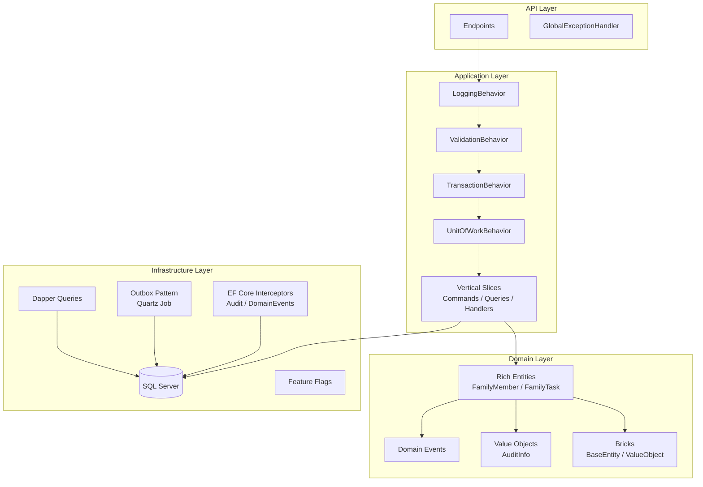
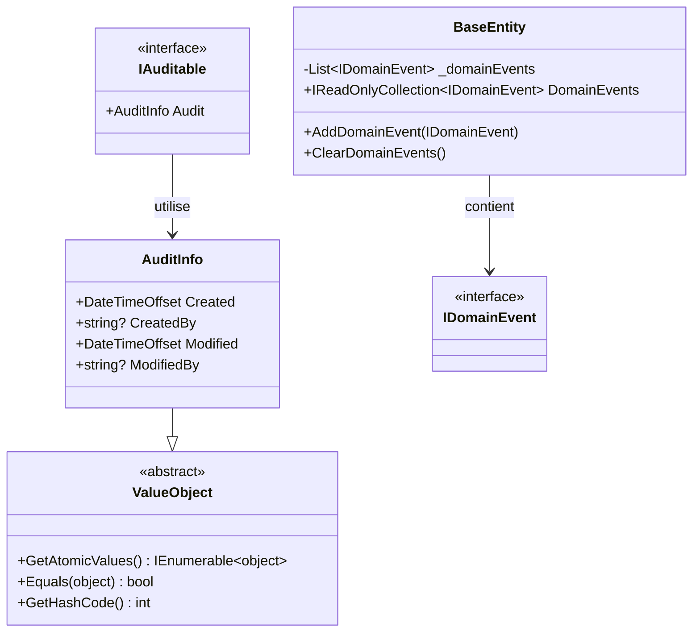
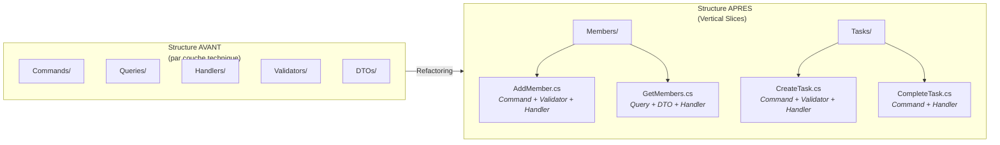
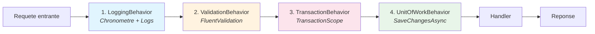
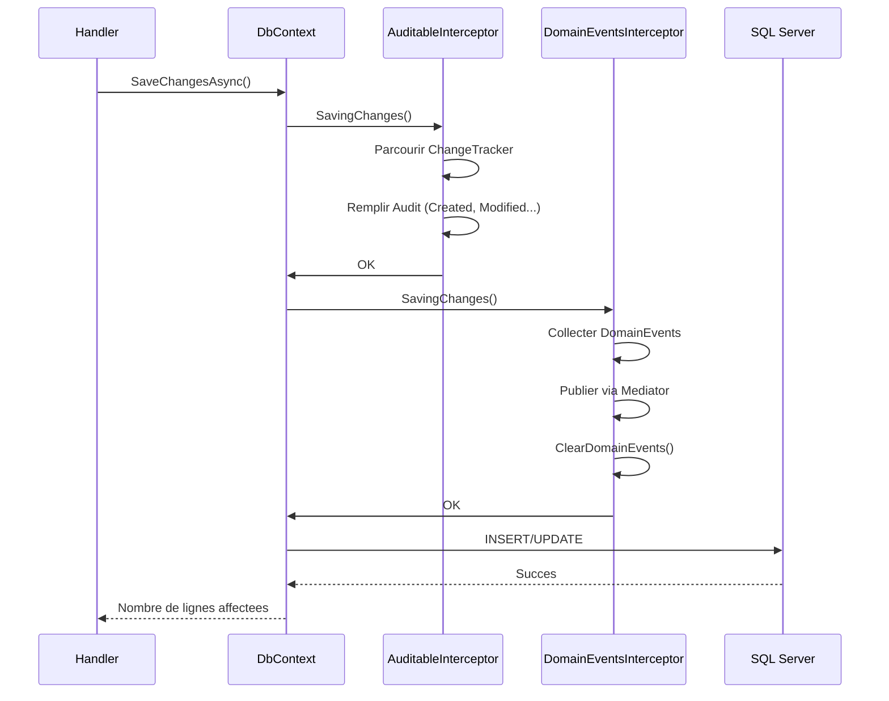
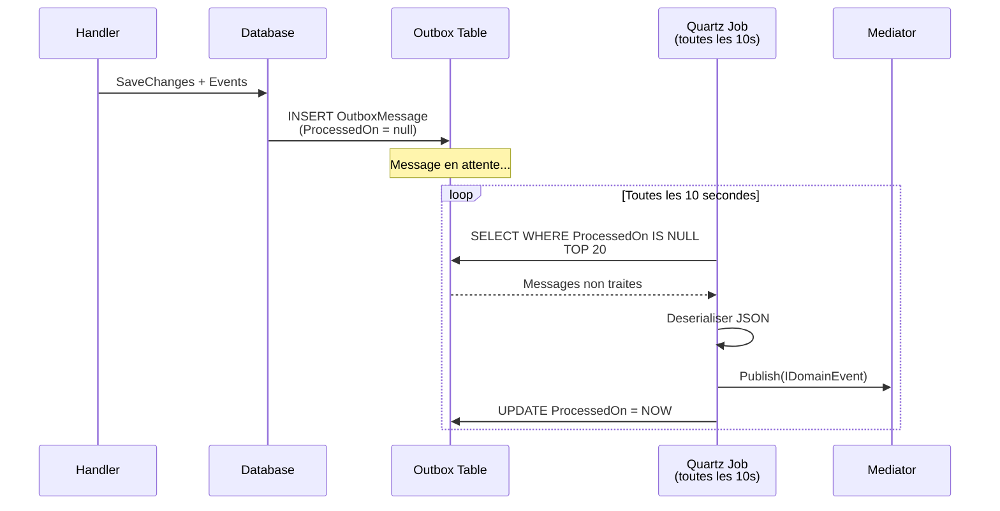
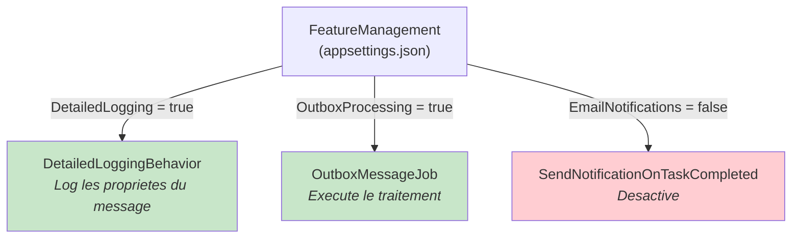

# =============================================
# Module 03 - Exercice Pratique
# Evoluer FamilyHub vers une Pragmatic Architecture
# =============================================

> **Difficulte** : :star::star::star::star: (4/5)
> **Duree estimee** : :clock3: 4-6 heures
> **Prerequis** : Modules 01 & 02 completes

---

## :dart: Objectif

Transformer le projet FamilyHub (issu des Modules 01 et 02) en une architecture pragmatique en appliquant les patterns vus en cours. Vous allez evoluer progressivement votre application en ajoutant :

- Des briques DDD (BaseEntity, ValueObject, Domain Events)
- Un Rich Domain Model
- Des Pipeline Behaviors
- Des EF Core Interceptors
- Le Outbox Pattern
- Des Feature Flags
- Une reorganisation en Vertical Slices

---

## :jigsaw: Ce que vous allez construire



---

## :white_check_mark: Prerequis

- [ ] Avoir complete les exercices des Modules 01 et 02
- [ ] Disposer du projet FamilyHub avec CQRS + Mediator fonctionnel
- [ ] .NET 9 SDK installe
- [ ] SQL Server LocalDB ou SQL Server installe

---

## :package: Packages NuGet necessaires

```bash
dotnet add package Ardalis.Result
dotnet add package Ardalis.Result.AspNetCore
dotnet add package Ardalis.Result.FluentValidation
dotnet add package FluentValidation
dotnet add package Mediator.Abstractions
dotnet add package Mediator.SourceGenerator
dotnet add package Serilog
dotnet add package Microsoft.FeatureManagement
dotnet add package Quartz
dotnet add package Quartz.Extensions.DependencyInjection
dotnet add package Quartz.Extensions.Hosting
dotnet add package Dapper
```

---

## Partie 1 : Les fondations DDD (Bricks)

### :footprints: Etape 1/8 - Creer le projet Bricks

Creez un nouveau projet de classe `FamilyHub.Bricks` qui contiendra les briques de base reutilisables.



**A creer :**

#### - [ ] 1. `IDomainEvent.cs` - Interface marqueur pour les evenements de domaine

```csharp
// File: src/FamilyHub.Bricks/Model/IDomainEvent.cs
using Mediator;

namespace FamilyHub.Bricks.Model;

public interface IDomainEvent : INotification
{
}
```

#### - [ ] 2. `BaseEntity.cs` - Classe de base pour toutes les entites

Implementez la classe `BaseEntity` avec :
- Une liste privee `_domainEvents` de type `List<IDomainEvent>`
- Une propriete publique en lecture seule `DomainEvents` (annotee `[NotMapped]`)
- Une methode `AddDomainEvent(IDomainEvent domainEvent)`
- Une methode `ClearDomainEvents()`

<details>
<summary>:bulb: Indice</summary>

Utilisez `_domainEvents.AsReadOnly()` pour exposer la collection en lecture seule. Cela empeche les appelants externes de modifier la liste directement.

```csharp
[NotMapped]
public IReadOnlyCollection<IDomainEvent> DomainEvents => _domainEvents.AsReadOnly();
```

</details>

#### - [ ] 3. `ValueObject.cs` - Classe de base pour les Value Objects

Implementez la classe abstraite `ValueObject` avec :
- Une methode abstraite `GetAtomicValues()` retournant `IEnumerable<object>`
- Un override de `Equals()` qui compare les valeurs atomiques une par une
- Un override de `GetHashCode()` qui combine les hash codes des valeurs atomiques
- Des methodes statiques `EqualOperator` et `NotEqualOperator`

<details>
<summary>:bulb: Indice</summary>

Utilisez l'operateur XOR (`^`) pour detecter le cas ou un seul des deux est `null` :

```csharp
protected static bool EqualOperator(ValueObject? left, ValueObject? right)
{
    if (left is null ^ right is null)
        return false;
    return left is null || left.Equals(right);
}
```

</details>

#### - [ ] 4. `IAuditable.cs` - Interface pour les entites auditables

```csharp
// File: src/FamilyHub.Bricks/Model/IAuditable.cs
namespace FamilyHub.Bricks.Model;

public interface IAuditable
{
    AuditInfo Audit { get; }
}
```

#### - [ ] 5. `AuditInfo.cs` - Value Object pour les informations d'audit

Creez un Value Object `AuditInfo` avec les proprietes :
- `Created` (`DateTimeOffset`)
- `CreatedBy` (`string?`, max 64 caracteres)
- `Modified` (`DateTimeOffset`)
- `ModifiedBy` (`string?`, max 64 caracteres)

<details>
<summary>:bulb: Indice</summary>

Annotez la classe avec `[Owned]` pour qu'EF Core la stocke dans la table parente :

```csharp
[Owned]
public class AuditInfo : ValueObject
{
    [MaxLength(64)]
    public string? CreatedBy { get; set; }
    // ...
}
```

</details>

#### - [ ] 6. `TypeExtensions.cs` - Detection Command vs Query

Implementez les methodes d'extension `IsCommand()` et `IsQuery()` qui inspectent un `Type` pour determiner s'il implemente les interfaces Command ou Query du Mediator.

<details>
<summary>:bulb: Indice</summary>

Utilisez `IsAssignableFrom` et `GetInterfaces()` pour verifier les generiques ouverts :

```csharp
public static bool IsCommand(this Type type)
{
    return type.GetInterfaces().Any(i =>
        i.IsGenericType &&
        (typeof(ICommand<>).IsAssignableFrom(i.GetGenericTypeDefinition()) ||
         typeof(ICommand).IsAssignableFrom(i)));
}
```

</details>

---

### :test_tube: Resultat attendu - Verification Partie 1

Apres avoir complete cette partie, le test suivant doit passer :

```csharp
// Ce test doit passer
var createType = typeof(CreateFamilyMember);  // votre Command
Assert.True(createType.IsCommand());
Assert.False(createType.IsQuery());

var getType = typeof(GetFamilyMembers);  // votre Query
Assert.False(getType.IsCommand());
Assert.True(getType.IsQuery());
```

> **Astuce** : Compilez le projet `FamilyHub.Bricks` de maniere isolee avant de continuer. Il ne doit avoir aucune dependance vers les autres projets FamilyHub.

---

## Partie 2 : Rich Domain Model

### :footprints: Etape 2/8 - Transformer les entites en Rich Domain Model

#### - [ ] Exercice 2.1 : Transformer FamilyMember en Rich Entity

Transformez votre entite `FamilyMember` d'un modele anemique vers un Rich Domain Model.

**Avant (anemique) :**

```csharp
// File: src/FamilyHub.Domain/Members/FamilyMember.cs (AVANT)
public class FamilyMember
{
    public Guid Id { get; set; }
    public string FirstName { get; set; }
    public string LastName { get; set; }
    public string Email { get; set; }
    public FamilyRole Role { get; set; }
    public bool IsActive { get; set; }
}
```

**Apres (riche) :**

```csharp
// File: src/FamilyHub.Domain/Members/FamilyMember.cs (APRES)
public class FamilyMember : BaseEntity, IAuditable
{
    public Guid Id { get; set; }
    public string FirstName { get; set; }
    public string LastName { get; set; }
    public string Email { get; set; }
    public FamilyRole Role { get; set; }
    public bool IsActive { get; set; }
    public AuditInfo Audit { get; set; } = new();

    // Constructeur parametre vide pour EF Core
    public FamilyMember() { }

    // Constructeur metier
    public FamilyMember(Guid id, string firstName, string lastName, string email,
                        FamilyRole role)
    {
        Id = id;
        FirstName = firstName;
        LastName = lastName;
        Email = email;
        Role = role;
        IsActive = true;

        AddDomainEvent(new MemberAdded(this));
    }

    public Result Deactivate()
    {
        if (!IsActive)
            return Result.Invalid(new ValidationError(
                Id.ToString(), "Member is already inactive",
                "Members.AlreadyInactive", ValidationSeverity.Error));

        IsActive = false;
        AddDomainEvent(new MemberDeactivated(this));
        return Result.Success();
    }

    public Result ChangeRole(FamilyRole newRole)
    {
        if (!IsActive)
            return Result.Invalid(new ValidationError(
                Id.ToString(), "Cannot change role of inactive member",
                "Members.Inactive", ValidationSeverity.Error));

        if (Role == newRole)
            return Result.Invalid(new ValidationError(
                Id.ToString(), "Member already has this role",
                "Members.SameRole", ValidationSeverity.Error));

        var oldRole = Role;
        Role = newRole;
        AddDomainEvent(new MemberRoleChanged(this, oldRole, newRole));
        return Result.Success();
    }
}
```

**A faire :**

1. - [ ] Faites heriter `FamilyMember` de `BaseEntity` et implementez `IAuditable`
2. - [ ] Ajoutez le constructeur metier qui leve l'evenement `MemberAdded`
3. - [ ] Implementez `Deactivate()` avec le Result Pattern et l'evenement `MemberDeactivated`
4. - [ ] Implementez `ChangeRole()` avec le Result Pattern et l'evenement `MemberRoleChanged`
5. - [ ] Creez une classe `Errors` centralisee pour les erreurs metier

> **Note** : Le constructeur sans parametre est necessaire pour EF Core. Ne le supprimez pas, meme s'il semble inutile.

#### - [ ] Exercice 2.2 : Transformer FamilyTask en Rich Entity

Faites le meme travail pour `FamilyTask` :

```csharp
// File: src/FamilyHub.Domain/Tasks/FamilyTask.cs
public class FamilyTask : BaseEntity, IAuditable
{
    // ... proprietes ...

    public FamilyTask(Guid id, string title, Guid? assignedToId)
    {
        // Initialiser + lever TaskCreated
    }

    public Result Complete()
    {
        // Verifier pas deja complete
        // IsCompleted = true
        // CompletedDate = DateTime.UtcNow
        // Lever TaskCompleted
    }

    public Result Assign(Guid memberId)
    {
        // Verifier pas deja complete
        // AssignedToId = memberId
        // Lever TaskAssigned
    }

    public Result Reschedule(DateTime newDueDate)
    {
        // Verifier pas deja complete
        // Verifier date dans le futur
        // DueDate = newDueDate
        // Lever TaskRescheduled
    }
}
```

**A implementer :**
- `Complete()` : complete la tache avec evenement `TaskCompleted`
- `Assign(Guid memberId)` : assigne la tache avec evenement `TaskAssigned`
- `Reschedule(DateTime newDueDate)` : replanifie avec evenement `TaskRescheduled`

<details>
<summary>:bulb: Indice pour Complete()</summary>

```csharp
public Result Complete()
{
    if (IsCompleted)
        return Result.Invalid(new ValidationError(
            Id.ToString(), "Task is already completed",
            "Tasks.AlreadyCompleted", ValidationSeverity.Error));

    IsCompleted = true;
    CompletedDate = DateTime.UtcNow;
    AddDomainEvent(new TaskCompleted(this));
    return Result.Success();
}
```

</details>

#### - [ ] Exercice 2.3 : Creer les Domain Events

Creez les Domain Events suivants en tant que `record` implementant `IDomainEvent` :

```
Domain/
  Members/
    Events/
      MemberAdded.cs
      MemberDeactivated.cs
      MemberRoleChanged.cs
  Tasks/
    Events/
      TaskCreated.cs
      TaskCompleted.cs
      TaskAssigned.cs
      TaskRescheduled.cs
```

**Exemple :**

```csharp
// File: src/FamilyHub.Domain/Members/Events/MemberAdded.cs
public record MemberAdded(FamilyMember Member) : IDomainEvent;

// File: src/FamilyHub.Domain/Members/Events/MemberRoleChanged.cs
public record MemberRoleChanged(
    FamilyMember Member,
    FamilyRole OldRole,
    FamilyRole NewRole) : IDomainEvent;

// File: src/FamilyHub.Domain/Tasks/Events/TaskCompleted.cs
public record TaskCompleted(FamilyTask Task) : IDomainEvent;

// File: src/FamilyHub.Domain/Tasks/Events/TaskAssigned.cs
public record TaskAssigned(FamilyTask Task, Guid AssignedToId) : IDomainEvent;
```

#### - [ ] Exercice 2.4 : Implementer le Null Object Pattern

Creez un pattern Null Object pour les membres de la famille :

```csharp
// File: src/FamilyHub.Domain/Members/FamilyMember.cs (ajout)
public class FamilyMember : BaseEntity, IAuditable
{
    // ... proprietes et methodes existantes ...

    public static readonly FamilyMember Unknown = new UnknownMember();
}

// File: src/FamilyHub.Domain/Members/UnknownMember.cs
public class UnknownMember : FamilyMember
{
    public UnknownMember()
    {
        Id = Guid.Empty;
        FirstName = "Inconnu";
        LastName = "Inconnu";
        Email = "unknown@familyhub.local";
        Role = FamilyRole.None;
        IsActive = false;
    }
}
```

### :test_tube: Resultat attendu - Verification Partie 2

A ce stade, votre domaine doit :
- [ ] Compiler sans erreur
- [ ] Chaque methode metier retourne un `Result`
- [ ] Les Domain Events sont leves dans les constructeurs et methodes metier
- [ ] `FamilyMember.Unknown` retourne une instance valide sans `null`

---

## Partie 3 : Reorganisation en Vertical Slices

### :footprints: Etape 3/8 - Restructurer les Features



#### - [ ] Exercice 3.1 : Restructurer les Features

Reorganisez votre code en Vertical Slices. Chaque fichier contient le Command/Query + le Handler + le Validator + les DTOs.

**Structure cible :**

```
src/
  FamilyHub.Application/
    Features/
      Members/
        AddMember.cs           // Command + Validator + Handler
        DeactivateMember.cs    // Command + Handler
        ChangeMemberRole.cs    // Command + Handler
        GetMembers.cs          // Query + DTO + Handler
        GetMemberDetail.cs     // Query + DTO + Handler
      Tasks/
        CreateTask.cs          // Command + Validator + Handler
        CompleteTask.cs        // Command + Handler
        AssignTask.cs          // Command + Handler
        RescheduleTask.cs      // Command + Handler
        GetTasks.cs            // Query + DTO + Handler
        GetTaskDetail.cs       // Query + DTO + Handler
        GetFamilyDashboard.cs  // Query + DTO + Handler (avec Dapper)
    IApplicationDbContext.cs
    IDbConnectionFactory.cs
```

**Exemple pour `AddMember.cs` :**

```csharp
// File: src/FamilyHub.Application/Features/Members/AddMember.cs
using Ardalis.Result;
using FluentValidation;
using Mediator;
using FamilyHub.Domain.Members;

namespace FamilyHub.Application.Features.Members;

// 1. Le Command
public record AddMember(
    Guid MemberId,
    string FirstName,
    string LastName,
    string Email,
    FamilyRole Role) : ICommand<Result>
{
}

// 2. Le Validator
public class AddMemberValidator : AbstractValidator<AddMember>
{
    public AddMemberValidator()
    {
        RuleFor(x => x.MemberId).NotEmpty();
        RuleFor(x => x.FirstName).NotEmpty().MaximumLength(100);
        RuleFor(x => x.LastName).NotEmpty().MaximumLength(100);
        RuleFor(x => x.Email).NotEmpty().EmailAddress();
    }
}

// 3. Le Handler
public class AddMemberHandler(IApplicationDbContext context)
    : ICommandHandler<AddMember, Result>
{
    public async ValueTask<Result> Handle(
        AddMember command, CancellationToken cancellationToken)
    {
        var member = new FamilyMember(
            command.MemberId,
            command.FirstName,
            command.LastName,
            command.Email,
            command.Role);

        await context.Members.AddAsync(member, cancellationToken);
        return Result.Success();
    }
}
```

**A faire pour chaque feature :**
1. - [ ] Deplacez le Command/Query, le Validator et le Handler dans un seul fichier
2. - [ ] Nommez le fichier par l'action metier (pas par le type technique)
3. - [ ] Les DTOs de reponse sont dans le meme fichier que la Query

> **Astuce** : Utilisez la fonctionnalite "Move to file" de votre IDE pour deplacer les classes sans perdre les `using`.

#### - [ ] Exercice 3.2 : Creer le IApplicationDbContext

```csharp
// File: src/FamilyHub.Application/IApplicationDbContext.cs
using Microsoft.EntityFrameworkCore;
using FamilyHub.Domain.Members;
using FamilyHub.Domain.Tasks;

namespace FamilyHub.Application;

public interface IApplicationDbContext
{
    DbSet<FamilyMember> Members { get; }
    DbSet<FamilyTask> Tasks { get; }
    Task<int> SaveChangesAsync(CancellationToken cancellationToken);
}
```

#### - [ ] Exercice 3.3 : Implementer une lecture avec Dapper

Creez un handler `GetFamilyDashboard` qui utilise **Dapper** pour une requete de lecture complexe. Ce dashboard affiche :
- Le nombre de membres actifs
- Le nombre de taches completees ce mois-ci
- Les 5 prochaines taches a faire (par date d'echeance)
- La repartition des taches par statut

```csharp
// File: src/FamilyHub.Application/Features/Tasks/GetFamilyDashboard.cs
public record GetFamilyDashboard : IQuery<Result<DashboardModel>> { }

public record DashboardModel
{
    public int ActiveMemberCount { get; set; }
    public int CompletedTasksThisMonth { get; set; }
    public List<UpcomingTask> UpcomingTasks { get; set; } = [];
    public int PendingTasksCount { get; set; }
    public int CompletedTasksCount { get; set; }
}

public record UpcomingTask(Guid Id, string Title, DateTime? DueDate, string AssignedTo);
```

**A implementer :**

Utilisez `IDbConnectionFactory` et `QueryMultipleAsync` de Dapper pour executer plusieurs requetes SQL en un seul appel :

```csharp
// File: src/FamilyHub.Application/Features/Tasks/GetFamilyDashboard.cs (handler)
public class GetFamilyDashboardHandler(
    IDbConnectionFactory dbConnectionFactory)
    : IQueryHandler<GetFamilyDashboard, Result<DashboardModel>>
{
    public async ValueTask<Result<DashboardModel>> Handle(
        GetFamilyDashboard request, CancellationToken cancellationToken)
    {
        var sql = @"
            SELECT COUNT(*) FROM FamilyMember WHERE IsActive = 1;

            SELECT COUNT(*) FROM FamilyTask
                WHERE IsCompleted = 1
                AND CompletedDate >= @StartOfMonth;

            SELECT TOP(5) t.Id, t.Title, t.DueDate,
                   CONCAT(m.FirstName, ' ', m.LastName) AS AssignedTo
                FROM FamilyTask t
                LEFT JOIN FamilyMember m ON t.AssignedToId = m.Id
                WHERE t.IsCompleted = 0
                ORDER BY t.DueDate;

            SELECT
                SUM(CASE WHEN IsCompleted = 0 THEN 1 ELSE 0 END) AS Pending,
                SUM(CASE WHEN IsCompleted = 1 THEN 1 ELSE 0 END) AS Completed
                FROM FamilyTask;";

        var connection = dbConnectionFactory.GetConnection();
        var startOfMonth = new DateTime(DateTime.UtcNow.Year, DateTime.UtcNow.Month, 1);

        using var multi = await connection.QueryMultipleAsync(
            sql, new { StartOfMonth = startOfMonth });

        var model = new DashboardModel
        {
            ActiveMemberCount = await multi.ReadSingleAsync<int>(),
            CompletedTasksThisMonth = await multi.ReadSingleAsync<int>(),
            UpcomingTasks = (await multi.ReadAsync<UpcomingTask>()).ToList()
        };

        var counts = await multi.ReadSingleAsync<dynamic>();
        model.PendingTasksCount = (int)(counts.Pending ?? 0);
        model.CompletedTasksCount = (int)(counts.Completed ?? 0);

        return Result.Success(model);
    }
}
```

### :test_tube: Resultat attendu - Verification Partie 3

- [ ] Chaque feature est dans un seul fichier (Command/Query + Validator + Handler + DTOs)
- [ ] Le projet compile sans erreur
- [ ] `IApplicationDbContext` est implemente par votre `ApplicationDbContext`
- [ ] Le dashboard Dapper retourne des donnees valides

---

## Partie 4 : Pipeline Behaviors

### :footprints: Etape 4/8 - Implementer les Pipeline Behaviors



> **Attention** : L'ordre d'enregistrement des behaviors est crucial. Logging d'abord (pour tout capturer), Validation ensuite (pour rejeter avant la transaction), Transaction, puis UnitOfWork.

#### - [ ] Exercice 4.1 : Implementer le LoggingBehavior

Creez un Pipeline Behavior qui :
- Log le nom de la requete au debut
- Mesure le temps d'execution avec `Stopwatch`
- Log le temps ecoule a la fin
- Log l'exception en cas d'erreur

```csharp
// File: src/FamilyHub.Infrastructure/Behaviors/LoggingBehavior.cs
using System.Diagnostics;
using Mediator;
using Serilog;
using Serilog.Context;
using Serilog.Core;

namespace FamilyHub.Infrastructure.Behaviors;

public class LoggingBehavior<TMessage, TResponse>
    : IPipelineBehavior<TMessage, TResponse> where TMessage : IMessage
{
    public async ValueTask<TResponse> Handle(
        TMessage message,
        MessageHandlerDelegate<TMessage, TResponse> next,
        CancellationToken cancellationToken)
    {
        // TODO: Implementez le logging
        // 1. Creer un logger contextualise avec le type du message
        // 2. Demarrer un chronometre
        // 3. Appeler next() dans un try/catch
        // 4. Logger l'erreur en cas d'exception
        // 5. Logger le temps ecoule dans le finally

        throw new NotImplementedException();
    }
}
```

<details>
<summary>:bulb: Indice</summary>

```csharp
var logger = Log.ForContext("RequestType", typeof(TMessage).Name);
var sw = Stopwatch.StartNew();
try
{
    logger.Information("Handling {RequestType}", typeof(TMessage).Name);
    var response = await next(message, cancellationToken);
    return response;
}
catch (Exception ex)
{
    logger.Error(ex, "Error handling {RequestType}", typeof(TMessage).Name);
    throw;
}
finally
{
    sw.Stop();
    logger.Information("Handled {RequestType} in {ElapsedMs}ms",
        typeof(TMessage).Name, sw.ElapsedMilliseconds);
}
```

</details>

#### - [ ] Exercice 4.2 : Implementer le ValidationBehavior

Creez un Pipeline Behavior qui :
- Recoit tous les validateurs FluentValidation pour le type de message
- Execute toutes les validations en parallele
- Lance une `ValidationException` si des erreurs sont trouvees

```csharp
// File: src/FamilyHub.Infrastructure/Behaviors/ValidationBehavior.cs
namespace FamilyHub.Infrastructure.Behaviors;

public class ValidationBehavior<TMessage, TResponse>(
    IEnumerable<IValidator<TMessage>> validators)
    : IPipelineBehavior<TMessage, TResponse> where TMessage : IMessage
{
    public async ValueTask<TResponse> Handle(
        TMessage message,
        MessageHandlerDelegate<TMessage, TResponse> next,
        CancellationToken cancellationToken)
    {
        // TODO: Implementez la validation
        // 1. Verifier si des validateurs existent (validators.Any())
        // 2. Creer un ValidationContext<TMessage>
        // 3. Executer toutes les validations avec Task.WhenAll
        // 4. Collecter les erreurs
        // 5. Si des erreurs : throw new ValidationException(failures)
        // 6. Sinon : appeler next()

        throw new NotImplementedException();
    }
}
```

<details>
<summary>:bulb: Indice</summary>

```csharp
if (!validators.Any())
    return await next(message, cancellationToken);

var context = new ValidationContext<TMessage>(message);
var results = await Task.WhenAll(
    validators.Select(v => v.ValidateAsync(context, cancellationToken)));
var failures = results.SelectMany(r => r.Errors)
    .Where(f => f != null).ToList();

if (failures.Count > 0)
    throw new ValidationException(failures);
```

</details>

#### - [ ] Exercice 4.3 : Implementer le TransactionBehavior

Creez un Pipeline Behavior qui :
- Verifie si le message est un Command via `IsCommand()`
- Si oui : enveloppe l'execution dans un `TransactionScope`
- Si non : passe directement au behavior suivant

```csharp
// File: src/FamilyHub.Infrastructure/Behaviors/TransactionBehavior.cs
namespace FamilyHub.Infrastructure.Behaviors;

public class TransactionBehavior<TMessage, TResponse>
    : IPipelineBehavior<TMessage, TResponse> where TMessage : IMessage
{
    public async ValueTask<TResponse> Handle(
        TMessage message,
        MessageHandlerDelegate<TMessage, TResponse> next,
        CancellationToken cancellationToken)
    {
        // TODO: Implementez la gestion des transactions
        // ATTENTION :
        // - Uniquement pour les Commands (IsCommand())
        // - IsolationLevel.ReadCommitted
        // - TransactionScopeAsyncFlowOption.Enabled (obligatoire pour async)
        // - scope.Complete() apres le succes

        throw new NotImplementedException();
    }
}
```

> **Attention** : Oublier `TransactionScopeAsyncFlowOption.Enabled` est un bug classique. Sans cette option, le `TransactionScope` ne fonctionne pas correctement avec `async/await`.

<details>
<summary>:bulb: Indice</summary>

```csharp
if (!typeof(TMessage).IsCommand())
    return await next(message, cancellationToken);

using var scope = new TransactionScope(
    TransactionScopeOption.Required,
    new TransactionOptions { IsolationLevel = IsolationLevel.ReadCommitted },
    TransactionScopeAsyncFlowOption.Enabled);

var response = await next(message, cancellationToken);
scope.Complete();
return response;
```

</details>

#### - [ ] Exercice 4.4 : Implementer le UnitOfWorkBehavior

Creez un Pipeline Behavior qui :
- Execute le handler
- Si le message est un Command : appelle `SaveChangesAsync`

```csharp
// File: src/FamilyHub.Infrastructure/Behaviors/UnitOfWorkBehavior.cs
namespace FamilyHub.Infrastructure.Behaviors;

public class UnitOfWorkBehavior<TMessage, TResponse>(
    IApplicationDbContext context)
    : IPipelineBehavior<TMessage, TResponse> where TMessage : IMessage
{
    public async ValueTask<TResponse> Handle(
        TMessage message,
        MessageHandlerDelegate<TMessage, TResponse> next,
        CancellationToken cancellationToken)
    {
        // TODO: Implementez le Unit of Work
        // 1. Appeler next() pour executer le handler
        // 2. Si IsCommand() : appeler context.SaveChangesAsync()
        // 3. Retourner la reponse

        throw new NotImplementedException();
    }
}
```

#### - [ ] Exercice 4.5 : Enregistrer les behaviors dans le bon ordre

Configurez le Mediator avec les Pipeline Behaviors dans l'ordre correct :

```csharp
// File: src/FamilyHub.Api/Program.cs (ou ServiceCollectionExtensions)
services.AddMediator(options =>
{
    options.ServiceLifetime = ServiceLifetime.Scoped;
    options.PipelineBehaviors =
    [
        // TODO: Quel ordre ?
        // Rappel : Logging -> Validation -> Transaction -> UnitOfWork
    ];
});
```

> **Note** : Pourquoi le `ValidationBehavior` doit etre AVANT le `TransactionBehavior` ? Parce qu'il est inutile (et couteux) d'ouvrir une transaction si les donnees sont invalides. On valide d'abord, on transactionne ensuite.

### :test_tube: Resultat attendu - Verification Partie 4

Quand vous envoyez une requete invalide (ex: email vide), vous devriez voir dans les logs :

```
[INF] Handling AddMember
[INF] Handled AddMember in 3ms
// Et une reponse HTTP 400 avec les erreurs de validation
```

Quand vous envoyez une requete valide :

```
[INF] Handling AddMember
[INF] Handled AddMember in 45ms
// Et une reponse HTTP 200
```

---

## Partie 5 : EF Core Interceptors

### :footprints: Etape 5/8 - Implementer les Interceptors



#### - [ ] Exercice 5.1 : Implementer l'AuditableInterceptor

Creez un interceptor EF Core qui met a jour automatiquement les informations d'audit :

```csharp
// File: src/FamilyHub.Infrastructure/Database/Interceptors/AuditableInterceptor.cs
namespace FamilyHub.Infrastructure.Database.Interceptors;

public class AuditableInterceptor(IUserContext userContext, TimeProvider timeProvider)
    : SaveChangesInterceptor
{
    public override InterceptionResult<int> SavingChanges(
        DbContextEventData eventData, InterceptionResult<int> result)
    {
        // TODO: Appeler UpdateAuditInfo puis base.SavingChanges
        throw new NotImplementedException();
    }

    public override ValueTask<InterceptionResult<int>> SavingChangesAsync(
        DbContextEventData eventData, InterceptionResult<int> result,
        CancellationToken cancellationToken = default)
    {
        // TODO: Appeler UpdateAuditInfo puis base.SavingChangesAsync
        throw new NotImplementedException();
    }

    public void UpdateAuditInfo(DbContext? context)
    {
        // TODO:
        // 1. Verifier que context n'est pas null
        // 2. DetectChanges()
        // 3. Parcourir ChangeTracker.Entries()
        // 4. Pour chaque entite IAuditable :
        //    - Si Added : renseigner Created + CreatedBy + Modified + ModifiedBy
        //    - Si Modified : renseigner Modified + ModifiedBy
        //    - Utiliser timeProvider.GetUtcNow() pour le timestamp
        //    - Utiliser userContext.CurrentUser.Id pour l'utilisateur

        throw new NotImplementedException();
    }
}
```

<details>
<summary>:bulb: Indice pour UpdateAuditInfo</summary>

```csharp
public void UpdateAuditInfo(DbContext? context)
{
    if (context is null) return;
    context.ChangeTracker.DetectChanges();

    foreach (var entry in context.ChangeTracker.Entries<IAuditable>())
    {
        var now = timeProvider.GetUtcNow();
        var user = userContext.CurrentUser?.Id;

        if (entry.State == EntityState.Added)
        {
            entry.Entity.Audit.Created = now;
            entry.Entity.Audit.CreatedBy = user;
        }

        if (entry.State is EntityState.Added or EntityState.Modified)
        {
            entry.Entity.Audit.Modified = now;
            entry.Entity.Audit.ModifiedBy = user;
        }
    }
}
```

</details>

#### - [ ] Exercice 5.2 : Implementer le DispatchDomainEventsInterceptor

Creez un interceptor qui publie les Domain Events avant la sauvegarde :

```csharp
// File: src/FamilyHub.Infrastructure/Database/Interceptors/DispatchDomainEventsInterceptor.cs
namespace FamilyHub.Infrastructure.Database.Interceptors;

public class DispatchDomainEventsInterceptor(IPublisher publisher)
    : SaveChangesInterceptor
{
    public override async ValueTask<InterceptionResult<int>> SavingChangesAsync(
        DbContextEventData eventData, InterceptionResult<int> result,
        CancellationToken cancellationToken = default)
    {
        // TODO: Appeler DispatchDomainEvents puis base.SavingChangesAsync
        throw new NotImplementedException();
    }

    public async Task DispatchDomainEvents(DbContext? context)
    {
        // TODO:
        // 1. Verifier que context n'est pas null
        // 2. Recuperer les entites (BaseEntity) avec des DomainEvents
        // 3. Extraire tous les events dans une liste separee
        // 4. Vider les DomainEvents des entites (ClearDomainEvents)
        // 5. Publier chaque event via publisher.Publish()

        throw new NotImplementedException();
    }
}
```

<details>
<summary>:bulb: Indice pour DispatchDomainEvents</summary>

```csharp
public async Task DispatchDomainEvents(DbContext? context)
{
    if (context is null) return;

    var entities = context.ChangeTracker.Entries<BaseEntity>()
        .Where(e => e.Entity.DomainEvents.Any())
        .Select(e => e.Entity)
        .ToList();

    var events = entities.SelectMany(e => e.DomainEvents).ToList();

    foreach (var entity in entities)
        entity.ClearDomainEvents();

    foreach (var domainEvent in events)
        await publisher.Publish(domainEvent);
}
```

</details>

#### - [ ] Exercice 5.3 : Enregistrer les interceptors

Configurez les interceptors dans le `DbContext` :

```csharp
// File: src/FamilyHub.Infrastructure/DependencyInjection.cs (extrait)
services.AddSingleton(_ => TimeProvider.System);
services.AddScoped<AuditableInterceptor>();
services.AddScoped<DispatchDomainEventsInterceptor>();

services.AddDbContext<ApplicationDbContext>((sp, options) =>
{
    options.UseSqlServer(connectionString);
    options.AddInterceptors(
        sp.GetRequiredService<AuditableInterceptor>(),
        sp.GetRequiredService<DispatchDomainEventsInterceptor>());
});
```

### :test_tube: Resultat attendu - Verification Partie 5

Apres avoir implemente les interceptors :

1. - [ ] Creez un membre de la famille via l'API
2. - [ ] Verifiez en base de donnees que les colonnes `Audit_Created`, `Audit_CreatedBy`, `Audit_Modified`, `Audit_ModifiedBy` sont renseignees
3. - [ ] Verifiez dans les logs que l'evenement `MemberAdded` a ete dispatche

```sql
-- Verification en base de donnees
SELECT Id, FirstName, LastName,
       Audit_Created, Audit_CreatedBy,
       Audit_Modified, Audit_ModifiedBy
FROM FamilyMember
WHERE Id = '...';
```

---

## Partie 6 : Outbox Pattern

### :footprints: Etape 6/8 - Implementer le Outbox Pattern



#### - [ ] Exercice 6.1 : Creer le modele OutboxMessage

```csharp
// File: src/FamilyHub.Infrastructure/Database/Models/OutboxMessage.cs
namespace FamilyHub.Infrastructure.Database.Models;

public class OutboxMessage
{
    public Guid Id { get; set; }
    public string Type { get; set; }            // Nom du type .NET de l'evenement
    public string Content { get; set; }         // Contenu JSON serialise
    public DateTimeOffset OccurredOn { get; set; }
    public DateTimeOffset? ProcessedOn { get; set; }  // null = pas encore traite
    public string? Error { get; set; }          // Message d'erreur eventuel
}
```

Ajoutez `DbSet<OutboxMessage> Outbox` a votre `ApplicationDbContext`.

#### - [ ] Exercice 6.2 : Creer le OutboxMessageJob

Implementez un Job Quartz.NET qui :
1. Recupere les messages non traites (max 20)
2. Deserialise chaque evenement
3. Publie via le Mediator
4. Marque comme traite
5. Sauvegarde en base

```csharp
// File: src/FamilyHub.Infrastructure/Jobs/OutboxMessageJob.cs
using System.Text.Json;
using Quartz;

namespace FamilyHub.Infrastructure.Jobs;

[DisallowConcurrentExecution]
public class OutboxMessageJob(
    ApplicationDbContext dbContext,
    IPublisher publisher,
    TimeProvider timeProvider) : IJob
{
    public async Task Execute(IJobExecutionContext context)
    {
        // TODO: Implementez le traitement de l'outbox
        // 1. Recuperer les messages ou ProcessedOn == null (max 20)
        // 2. Pour chaque message :
        //    a. Deserialiser le Content en IDomainEvent
        //    b. Publier via publisher.Publish()
        //    c. Mettre a jour ProcessedOn
        //    d. En cas d'erreur : renseigner le champ Error
        // 3. SaveChangesAsync

        throw new NotImplementedException();
    }
}
```

<details>
<summary>:bulb: Indice pour la deserialisation</summary>

```csharp
var messages = await dbContext.Outbox
    .Where(m => m.ProcessedOn == null)
    .OrderBy(m => m.OccurredOn)
    .Take(20)
    .ToListAsync();

foreach (var message in messages)
{
    try
    {
        var type = Assembly.GetExecutingAssembly().GetType(message.Type);
        var domainEvent = (IDomainEvent)JsonSerializer.Deserialize(message.Content, type!)!;
        await publisher.Publish(domainEvent);
        message.ProcessedOn = timeProvider.GetUtcNow();
    }
    catch (Exception ex)
    {
        message.Error = ex.Message;
    }
}

await dbContext.SaveChangesAsync();
```

</details>

#### - [ ] Exercice 6.3 : Configurer le Job

Enregistrez le Job dans la configuration des services :

```csharp
// File: src/FamilyHub.Infrastructure/DependencyInjection.cs (extrait)
static IServiceCollection ConfigureOutboxJob(this IServiceCollection services)
{
    var jobKey = new JobKey(nameof(OutboxMessageJob));

    return services.AddQuartz(configure =>
    {
        configure.AddJob<OutboxMessageJob>(jobKey)
            .AddTrigger(trigger => trigger.ForJob(jobKey)
            .WithSimpleSchedule(schedule =>
                schedule.WithIntervalInSeconds(10).RepeatForever()));
    })
    .AddQuartzHostedService();
}
```

### :test_tube: Resultat attendu - Verification Partie 6

1. - [ ] Inserez manuellement un `OutboxMessage` en base avec un evenement serialise
2. - [ ] Attendez que le job s'execute (10 secondes)
3. - [ ] Verifiez que `ProcessedOn` est renseigne
4. - [ ] Verifiez dans les logs que l'evenement a ete publie

```sql
-- Insertion manuelle pour test
INSERT INTO OutboxMessage (Id, Type, Content, OccurredOn, ProcessedOn, Error)
VALUES (
    NEWID(),
    'FamilyHub.Domain.Tasks.Events.TaskCompleted',
    '{"Task":{"Id":"...","Title":"Test"}}',
    GETUTCDATE(),
    NULL,
    NULL
);

-- Verification apres 10 secondes
SELECT * FROM OutboxMessage WHERE ProcessedOn IS NOT NULL;
```

---

## Partie 7 : Feature Flags

### :footprints: Etape 7/8 - Ajouter les Feature Flags



#### - [ ] Exercice 7.1 : Ajouter les Feature Flags

1. Ajoutez `Microsoft.FeatureManagement` a votre projet Infrastructure

2. Configurez les Feature Flags dans `appsettings.json` :

```json
// File: src/FamilyHub.Api/appsettings.json (extrait)
{
  "FeatureManagement": {
    "DetailedLogging": true,
    "OutboxProcessing": true,
    "EmailNotifications": false
  }
}
```

3. Enregistrez le service :

```csharp
services.AddFeatureManagement();
```

#### - [ ] Exercice 7.2 : Creer un behavior avec Feature Flag

Creez un `DetailedLoggingBehavior` qui log les details de la requete (proprietes) uniquement quand le Feature Flag `DetailedLogging` est active :

```csharp
// File: src/FamilyHub.Infrastructure/Behaviors/DetailedLoggingBehavior.cs
public class DetailedLoggingBehavior<TMessage, TResponse>(
    IFeatureManager featureManager)
    : IPipelineBehavior<TMessage, TResponse> where TMessage : IMessage
{
    public async ValueTask<TResponse> Handle(
        TMessage message,
        MessageHandlerDelegate<TMessage, TResponse> next,
        CancellationToken cancellationToken)
    {
        if (await featureManager.IsEnabledAsync("DetailedLogging"))
        {
            // TODO: Logger les proprietes du message
            // Utiliser reflexion ou serialisation JSON pour afficher le contenu
            var json = System.Text.Json.JsonSerializer.Serialize(message);
            Log.Information("Request details: {RequestType} {Details}",
                message.GetType().Name, json);
        }

        return await next(message, cancellationToken);
    }
}
```

#### - [ ] Exercice 7.3 : Conditionner l'OutboxMessageJob

Modifiez le `OutboxMessageJob` pour qu'il ne s'execute que si le Feature Flag `OutboxProcessing` est active :

```csharp
// File: src/FamilyHub.Infrastructure/Jobs/OutboxMessageJob.cs (modification)
public class OutboxMessageJob(
    ApplicationDbContext dbContext,
    IPublisher publisher,
    TimeProvider timeProvider,
    IFeatureManager featureManager) : IJob
{
    public async Task Execute(IJobExecutionContext context)
    {
        if (!await featureManager.IsEnabledAsync("OutboxProcessing"))
        {
            return; // Job desactive par Feature Flag
        }

        // ... traitement normal ...
    }
}
```

### :test_tube: Resultat attendu - Verification Partie 7

- [ ] Avec `DetailedLogging: true`, les logs affichent le JSON des requetes
- [ ] Avec `DetailedLogging: false`, les logs n'affichent PAS le JSON
- [ ] Avec `OutboxProcessing: false`, le job Quartz ne fait rien

---

## Partie 8 : Integration complete

### :footprints: Etape 8/8 - Tout assembler et tester

#### - [ ] Exercice 8.1 : Creer un handler de Domain Event

Creez un handler qui reagit a l'evenement `TaskCompleted` pour envoyer une notification :

```csharp
// File: src/FamilyHub.Application/Features/Tasks/EventHandlers/SendNotificationOnTaskCompleted.cs
using Mediator;
using FamilyHub.Domain.Tasks.Events;
using Microsoft.FeatureManagement;

namespace FamilyHub.Application.Features.Tasks.EventHandlers;

public class SendNotificationOnTaskCompleted(IFeatureManager featureManager)
    : INotificationHandler<TaskCompleted>
{
    public async ValueTask Handle(
        TaskCompleted notification, CancellationToken cancellationToken)
    {
        if (await featureManager.IsEnabledAsync("EmailNotifications"))
        {
            // TODO: Envoyer une notification
            // Pour l'instant, logger simplement
            Console.WriteLine(
                $"[NOTIFICATION] Tache '{notification.Task.Title}' completee !");
        }
    }
}
```

#### - [ ] Exercice 8.2 : Implementer le GlobalExceptionHandler

Creez un handler d'exception global qui transforme les `ValidationException` en reponses HTTP 400 et les autres exceptions en HTTP 500 :

```csharp
// File: src/FamilyHub.Api/Infrastructure/GlobalExceptionHandler.cs
using Ardalis.Result;
using Ardalis.Result.AspNetCore;
using Ardalis.Result.FluentValidation;
using FluentValidation.Results;
using Microsoft.AspNetCore.Diagnostics;
using Microsoft.AspNetCore.Mvc;

namespace FamilyHub.Api.Infrastructure;

public class GlobalExceptionHandler : IExceptionHandler
{
    public async ValueTask<bool> TryHandleAsync(
        HttpContext httpContext, Exception exception,
        CancellationToken cancellationToken)
    {
        if (exception is FluentValidation.ValidationException validationException)
        {
            // TODO: Convertir en Result.Invalid via Ardalis.Result.FluentValidation
            // Utiliser .AsErrors() et .ToMinimalApiResult()
        }
        else
        {
            // TODO: Retourner un ProblemDetails generique (HTTP 500)
            // NE PAS exposer les details de l'exception en production
        }

        return true;
    }
}
```

> **Attention** : Ne JAMAIS exposer les details des exceptions (stack trace, inner exception) dans les reponses HTTP en production. Utilisez un Correlation ID pour retrouver l'erreur dans les logs.

#### - [ ] Exercice 8.3 : Test d'integration complet

Testez le flux complet en envoyant des requetes via l'API :

| # | Requete | Verification |
|---|---------|-------------|
| 1 | **POST /api/members** (email invalide) | Reponse 400 avec erreurs de validation |
| 2 | **POST /api/members** (donnees valides) | Audit renseigne en base + `MemberAdded` dispatche |
| 3 | **POST /api/tasks** | Validation + Audit + `TaskCreated` |
| 4 | **PUT /api/tasks/{id}/complete** | `TaskCompleted` dispatche + notification (si Feature Flag) |
| 5 | **PUT /api/tasks/{id}/complete** (meme tache) | Erreur 400 via Result Pattern |
| 6 | **GET /api/dashboard** | Statistiques correctes via Dapper |

**Details des verifications :**

1. **POST /api/members** - Ajouter un membre
   - Verifiez que la validation fonctionne (envoyez un email invalide -> 400)
   - Verifiez que l'audit est renseigne en base
   - Verifiez que l'evenement `MemberAdded` est dispatche

2. **POST /api/tasks** - Creer une tache
   - Verifiez la validation
   - Verifiez l'audit

3. **PUT /api/tasks/{id}/complete** - Completer une tache
   - Verifiez que `TaskCompleted` est dispatche
   - Verifiez que le handler de notification est appele (si Feature Flag active)

4. **PUT /api/tasks/{id}/complete** (meme tache) - Essayer de completer a nouveau
   - Verifiez que le Result Pattern retourne une erreur 400

5. **GET /api/dashboard** - Dashboard avec Dapper
   - Verifiez que les statistiques sont correctes

---

## :star2: Bonus : Challenges supplementaires

### Challenge 1 : Decorator pour le logging des emails

Creez un `LoggingEmailSenderDecorator` qui enveloppe `IEmailSender` et log chaque tentative d'envoi :

```csharp
// File: src/FamilyHub.Infrastructure/Email/LoggingEmailSenderDecorator.cs
public class LoggingEmailSenderDecorator(IEmailSender inner) : IEmailSender
{
    public async Task SendEmailAsync(string to, string from, string subject, string body)
    {
        Log.Information("Sending email to {To} from {From}: {Subject}", to, from, subject);
        await inner.SendEmailAsync(to, from, subject, body);
        Log.Information("Email sent successfully to {To}", to);
    }
}
```

Empilez-le avec le `RetryEmailSenderDecorator` :

```
IEmailSender -> LoggingDecorator -> RetryDecorator -> MimeKitEmailSender
```

### Challenge 2 : Feature Flag filtre par pourcentage

Configurez un Feature Flag qui n'est actif que pour 50% des requetes :

```json
{
  "FeatureManagement": {
    "DetailedLogging": {
      "EnabledFor": [
        {
          "Name": "Percentage",
          "Parameters": { "Value": 50 }
        }
      ]
    }
  }
}
```

### Challenge 3 : Outbox avec gestion d'erreurs avancee

Ameliorez le `OutboxMessageJob` pour :
- Ajouter un compteur de tentatives (`RetryCount`)
- Ne pas retraiter les messages qui ont echoue plus de 3 fois
- Logger les messages "morts" (dead letters)

```csharp
// File: src/FamilyHub.Infrastructure/Database/Models/OutboxMessage.cs (extension)
public class OutboxMessage
{
    // ... proprietes existantes ...
    public int RetryCount { get; set; }
    public int MaxRetries { get; set; } = 3;
}
```

### Challenge 4 : Creer un ProfilingBehavior avec MiniProfiler

Implementez un `ProfilingBehavior` conditionne par un Feature Flag, identique a celui du projet pragmatic-architecture :

```csharp
// File: src/FamilyHub.Infrastructure/Behaviors/ProfilingBehavior.cs
public class ProfilingBehavior<TMessage, TResponse>(IFeatureManager featureManager)
    : IPipelineBehavior<TMessage, TResponse> where TMessage : IMessage
{
    public async ValueTask<TResponse> Handle(...)
    {
        if (await featureManager.IsEnabledAsync("MiniProfiler"))
        {
            using (MiniProfiler.Current.CustomTiming(
                message.GetType().Name, string.Empty))
            {
                return await next(message, cancellationToken);
            }
        }
        return await next(message, cancellationToken);
    }
}
```

---

## :bar_chart: Criteres d'evaluation

| Critere | Points | Description |
|---------|--------|-------------|
| **Bricks** | /15 | BaseEntity, ValueObject, IDomainEvent, IAuditable, TypeExtensions |
| **Rich Domain Model** | /20 | FamilyMember et FamilyTask avec logique metier, Result Pattern, Domain Events |
| **Vertical Slices** | /10 | Organisation correcte des features |
| **Pipeline Behaviors** | /20 | Les 4 behaviors fonctionnels et dans le bon ordre |
| **EF Core Interceptors** | /15 | AuditableInterceptor + DispatchDomainEventsInterceptor |
| **Outbox Pattern** | /10 | OutboxMessage + OutboxMessageJob |
| **Feature Flags** | /5 | Au moins 1 Feature Flag fonctionnel |
| **Integration** | /5 | Le flux complet fonctionne de bout en bout |
| **Total** | **/100** | |

### Bonus (points supplementaires)

| Challenge | Points |
|-----------|--------|
| Decorator empile (Logging + Retry) | +5 |
| Feature Flag par pourcentage | +3 |
| Outbox avec gestion d'erreurs avancee | +5 |
| ProfilingBehavior avec MiniProfiler | +2 |

---

## :books: Conseils de travail

1. **Procedez dans l'ordre** : les parties sont progressives, chacune depend des precedentes
2. **Testez a chaque etape** : ne passez pas a la partie suivante sans verification
3. **Utilisez le projet pragmatic-architecture comme reference** : c'est votre modele
4. **Ne copiez pas betement** : adaptez le code a votre domaine FamilyHub
5. **Documentez vos choix pragmatiques** : ajoutez des commentaires quand vous faites un compromis
6. **Commitez regulierement** : un commit par partie completee

### Commandes utiles

```bash
# Creer la base de donnees (si EnsureCreated dans le code)
dotnet run

# Tester l'API
curl -X POST http://localhost:5000/api/members \
  -H "Content-Type: application/json" \
  -d '{"memberId":"...", "firstName":"Alice", "lastName":"Dupont", "email":"alice@test.com", "role":"Parent"}'

# Verifier la base de donnees
# Utilisez SQL Server Management Studio ou Azure Data Studio
SELECT * FROM FamilyMember;
SELECT * FROM OutboxMessage;
```

---

## :white_check_mark: Recapitulatif final

Cochez chaque element au fur et a mesure de votre progression :

### Partie 1 - Bricks DDD
- [ ] `IDomainEvent.cs` cree
- [ ] `BaseEntity.cs` avec gestion des Domain Events
- [ ] `ValueObject.cs` avec comparaison par valeur
- [ ] `IAuditable.cs` et `AuditInfo.cs`
- [ ] `TypeExtensions.cs` avec `IsCommand()` / `IsQuery()`

### Partie 2 - Rich Domain Model
- [ ] `FamilyMember` herite de `BaseEntity` et implemente `IAuditable`
- [ ] Methodes metier `Deactivate()` et `ChangeRole()` avec Result Pattern
- [ ] `FamilyTask` avec methodes `Complete()`, `Assign()`, `Reschedule()`
- [ ] Tous les Domain Events crees (7 au total)
- [ ] Null Object Pattern (`FamilyMember.Unknown`)

### Partie 3 - Vertical Slices
- [ ] Features reorganisees en fichiers uniques
- [ ] `IApplicationDbContext` cree et implemente
- [ ] Dashboard Dapper fonctionnel

### Partie 4 - Pipeline Behaviors
- [ ] `LoggingBehavior` avec chronometre
- [ ] `ValidationBehavior` avec FluentValidation
- [ ] `TransactionBehavior` avec `TransactionScope`
- [ ] `UnitOfWorkBehavior` avec `SaveChangesAsync`
- [ ] Behaviors enregistres dans le bon ordre

### Partie 5 - EF Core Interceptors
- [ ] `AuditableInterceptor` renseigne les champs d'audit
- [ ] `DispatchDomainEventsInterceptor` publie les evenements
- [ ] Interceptors enregistres dans le `DbContext`

### Partie 6 - Outbox Pattern
- [ ] Modele `OutboxMessage` cree
- [ ] `OutboxMessageJob` Quartz fonctionnel
- [ ] Job configure avec intervalle de 10 secondes

### Partie 7 - Feature Flags
- [ ] Feature Flags configures dans `appsettings.json`
- [ ] `DetailedLoggingBehavior` conditionne par Feature Flag
- [ ] `OutboxMessageJob` conditionne par Feature Flag

### Partie 8 - Integration
- [ ] Flux complet POST -> Validation -> Audit -> Domain Events fonctionne
- [ ] `GlobalExceptionHandler` en place
- [ ] Test d'integration complet passe

---

Bon courage ! :rocket:
