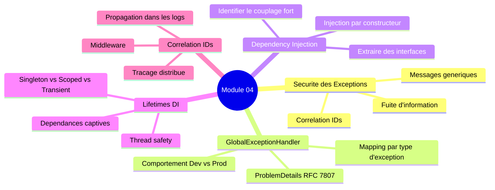
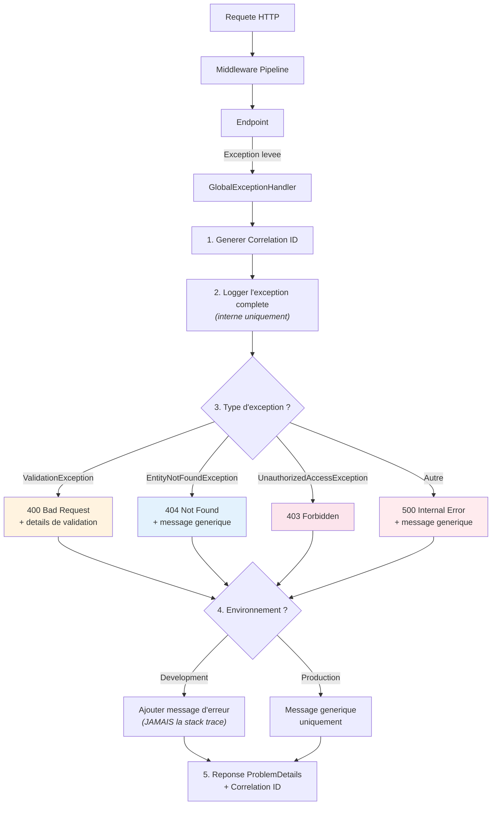
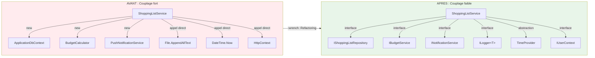
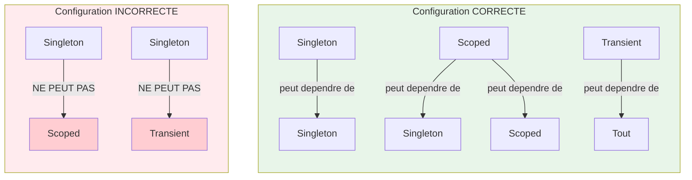
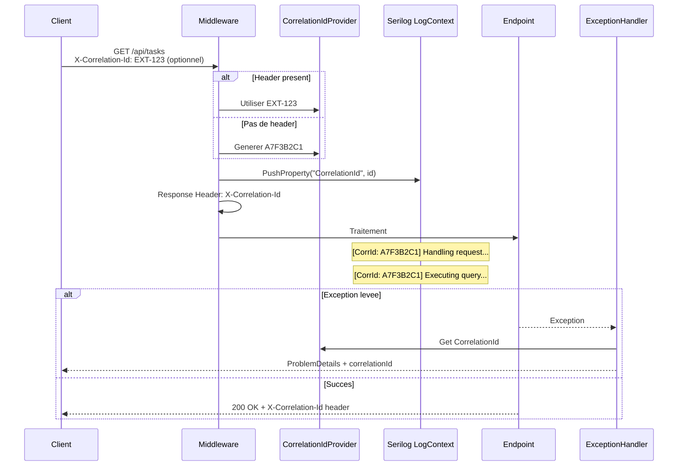

# =============================================
# Module 04 - Exercices
# Exceptions, DI/IoC & Securite
# =============================================

> **Difficulte** : :star::star::star: (3/5)
> **Duree estimee** : :clock3: 3-4 heures
> **Prerequis** : Notions de base en ASP.NET Core, DI, HTTP

---

> **Contexte** : Tous les exercices utilisent le projet **FamilyHub** comme fil rouge. FamilyHub est une application de gestion familiale avec des fonctionnalites de gestion de taches, de budget, de membres de la famille et de notifications.

---

## :dart: Ce que vous allez apprendre



---

## :footprints: Vue d'ensemble des exercices

| # | Exercice | Points | Competence cle |
|---|----------|--------|----------------|
| 1 | Identifier les failles de securite | /20 | :shield: Securite |
| 2 | GlobalExceptionHandler | /25 | :rotating_light: Gestion d'erreurs |
| 3 | Refactoring DI | /25 | :syringe: Injection de dependances |
| 4 | Dependances captives | /15 | :bug: Diagnostic |
| 5 | Correlation IDs | /15 | :link: Tracabilite |
| | **Total** | **/100** | |

---

## Exercice 1 : Identifier les failles de securite dans les exceptions

> **Difficulte** : :star::star: | **Duree** : :clock3: ~30 min | **Type** : Analyse de code

### :dart: Objectif

Developper votre "oeil securite" en identifiant les problemes dans du code de gestion d'erreurs.

### Consigne

Analysez les extraits de code suivants. Pour chaque extrait :
1. **Identifiez** toutes les informations sensibles qui fuient
2. **Expliquez** ce qu'un attaquant pourrait en faire
3. **Reecrivez** le code de maniere securisee

---

### - [ ] Extrait 1 : Endpoint de connexion

```csharp
// File: src/FamilyHub.Api/Endpoints/AuthEndpoints.cs (CODE VULNERABLE)
[HttpPost("/api/auth/login")]
public async Task<IActionResult> Login([FromBody] LoginRequest request)
{
    try
    {
        var user = await _dbContext.Users
            .FirstOrDefaultAsync(u => u.Email == request.Email);

        if (user == null)
        {
            return BadRequest(new
            {
                error = $"Aucun compte trouve avec l'email '{request.Email}'",
                suggestion = "Verifiez votre email ou creez un compte"
            });
        }

        if (!BCrypt.Net.BCrypt.Verify(request.Password, user.PasswordHash))
        {
            return BadRequest(new
            {
                error = $"Mot de passe incorrect pour le compte '{request.Email}'",
                attempts = user.FailedLoginAttempts + 1,
                maxAttempts = 5
            });
        }

        user.FailedLoginAttempts = 0;
        user.LastLoginAt = DateTime.UtcNow;
        await _dbContext.SaveChangesAsync();

        return Ok(new { token = GenerateJwt(user) });
    }
    catch (Exception ex)
    {
        return StatusCode(500, new
        {
            error = ex.Message,
            stackTrace = ex.StackTrace,
            innerException = ex.InnerException?.Message
        });
    }
}
```

**Questions :**
- Combien de problemes de securite pouvez-vous identifier ? (Il y en a au moins 6)
- Pour chaque probleme, expliquez le scenario d'attaque correspondant.

<details>
<summary>:bulb: Indice - Nombre de problemes</summary>

Il y en a au moins **7** :

1. Messages differents pour "email inexistant" vs "mauvais mot de passe" (enumeration de comptes)
2. L'email est repete dans le message d'erreur
3. Le nombre de tentatives echouees est expose
4. Le nombre maximum de tentatives est expose
5. `ex.Message` est renvoye au client
6. `ex.StackTrace` est renvoye au client
7. `ex.InnerException.Message` peut contenir des infos SQL

</details>

---

### - [ ] Extrait 2 : Endpoint de gestion du budget familial

```csharp
// File: src/FamilyHub.Api/Endpoints/ExpenseEndpoints.cs (CODE VULNERABLE)
[HttpPost("/api/family/{familyId}/expenses")]
public async Task<IActionResult> AddExpense(Guid familyId, [FromBody] ExpenseRequest request)
{
    try
    {
        var family = await _dbContext.Families
            .Include(f => f.Members)
            .Include(f => f.Budget)
            .FirstOrDefaultAsync(f => f.Id == familyId);

        if (family == null)
        {
            throw new Exception(
                $"La famille avec l'ID {familyId} n'existe pas dans la table 'Families' " +
                $"de la base de donnees '{_dbContext.Database.GetConnectionString()}'");
        }

        if (request.Amount > family.Budget.Remaining)
        {
            return BadRequest(new
            {
                error = $"Budget insuffisant. Reste : {family.Budget.Remaining:C} " +
                        $"sur un budget total de {family.Budget.Total:C}. " +
                        $"La depense de {request.Amount:C} depasse de " +
                        $"{request.Amount - family.Budget.Remaining:C}.",
                familyName = family.Name,
                memberCount = family.Members.Count,
                budgetId = family.Budget.Id
            });
        }

        // ... ajout de la depense
        return Ok();
    }
    catch (DbUpdateException ex)
    {
        return StatusCode(500, new
        {
            error = $"Erreur SQL : {ex.InnerException?.Message}",
            query = ex.InnerException?.Data["HelpLink.EvtID"],
            server = _dbContext.Database.GetConnectionString()
        });
    }
    catch (Exception ex)
    {
        return StatusCode(500, new
        {
            error = ex.ToString() // ToString() inclut message + stack trace + inner exceptions
        });
    }
}
```

**Questions :**
- Listez TOUTES les informations sensibles exposees.
- Quel type d'attaque est facilite par la fuite de la chaine de connexion ?
- Reecrivez ce code de maniere securisee en utilisant le pattern Result et un GlobalExceptionHandler.

<details>
<summary>:bulb: Indice - Informations sensibles</summary>

Informations exposees :
- **Chaine de connexion** complete (serveur, base, credentials possibles)
- **Nom de la table** SQL (`Families`)
- **Montants budgetaires** exacts (budget total, restant, depassement)
- **Nom de la famille**
- **Nombre de membres**
- **ID interne du budget**
- **Messages d'erreur SQL** bruts
- **Stack trace** complete via `ex.ToString()`

La chaine de connexion permet une attaque directe sur la base de donnees (SQL injection, connexion directe).

</details>

---

### - [ ] Extrait 3 : Service d'envoi d'emails

```csharp
// File: src/FamilyHub.Infrastructure/Email/EmailService.cs (CODE VULNERABLE)
public async Task SendWelcomeEmail(string userEmail)
{
    try
    {
        using var client = new SmtpClient();
        await client.ConnectAsync("smtp.familyhub.com", 587, true);
        await client.AuthenticateAsync("noreply@familyhub.com", "SmtP_P@ssw0rd_2024!");

        var message = new MimeMessage();
        message.From.Add(new MailboxAddress("FamilyHub", "noreply@familyhub.com"));
        message.To.Add(new MailboxAddress(userEmail, userEmail));
        message.Subject = "Bienvenue sur FamilyHub";
        message.Body = new TextPart("plain") { Text = "Bienvenue !" };

        await client.SendAsync(message);
    }
    catch (Exception ex)
    {
        throw new Exception(
            $"Impossible d'envoyer l'email a {userEmail} via " +
            $"smtp.familyhub.com:587 (user: noreply@familyhub.com). " +
            $"Erreur : {ex.Message}");
    }
}
```

**Questions :**
- Quelles informations l'attaquant obtient-il si cette exception remonte jusqu'au client ?
- Quels sont les problemes DANS le code lui-meme (pas seulement dans le message d'erreur) ?
- Proposez une version securisee.

<details>
<summary>:bulb: Indice - Problemes dans le code</summary>

**Informations exposees :**
- Adresse email du destinataire
- Serveur SMTP et port
- Compte SMTP utilise
- Message d'erreur SMTP interne

**Problemes dans le code :**
- Mot de passe SMTP en dur dans le code source (`"SmtP_P@ssw0rd_2024!"`)
- Serveur SMTP et port en dur (pas configurable)
- Pas d'utilisation d'`IOptions<T>` pour la configuration
- Le `new Exception()` casse la chaine d'exceptions (perte de la stack trace originale)

</details>

### :test_tube: Resultat attendu - Exercice 1

Vous devriez avoir produit :
- [ ] Une analyse detaillee de chaque extrait avec les failles identifiees
- [ ] Les scenarios d'attaque pour chaque faille
- [ ] Une version reecrite et securisee de chaque extrait

---

## Exercice 2 : Implementer un GlobalExceptionHandler pour FamilyHub

> **Difficulte** : :star::star::star: | **Duree** : :clock3: ~45 min | **Type** : Implementation

### :dart: Objectif

Creer un gestionnaire global d'exceptions securise avec Correlation IDs pour le projet FamilyHub.

### Ce que vous allez construire



### Consigne

Implementez un `GlobalExceptionHandler` complet pour FamilyHub avec les exigences suivantes :

1. **Gestion des `ValidationException`** (FluentValidation) : retourner HTTP 400 avec les details de validation
2. **Gestion des `EntityNotFoundException`** (custom) : retourner HTTP 404 avec un message generique
3. **Gestion des `UnauthorizedAccessException`** : retourner HTTP 403
4. **Gestion de toutes les autres exceptions** : retourner HTTP 500 avec un message generique
5. **Correlation ID** : genere pour chaque erreur, inclus dans la reponse ET dans les logs
6. **Logging** : logger l'exception complete (stack trace, inner exception, contexte de la requete)
7. **Comportement different en Development** : en dev, inclure le message d'erreur dans la reponse (mais JAMAIS la stack trace)

---

### - [ ] Etape 1/4 : Creer l'exception custom `EntityNotFoundException`

```csharp
// File: src/FamilyHub.Domain/Exceptions/EntityNotFoundException.cs

// Creez cette exception dans le projet Domain
public class EntityNotFoundException : Exception
{
    // TODO: Implementez avec les proprietes EntityType et EntityId
    // Le message expose ne doit PAS contenir l'ID de l'entite
}
```

<details>
<summary>:bulb: Indice</summary>

```csharp
public class EntityNotFoundException : Exception
{
    public string EntityType { get; }
    public object EntityId { get; }

    public EntityNotFoundException(string entityType, object entityId)
        : base($"Entity of type '{entityType}' was not found.")
    {
        EntityType = entityType;
        EntityId = entityId;
    }
}
```

> **Note** : Le `EntityId` est stocke dans la propriete pour le logging interne, mais le `Message` public ne le contient PAS pour eviter toute fuite.

</details>

---

### - [ ] Etape 2/4 : Implementer le GlobalExceptionHandler

```csharp
// File: src/FamilyHub.Api/Infrastructure/FamilyHubExceptionHandler.cs
using Microsoft.AspNetCore.Diagnostics;
using Microsoft.AspNetCore.Mvc;

namespace FamilyHub.Api.Infrastructure;

public class FamilyHubExceptionHandler : IExceptionHandler
{
    private readonly ILogger<FamilyHubExceptionHandler> _logger;
    private readonly IHostEnvironment _environment;

    public FamilyHubExceptionHandler(
        ILogger<FamilyHubExceptionHandler> logger,
        IHostEnvironment environment)
    {
        _logger = logger;
        _environment = environment;
    }

    public async ValueTask<bool> TryHandleAsync(
        HttpContext httpContext,
        Exception exception,
        CancellationToken cancellationToken)
    {
        // TODO: Implementez la logique ici

        // 1. Generer un Correlation ID unique (8 caracteres hex)

        // 2. Logger l'exception complete avec le Correlation ID
        //    Inclure : Path, Method, User (si authentifie), CorrelationId

        // 3. Selon le type d'exception, creer le ProblemDetails approprie :
        //    - ValidationException -> 400
        //    - EntityNotFoundException -> 404
        //    - UnauthorizedAccessException -> 403
        //    - Autre -> 500

        // 4. En mode Development, ajouter le message d'erreur
        //    (mais JAMAIS la stack trace)

        // 5. Toujours inclure le Correlation ID dans les extensions

        // 6. Ecrire la reponse

        throw new NotImplementedException();
    }
}
```

<details>
<summary>:bulb: Indice - Structure du switch</summary>

```csharp
var (statusCode, title, type) = exception switch
{
    ValidationException => (400, "Erreur de validation",
        "https://datatracker.ietf.org/doc/html/rfc7231#section-6.5.1"),
    EntityNotFoundException => (404, "La ressource demandee n'a pas ete trouvee.",
        "https://datatracker.ietf.org/doc/html/rfc7231#section-6.5.4"),
    UnauthorizedAccessException => (403, "Acces refuse.",
        "https://datatracker.ietf.org/doc/html/rfc7231#section-6.5.3"),
    _ => (500, "Une erreur interne est survenue.",
        "https://datatracker.ietf.org/doc/html/rfc7231#section-6.6.1")
};
```

</details>

---

### - [ ] Etape 3/4 : Enregistrer le handler

```csharp
// File: src/FamilyHub.Api/Program.cs (ou ServiceCollectionExtensions)

// Montrez comment enregistrer le handler dans ServiceCollectionExtensions
// et comment l'activer dans Program.cs
```

<details>
<summary>:bulb: Indice</summary>

```csharp
// Dans ServiceCollectionExtensions
services.AddExceptionHandler<FamilyHubExceptionHandler>();
services.AddProblemDetails();

// Dans Program.cs (avant app.MapControllers ou app.MapEndpoints)
app.UseExceptionHandler();
```

</details>

---

### - [ ] Etape 4/4 : Verifier les criteres de reussite

- [ ] Le handler attrape les 4 types d'exceptions
- [ ] Un Correlation ID unique est genere pour chaque erreur
- [ ] Le Correlation ID est present dans la reponse JSON ET dans les logs
- [ ] En production, AUCUNE information sensible n'est exposee
- [ ] En developpement, le message d'erreur (mais pas la stack trace) est inclus
- [ ] Le format ProblemDetails (RFC 7807) est respecte
- [ ] L'exception complete est logguee en interne

### :test_tube: Resultat attendu - Reponses HTTP

**En Production :**
```json
{
    "type": "https://datatracker.ietf.org/doc/html/rfc7231#section-6.6.1",
    "title": "Une erreur interne est survenue.",
    "status": 500,
    "correlationId": "A7F3B2C1"
}
```

**En Developpement :**
```json
{
    "type": "https://datatracker.ietf.org/doc/html/rfc7231#section-6.6.1",
    "title": "Une erreur interne est survenue.",
    "status": 500,
    "detail": "Connection to database 'FamilyHub' failed.",
    "correlationId": "A7F3B2C1"
}
```

**Pour une erreur 404 :**
```json
{
    "type": "https://datatracker.ietf.org/doc/html/rfc7231#section-6.5.4",
    "title": "La ressource demandee n'a pas ete trouvee.",
    "status": 404,
    "correlationId": "B3D2E1F4"
}
```

---

## Exercice 3 : Refactorer du code tightly-coupled avec DI

> **Difficulte** : :star::star::star: | **Duree** : :clock3: ~1h | **Type** : Refactoring

### :dart: Objectif

Transformer du code fortement couple en code faiblement couple utilisant l'injection de dependances.

### Ce que vous allez transformer



### Consigne

Le code suivant represente un service de gestion de la liste de courses familiale. Il fonctionne mais est **fortement couple** et **impossible a tester**. Votre mission : le refactorer.

### Code a refactorer

```csharp
// File: ORIGINAL - A NE PAS GARDER TEL QUEL
public class ShoppingListService
{
    public void AddItem(Guid familyId, string itemName, decimal estimatedPrice)
    {
        // Dependance directe : base de donnees
        var context = new ApplicationDbContext(
            "Server=localhost;Database=FamilyHub;Trusted_Connection=true");

        var family = context.Families.Find(familyId);
        if (family == null)
        {
            throw new Exception($"Famille {familyId} non trouvee dans la base FamilyHub");
        }

        // Dependance directe : calcul de budget
        var budgetCalculator = new BudgetCalculator();
        var remainingBudget = budgetCalculator.GetRemainingBudget(familyId);

        if (estimatedPrice > remainingBudget)
        {
            throw new Exception(
                $"Budget insuffisant ({remainingBudget}E restant). " +
                $"Impossible d'ajouter '{itemName}' a {estimatedPrice}E.");
        }

        var item = new ShoppingItem
        {
            Id = Guid.NewGuid(),
            FamilyId = familyId,
            Name = itemName,
            EstimatedPrice = estimatedPrice,
            AddedAt = DateTime.Now, // Dependance directe : horloge systeme
            AddedBy = GetCurrentUserFromHttpContext() // Dependance directe : HTTP context
        };

        context.ShoppingItems.Add(item);
        context.SaveChanges();

        // Dependance directe : notification
        var notifier = new PushNotificationService("api-key-12345-secret");
        notifier.NotifyFamily(familyId,
            $"{item.AddedBy} a ajoute '{itemName}' a la liste de courses");

        // Dependance directe : logging
        File.AppendAllText("C:\\logs\\shopping.log",
            $"[{DateTime.Now}] Item added: {itemName} for family {familyId}\n");
    }

    private string GetCurrentUserFromHttpContext()
    {
        // Accede directement au HttpContext... mauvaise idee
        return "hardcoded-user";
    }
}
```

> **Attention** : Ce code contient **6 dependances directes** a identifier et extraire. Chaque `new`, chaque `static`, chaque `DateTime.Now` est un signal d'alerte.

---

### - [ ] Etape 1/5 : Identifier toutes les dependances

Listez toutes les dependances directes dans ce code (il y en a au moins 6).

<details>
<summary>:bulb: Indice - Les 6 dependances</summary>

1. `ApplicationDbContext` (avec chaine de connexion en dur) --> `IShoppingListRepository`
2. `BudgetCalculator` (instancie directement) --> `IBudgetService`
3. `PushNotificationService` (avec cle API en dur) --> `INotificationService`
4. `DateTime.Now` (horloge systeme directe) --> `TimeProvider`
5. `GetCurrentUserFromHttpContext()` (acces HTTP direct) --> `IUserContext`
6. `File.AppendAllText` (ecriture fichier directe) --> `ILogger<ShoppingListService>`

</details>

---

### - [ ] Etape 2/5 : Creer les interfaces

Pour chaque dependance, creez une interface appropriee :

```csharp
// File: src/FamilyHub.Application/Interfaces/IBudgetService.cs
public interface IBudgetService
{
    decimal GetRemainingBudget(Guid familyId);
}

// TODO: Creez les interfaces pour :
// - L'acces aux donnees (repository)
// - Les notifications
// - Le contexte utilisateur
// - L'horloge (TimeProvider)
// - Le logging (utilisez ILogger<T>)
```

<details>
<summary>:bulb: Indice - Toutes les interfaces</summary>

```csharp
public interface IShoppingListRepository
{
    Task<Family?> GetFamilyAsync(Guid familyId);
    Task AddItemAsync(ShoppingItem item);
    Task SaveChangesAsync();
}

public interface INotificationService
{
    Task NotifyFamilyAsync(Guid familyId, string message);
}

public interface IUserContext
{
    string CurrentUserId { get; }
}

// TimeProvider est deja fourni par .NET 8+
// ILogger<T> est deja fourni par Microsoft.Extensions.Logging
```

</details>

---

### - [ ] Etape 3/5 : Refactorer ShoppingListService

Reecrivez `ShoppingListService` en utilisant :
- L'injection par constructeur pour toutes les dependances
- Le Result pattern au lieu des exceptions pour les erreurs metier
- Des messages d'erreur generiques (pas de fuite d'information)

```csharp
// File: src/FamilyHub.Application/Services/ShoppingListService.cs
public class ShoppingListService
{
    // TODO: Declarez les dependances en readonly

    // TODO: Constructor injection

    public Result AddItem(Guid familyId, string itemName, decimal estimatedPrice)
    {
        // TODO: Reecrivez la logique avec les interfaces injectees
        // TODO: Utilisez Result au lieu des exceptions pour les erreurs metier
        // TODO: Utilisez TimeProvider au lieu de DateTime.Now
        throw new NotImplementedException();
    }
}
```

<details>
<summary>:bulb: Indice - Service refactore</summary>

```csharp
public class ShoppingListService(
    IShoppingListRepository repository,
    IBudgetService budgetService,
    INotificationService notificationService,
    IUserContext userContext,
    TimeProvider timeProvider,
    ILogger<ShoppingListService> logger)
{
    public async Task<Result> AddItem(Guid familyId, string itemName, decimal estimatedPrice)
    {
        var family = await repository.GetFamilyAsync(familyId);
        if (family is null)
            return Result.NotFound();

        var remaining = budgetService.GetRemainingBudget(familyId);
        if (estimatedPrice > remaining)
            return Result.Invalid(new ValidationError("Budget insuffisant."));

        var item = new ShoppingItem
        {
            Id = Guid.NewGuid(),
            FamilyId = familyId,
            Name = itemName,
            EstimatedPrice = estimatedPrice,
            AddedAt = timeProvider.GetUtcNow().DateTime,
            AddedBy = userContext.CurrentUserId
        };

        await repository.AddItemAsync(item);
        await repository.SaveChangesAsync();

        await notificationService.NotifyFamilyAsync(familyId,
            $"{item.AddedBy} a ajoute '{itemName}' a la liste de courses");

        logger.LogInformation("Item {ItemName} added for family {FamilyId}",
            itemName, familyId);

        return Result.Success();
    }
}
```

</details>

---

### - [ ] Etape 4/5 : Enregistrer dans la DI

Ecrivez le code d'enregistrement dans un `ServiceCollectionExtensions` :

```csharp
// File: src/FamilyHub.Infrastructure/DependencyInjection.cs
public static class ShoppingServiceExtensions
{
    public static IServiceCollection AddShoppingServices(
        this IServiceCollection services)
    {
        // TODO: Enregistrez tous les services avec le bon lifetime
        // Justifiez chaque choix de lifetime en commentaire
        throw new NotImplementedException();
    }
}
```

<details>
<summary>:bulb: Indice - Lifetimes recommandes</summary>

```csharp
// Scoped : un par requete HTTP, partage le DbContext
services.AddScoped<IShoppingListRepository, ShoppingListRepository>();

// Scoped : lie a la requete HTTP pour l'utilisateur courant
services.AddScoped<IUserContext, HttpUserContext>();

// Scoped : utilise le repository (Scoped), donc doit etre Scoped
services.AddScoped<IBudgetService, BudgetService>();

// Singleton : stateless, peut etre reutilise
services.AddSingleton<INotificationService, PushNotificationService>();

// Singleton : l'horloge systeme ne change pas
services.AddSingleton<TimeProvider>(_ => TimeProvider.System);

// Scoped : le service metier lui-meme
services.AddScoped<ShoppingListService>();
```

</details>

---

### - [ ] Etape 5/5 : Ecrire les tests unitaires

Ecrivez un test qui verifie que `AddItem` :
1. Retourne une erreur si le budget est insuffisant
2. Envoie une notification si l'ajout reussit
3. N'envoie PAS de notification si le budget est insuffisant

```csharp
// File: tests/FamilyHub.Application.Tests/ShoppingListServiceTests.cs
public class ShoppingListServiceTests
{
    [Fact]
    public async Task AddItem_WhenBudgetInsufficient_ShouldReturnError()
    {
        // TODO: Arrange avec des mocks
        // TODO: Act
        // TODO: Assert
    }

    [Fact]
    public async Task AddItem_WhenSuccessful_ShouldNotifyFamily()
    {
        // TODO: Arrange
        // TODO: Act
        // TODO: Assert : verifier que NotifyFamily a ete appele
    }

    [Fact]
    public async Task AddItem_WhenBudgetInsufficient_ShouldNotNotify()
    {
        // TODO: Arrange
        // TODO: Act
        // TODO: Assert : verifier que NotifyFamily n'a PAS ete appele
    }
}
```

<details>
<summary>:bulb: Indice - Exemple de test avec mock</summary>

```csharp
[Fact]
public async Task AddItem_WhenBudgetInsufficient_ShouldReturnError()
{
    // Arrange
    var repo = Substitute.For<IShoppingListRepository>();
    repo.GetFamilyAsync(Arg.Any<Guid>()).Returns(new Family());

    var budget = Substitute.For<IBudgetService>();
    budget.GetRemainingBudget(Arg.Any<Guid>()).Returns(10m); // seulement 10 EUR

    var notifier = Substitute.For<INotificationService>();
    var userContext = Substitute.For<IUserContext>();
    var logger = Substitute.For<ILogger<ShoppingListService>>();

    var service = new ShoppingListService(
        repo, budget, notifier, userContext, TimeProvider.System, logger);

    // Act
    var result = await service.AddItem(Guid.NewGuid(), "TV 4K", 500m); // 500 > 10

    // Assert
    Assert.False(result.IsSuccess);
    await notifier.DidNotReceive().NotifyFamilyAsync(Arg.Any<Guid>(), Arg.Any<string>());
}
```

</details>

### :test_tube: Resultat attendu - Exercice 3

- [ ] Toutes les dependances directes (`new`, `File.AppendAllText`, `DateTime.Now`) sont eliminees
- [ ] Le service utilise uniquement des interfaces injectees par constructeur
- [ ] Le Result pattern remplace les exceptions pour les erreurs metier
- [ ] Les messages d'erreur ne contiennent pas d'information sensible
- [ ] Les lifetimes sont correctement choisis et justifies
- [ ] Les 3 tests unitaires passent

---

## Exercice 4 : Corriger des bugs de dependance captive

> **Difficulte** : :star::star::star: | **Duree** : :clock3: ~30 min | **Type** : Diagnostic & Correction

### :dart: Objectif

Diagnostiquer et corriger des problemes de lifetimes dans une configuration DI.

### Le probleme de la dependance captive illustre



> **Attention** : La regle d'or est simple -- un service ne doit JAMAIS dependre d'un service avec un lifetime plus court. Singleton > Scoped > Transient.

### Consigne

Le code suivant contient **4 bugs de dependance captive** (ou bugs lies aux lifetimes). Trouvez-les et corrigez-les.

### Code bugge

```csharp
// File: src/FamilyHub.Infrastructure/DependencyInjection.cs (CODE BUGGE)

// === ENREGISTREMENT DES SERVICES ===

public static class FamilyHubServiceExtensions
{
    public static IServiceCollection AddFamilyHub(this IServiceCollection services)
    {
        // Service 1 : Cache des familles
        services.AddSingleton<FamilyCacheService>();

        // Service 2 : Service de notification
        services.AddSingleton<NotificationService>();

        // Service 3 : Repository des familles
        services.AddScoped<IFamilyRepository, FamilyRepository>();

        // Service 4 : Contexte utilisateur
        services.AddScoped<IUserContext, UserContext>();

        // Service 5 : Service de budget (fait des calculs lourds)
        services.AddTransient<IBudgetCalculator, BudgetCalculator>();

        // Service 6 : Audit logger
        services.AddSingleton<IAuditLogger, AuditLogger>();

        return services;
    }
}

// === DEFINITIONS DES SERVICES ===

// Service 1 : Cache des familles (Singleton)
public class FamilyCacheService
{
    private readonly IFamilyRepository _familyRepository; // BUG ?
    private readonly Dictionary<Guid, Family> _cache = new();

    public FamilyCacheService(IFamilyRepository familyRepository)
    {
        _familyRepository = familyRepository;
    }

    public async Task<Family?> GetFamily(Guid id)
    {
        if (_cache.TryGetValue(id, out var family))
            return family;

        family = await _familyRepository.GetByIdAsync(id);
        if (family != null)
            _cache[id] = family;

        return family;
    }
}

// Service 2 : Notification (Singleton)
public class NotificationService
{
    private readonly IUserContext _userContext; // BUG ?
    private readonly IAuditLogger _auditLogger;

    public NotificationService(IUserContext userContext, IAuditLogger auditLogger)
    {
        _userContext = userContext;
        _auditLogger = auditLogger;
    }

    public async Task NotifyFamily(Guid familyId, string message)
    {
        var currentUser = _userContext.CurrentUser;
        await _auditLogger.LogAsync(
            $"Notification envoyee par {currentUser.Name} a la famille {familyId}");
        // ... envoi de la notification
    }
}

// Service 3 : Family Repository (Scoped)
public class FamilyRepository : IFamilyRepository
{
    private readonly ApplicationDbContext _context;

    public FamilyRepository(ApplicationDbContext context)
    {
        _context = context;
    }

    public async Task<Family?> GetByIdAsync(Guid id)
    {
        return await _context.Families.FindAsync(id);
    }
}

// Service 4 : Budget Calculator (Transient)
public class BudgetCalculator : IBudgetCalculator
{
    private readonly IFamilyRepository _familyRepository;
    private readonly IUserContext _userContext; // Necessaire ?

    public BudgetCalculator(
        IFamilyRepository familyRepository,
        IUserContext userContext)
    {
        _familyRepository = familyRepository;
        _userContext = userContext;
    }

    public async Task<decimal> CalculateRemaining(Guid familyId)
    {
        var family = await _familyRepository.GetByIdAsync(familyId);
        return family?.Budget?.Remaining ?? 0;
    }
}

// Service 5 : Audit Logger (Singleton)
public class AuditLogger : IAuditLogger
{
    private readonly IApplicationDbContext _dbContext; // BUG ?

    public AuditLogger(IApplicationDbContext dbContext)
    {
        _dbContext = dbContext;
    }

    public async Task LogAsync(string message)
    {
        _dbContext.AuditLogs.Add(new AuditLog
        {
            Message = message,
            Timestamp = DateTime.UtcNow
        });
        await _dbContext.SaveChangesAsync(CancellationToken.None);
    }
}
```

---

### - [ ] Etape 1/2 : Trouver les 4 bugs

Pour chaque bug :

1. **Identifiez** le service problematique et la dependance captive
2. **Expliquez** le symptome que l'utilisateur verrait en production (quel bug concret ?)
3. **Proposez** une correction (il peut y avoir plusieurs solutions)
4. **Justifiez** votre choix de correction

### Tableau a remplir

| # | Service bugge | Dependance captive | Symptome en production | Correction proposee |
|---|--------------|-------------------|----------------------|-------------------|
| 1 | ? | ? | ? | ? |
| 2 | ? | ? | ? | ? |
| 3 | ? | ? | ? | ? |
| 4 | ? | ? | ? | ? |

<details>
<summary>:bulb: Indice - Les 4 bugs identifies</summary>

| # | Service bugge | Dependance captive | Symptome | Correction |
|---|--------------|-------------------|----------|------------|
| 1 | `FamilyCacheService` (Singleton) | `IFamilyRepository` (Scoped) | Le repository utilise un DbContext dispose, erreurs `ObjectDisposedException` | Injecter `IServiceScopeFactory` et creer un scope a chaque appel |
| 2 | `NotificationService` (Singleton) | `IUserContext` (Scoped) | Toujours le meme utilisateur (celui de la premiere requete), mauvais audit | Injecter `IServiceScopeFactory` ou passer en Scoped |
| 3 | `AuditLogger` (Singleton) | `IApplicationDbContext` (Scoped) | DbContext dispose, crash sur l'ecriture d'audit | Injecter `IServiceScopeFactory` ou passer en Scoped |
| 4 | `FamilyCacheService` (Singleton) | `Dictionary<>` non thread-safe | Corruption de donnees sous charge, `InvalidOperationException` | Utiliser `ConcurrentDictionary<>` |

</details>

---

### - [ ] Etape 2/2 : Questions bonus

- Y a-t-il aussi un probleme de **thread-safety** dans le code ? Lequel ?
- Le `BudgetCalculator` est enregistre en `Transient` mais depend de services `Scoped`. Est-ce un bug ? Pourquoi ?
- Proposez un schema d'enregistrement corrige complet avec les bons lifetimes.

<details>
<summary>:bulb: Indice - Thread-safety et Transient</summary>

**Thread-safety** : Le `Dictionary<Guid, Family>` dans `FamilyCacheService` n'est pas thread-safe. Dans un Singleton, plusieurs threads y accedent simultanement. Utilisez `ConcurrentDictionary<Guid, Family>` a la place.

**Transient + Scoped** : Le `BudgetCalculator` (Transient) qui depend de services Scoped n'est **PAS** un bug. Un Transient peut dependre de Scoped car le Transient est cree dans le scope de la requete et a un lifetime plus court que le Scoped. La regle est : ne pas dependre de services avec un lifetime **plus court**, pas plus long.

</details>

### :test_tube: Resultat attendu - Exercice 4

- [ ] Les 4 bugs sont identifies avec le bon symptome
- [ ] Chaque correction est justifiee
- [ ] Les questions bonus sont traitees
- [ ] Un schema d'enregistrement corrige est propose

---

## Exercice 5 : Ajouter des Correlation IDs aux reponses d'erreur

> **Difficulte** : :star::star::star::star: | **Duree** : :clock3: ~45 min | **Type** : Implementation

### :dart: Objectif

Implementer un systeme complet de Correlation IDs qui trace les requetes de bout en bout.

### Architecture du Correlation ID



### Consigne

Creez un systeme de Correlation IDs pour FamilyHub qui :

1. **Genere** un Correlation ID unique pour chaque requete HTTP entrante
2. **Propage** ce Correlation ID dans tous les logs de la requete
3. **Retourne** le Correlation ID dans les headers de reponse HTTP
4. **Inclut** le Correlation ID dans les reponses d'erreur (ProblemDetails)
5. **Accepte** un Correlation ID externe (header `X-Correlation-Id`) pour le tracage distribue

---

### - [ ] Etape 1/5 : Creer le service CorrelationIdProvider

```csharp
// File: src/FamilyHub.Infrastructure/Correlation/ICorrelationIdProvider.cs
public interface ICorrelationIdProvider
{
    string CorrelationId { get; }
}

// TODO: Implementez ce service
// - Si un header X-Correlation-Id est present dans la requete, utilisez-le
// - Sinon, generez un nouveau GUID court (8 caracteres hexadecimaux)
// - Le Correlation ID doit etre le MEME pendant toute la duree de la requete
//
// Question : quel lifetime pour ce service ? Pourquoi ?
```

<details>
<summary>:bulb: Indice - Lifetime</summary>

Le `ICorrelationIdProvider` doit etre **Scoped** car :
- Le Correlation ID doit etre le **MEME** pendant toute la requete (pas Transient)
- Le Correlation ID doit etre **DIFFERENT** pour chaque requete (pas Singleton)
- **Scoped** = un par requete HTTP = exactement ce qu'il faut

```csharp
services.AddScoped<ICorrelationIdProvider, CorrelationIdProvider>();
```

</details>

---

### - [ ] Etape 2/5 : Creer le middleware

```csharp
// File: src/FamilyHub.Api/Middleware/CorrelationIdMiddleware.cs
public class CorrelationIdMiddleware
{
    private readonly RequestDelegate _next;

    public CorrelationIdMiddleware(RequestDelegate next)
    {
        _next = next;
    }

    public async Task InvokeAsync(HttpContext context, ICorrelationIdProvider correlationProvider)
    {
        // TODO:
        // 1. Lire ou generer le Correlation ID
        // 2. Ajouter le Correlation ID au header de reponse
        // 3. Pousser le Correlation ID dans le contexte de logging (Serilog LogContext)
        // 4. Appeler next(context)

        throw new NotImplementedException();
    }
}
```

<details>
<summary>:bulb: Indice</summary>

```csharp
public async Task InvokeAsync(HttpContext context, ICorrelationIdProvider correlationProvider)
{
    var correlationId = correlationProvider.CorrelationId;

    context.Response.Headers["X-Correlation-Id"] = correlationId;

    using (LogContext.PushProperty("CorrelationId", correlationId))
    {
        await _next(context);
    }
}
```

</details>

---

### - [ ] Etape 3/5 : Integrer dans le GlobalExceptionHandler

Modifiez le `FamilyHubExceptionHandler` de l'exercice 2 pour utiliser le `ICorrelationIdProvider` :

```csharp
// File: src/FamilyHub.Api/Infrastructure/FamilyHubExceptionHandler.cs (modification)
public class FamilyHubExceptionHandler : IExceptionHandler
{
    private readonly ILogger<FamilyHubExceptionHandler> _logger;
    private readonly IHostEnvironment _environment;
    private readonly ICorrelationIdProvider _correlationIdProvider;

    // TODO: Modifiez pour utiliser le Correlation ID du provider
    // au lieu d'en generer un nouveau

    public async ValueTask<bool> TryHandleAsync(
        HttpContext httpContext,
        Exception exception,
        CancellationToken cancellationToken)
    {
        // TODO: Utilisez _correlationIdProvider.CorrelationId
        throw new NotImplementedException();
    }
}
```

---

### - [ ] Etape 4/5 : Configurer Serilog

```csharp
// TODO: Configurez Serilog pour inclure le Correlation ID dans chaque log
// Indice : utilisez Serilog.Context.LogContext.PushProperty
```

**Resultat attendu dans les logs :**

```
[INF] [CorrId: A7F3B2C1] Handling request GET /api/tasks
[INF] [CorrId: A7F3B2C1] Executing query GetTasks
[INF] [CorrId: A7F3B2C1] Query returned 5 results in 12.3ms
[ERR] [CorrId: A7F3B2C1] SqlException: Connection timeout
```

<details>
<summary>:bulb: Indice - Configuration Serilog</summary>

```csharp
// Dans Program.cs ou la configuration Serilog
Log.Logger = new LoggerConfiguration()
    .Enrich.FromLogContext() // IMPORTANT : active les proprietes du LogContext
    .WriteTo.Console(outputTemplate:
        "[{Timestamp:HH:mm:ss} {Level:u3}] [{CorrelationId}] {Message:lj}{NewLine}{Exception}")
    .CreateLogger();
```

</details>

---

### - [ ] Etape 5/5 : Tests de bout en bout

Ecrivez des tests d'integration qui verifient :

```csharp
// File: tests/FamilyHub.Api.Tests/CorrelationIdTests.cs
[Fact]
public async Task ErrorResponse_ShouldContainCorrelationId()
{
    // Arrange : configurer un endpoint qui leve une exception
    // Act : envoyer une requete HTTP
    // Assert :
    //   1. La reponse contient le header X-Correlation-Id
    //   2. Le body ProblemDetails contient le meme correlationId
    //   3. Si on envoie un X-Correlation-Id dans la requete,
    //      la reponse utilise le MEME ID
}

[Fact]
public async Task Request_WithExternalCorrelationId_ShouldPropagateIt()
{
    // Arrange
    var externalCorrelationId = "EXT-12345";
    var request = new HttpRequestMessage(HttpMethod.Get, "/api/tasks");
    request.Headers.Add("X-Correlation-Id", externalCorrelationId);

    // Act
    var response = await _client.SendAsync(request);

    // Assert
    var correlationId = response.Headers.GetValues("X-Correlation-Id").First();
    Assert.Equal(externalCorrelationId, correlationId);
}
```

### :test_tube: Resultat attendu - Exercice 5

- [ ] Un Correlation ID est genere pour chaque requete
- [ ] Le Correlation ID est present dans le header de reponse `X-Correlation-Id`
- [ ] Le Correlation ID est present dans les ProblemDetails en cas d'erreur
- [ ] Un Correlation ID externe est accepte et propage
- [ ] Tous les logs de la requete contiennent le meme Correlation ID
- [ ] Le lifetime du `ICorrelationIdProvider` est correct (et vous savez expliquer pourquoi)
- [ ] Les tests passent

---

## :bar_chart: Bareme et livrables

| Exercice | Points | Livrable |
|----------|--------|----------|
| Exercice 1 : Identifier les failles | /20 | Document avec analyse de chaque extrait |
| Exercice 2 : GlobalExceptionHandler | /25 | Code source + tests |
| Exercice 3 : Refactoring DI | /25 | Code source + tests + justification des lifetimes |
| Exercice 4 : Dependances captives | /15 | Tableau rempli + corrections + explications |
| Exercice 5 : Correlation IDs | /15 | Code source + tests d'integration |
| **Total** | **/100** | |

### Criteres transversaux

> **Attention** : Ces criteres s'appliquent a TOUS les exercices.

- **Securite** : Aucune information sensible ne fuit dans les reponses HTTP (-5 points par fuite)
- **Qualite du code** : Nommage clair, code lisible, commentaires pertinents
- **Tests** : Les tests sont significatifs (pas de tests qui testent rien)
- **Justification** : Chaque choix de lifetime est justifie

---

## :bulb: Hints (indices a consulter si vous bloquez)

<details>
<summary>Hint Exercice 1 : Les 6+ problemes de l'extrait 1</summary>

1. Message different pour "email inexistant" vs "mauvais mot de passe" (enumeration de comptes)
2. L'email est echo dans le message d'erreur
3. Le nombre de tentatives echouees est expose
4. Le nombre maximum de tentatives est expose
5. `ex.Message` est renvoye au client (fuite d'info systeme)
6. `ex.StackTrace` est renvoye au client (fuite d'architecture)
7. (Bonus) `ex.InnerException.Message` peut contenir des infos SQL

</details>

<details>
<summary>Hint Exercice 2 : Structure du handler</summary>

```csharp
var (statusCode, title, type) = exception switch
{
    ValidationException => (400, "Erreur de validation", "...#section-6.5.1"),
    EntityNotFoundException => (404, "Ressource non trouvee", "...#section-6.5.4"),
    UnauthorizedAccessException => (403, "Acces refuse", "...#section-6.5.3"),
    _ => (500, "Erreur interne", "...#section-6.6.1")
};
```

</details>

<details>
<summary>Hint Exercice 3 : Les 6 dependances a extraire</summary>

1. `ApplicationDbContext` --> `IFamilyRepository` (ou `IShoppingListRepository`)
2. `BudgetCalculator` --> `IBudgetService`
3. `PushNotificationService` --> `INotificationService`
4. `DateTime.Now` --> `TimeProvider`
5. `GetCurrentUserFromHttpContext()` --> `IUserContext`
6. `File.AppendAllText` --> `ILogger<ShoppingListService>`

</details>

<details>
<summary>Hint Exercice 4 : Les 4 bugs</summary>

1. `FamilyCacheService` (Singleton) depend de `IFamilyRepository` (Scoped)
2. `NotificationService` (Singleton) depend de `IUserContext` (Scoped)
3. `AuditLogger` (Singleton) depend de `IApplicationDbContext` (Scoped)
4. (Bonus) `FamilyCacheService` utilise un `Dictionary<>` qui n'est pas thread-safe dans un Singleton

Le `BudgetCalculator` (Transient) qui depend de services Scoped n'est PAS un bug : Transient peut dependre de Scoped.

</details>

<details>
<summary>Hint Exercice 5 : Lifetime du CorrelationIdProvider</summary>

Le `ICorrelationIdProvider` doit etre **Scoped** car :
- Le Correlation ID doit etre le MEME pendant toute la requete (pas Transient)
- Le Correlation ID doit etre DIFFERENT pour chaque requete (pas Singleton)
- Scoped = un par requete HTTP = exactement ce qu'il faut

</details>

---

## :white_check_mark: Recapitulatif final

Cochez chaque element au fur et a mesure de votre progression :

### Exercice 1 - Failles de securite
- [ ] Extrait 1 analyse (6+ failles identifiees)
- [ ] Extrait 2 analyse (fuite de chaine de connexion, budget, etc.)
- [ ] Extrait 3 analyse (credentials en dur, infos SMTP exposees)
- [ ] Versions securisees proposees pour chaque extrait

### Exercice 2 - GlobalExceptionHandler
- [ ] `EntityNotFoundException` custom creee
- [ ] Handler gere les 4 types d'exceptions
- [ ] Correlation ID dans chaque reponse d'erreur
- [ ] Comportement Dev vs Prod correct
- [ ] Format ProblemDetails RFC 7807

### Exercice 3 - Refactoring DI
- [ ] 6 dependances identifiees et extraites en interfaces
- [ ] `ShoppingListService` refactore avec injection par constructeur
- [ ] Result pattern au lieu des exceptions
- [ ] Lifetimes justifies pour chaque service
- [ ] 3 tests unitaires ecrits et passants

### Exercice 4 - Dependances captives
- [ ] 4 bugs identifies dans le tableau
- [ ] Symptomes en production expliques
- [ ] Corrections proposees et justifiees
- [ ] Questions bonus traitees (thread-safety, Transient + Scoped)

### Exercice 5 - Correlation IDs
- [ ] `ICorrelationIdProvider` implemente (Scoped)
- [ ] Middleware ajoute le header et pousse dans LogContext
- [ ] GlobalExceptionHandler utilise le provider
- [ ] Serilog configure avec le template CorrelationId
- [ ] Tests d'integration ecrits et passants

---

Bon courage ! :rocket:
