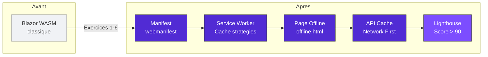
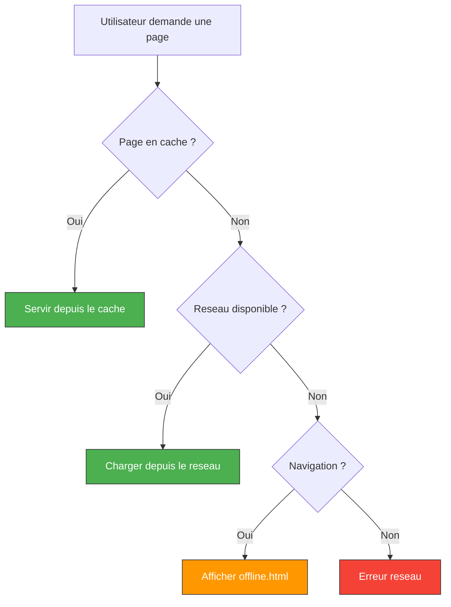
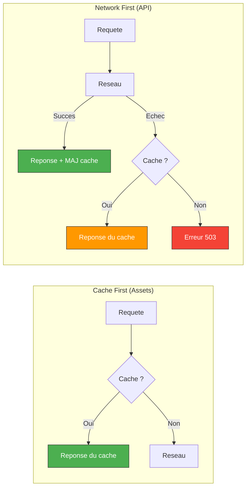
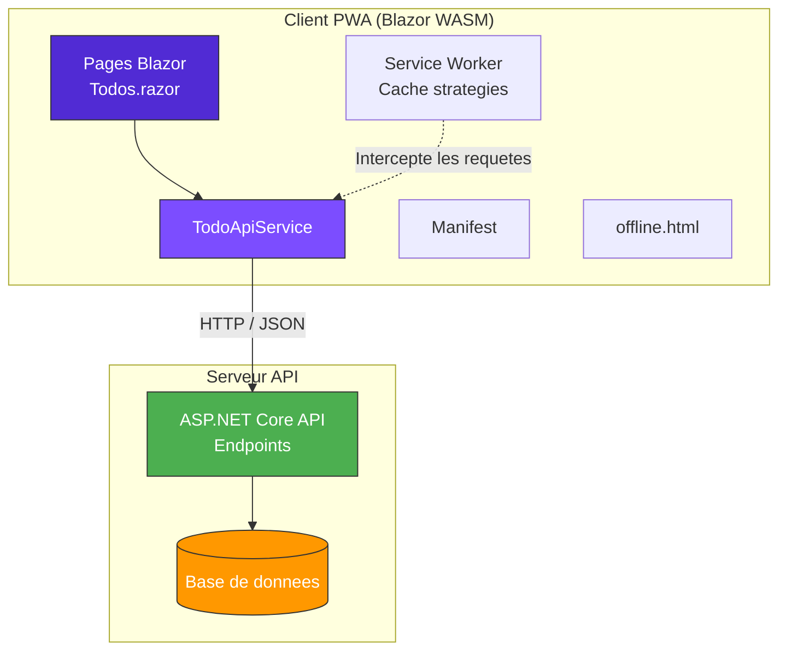

# Module 05 - Exercices : Transformer Blazor en PWA

<div align="center">

| | |
|---|---|
| **Difficulte globale** | :star: :star: :star: Junior C# / Blazor |
| **Duree totale estimee** | :clock3: 60-90 minutes |
| **Prerequis** | .NET 9 SDK, Visual Studio 2022 / VS Code, Chrome ou Edge |

</div>

---

## :dart: Ce que vous allez construire

A la fin de ce module, vous aurez transforme une application Blazor WebAssembly en une **Progressive Web App** complete, installable et fonctionnelle hors-ligne.



### Vue d'ensemble des exercices

| # | Exercice | Difficulte | Duree |
|:-:|----------|:----------:|:-----:|
| 1 | Creer une Blazor WASM PWA depuis le template | :star: | 10 min |
| 2 | Configurer le manifest avec des icones personnalisees | :star: | 15 min |
| 3 | Implementer une page de secours hors-ligne | :star::star: | 15 min |
| 4 | Ajouter une strategie de cache pour les appels API | :star::star: | 20 min |
| 5 | Convertir FamilyHub en PWA | :star::star::star: | 30 min |
| 6 | Audit Lighthouse et optimisation du score | :star::star: | 15 min |

---

## Exercice 1 : Creer une Blazor WASM PWA depuis le template

<div align="center">

| | |
|---|---|
| **Difficulte** | :star: Facile |
| **Duree estimee** | :clock3: 10 minutes |
| **Objectif** | Se familiariser avec le template PWA de Blazor et verifier le bon fonctionnement de l'environnement |

</div>

### Enonce

Creez un nouveau projet Blazor WebAssembly avec le support PWA active et verifiez que tous les elements PWA sont bien en place.

### Etapes

#### - [ ] Etape 1/5 -- Creer le projet

Ouvrez un terminal et creez un nouveau projet :

```bash
dotnet new blazorwasm --pwa -o FamilyHub.Pwa
cd FamilyHub.Pwa
```

#### - [ ] Etape 2/5 -- Explorer la structure

Ouvrez le projet dans Visual Studio ou VS Code et explorez la structure des fichiers.

> **Astuce** : Portez une attention particuliere aux fichiers `manifest.webmanifest`, `service-worker.js` et `service-worker.published.js` dans le dossier `wwwroot/`.

#### - [ ] Etape 3/5 -- Lancer l'application

```bash
dotnet run
```

#### - [ ] Etape 4/5 -- Ouvrir dans le navigateur

Ouvrez Chrome a l'adresse indiquee (ex: `https://localhost:5001`).

#### - [ ] Etape 5/5 -- Inspecter avec les DevTools

Ouvrez les DevTools (F12) et allez dans l'onglet **Application**.

### Resultat attendu

> Apres cette etape, vous devriez voir dans les DevTools :
> - L'onglet **Manifest** affiche les informations de votre application
> - L'onglet **Service Workers** montre un SW enregistre
> - L'application s'affiche normalement dans le navigateur

### Questions a verifier

Repondez a ces questions en explorant les DevTools :

- [ ] **Manifest** : Le manifest est-il detecte ? Quel est le `display` mode ? Combien d'icones sont declarees ?
- [ ] **Service Workers** : Le Service Worker est-il enregistre ? Quel est son statut (installed, activated) ?
- [ ] **Cache Storage** : Y a-t-il des caches ? Combien d'entrees contiennent-ils ?

### Questions de reflexion

1. Ouvrez le fichier `wwwroot/service-worker.js`. Que fait-il ? Pourquoi est-il si simple ?
2. Ouvrez le fichier `wwwroot/service-worker.published.js`. En quoi est-il different ? Quand est-il utilise ?
3. Ouvrez le fichier `.csproj`. Trouvez les deux elements lies au Service Worker. Que font-ils ?

<details>
<summary>:bulb: Indice pour la question 1</summary>

Le Service Worker de developpement est volontairement minimaliste. Pensez a ce qui se passerait si les fichiers etaient mis en cache pendant le developpement -- verriez-vous vos modifications ?

</details>

<details>
<summary>:bulb: Indice pour la question 3</summary>

Recherchez les elements `<ServiceWorkerAssetsManifest>` et `<ServiceWorker>` dans le fichier `.csproj`. L'un genere un inventaire des assets, l'autre indique quel fichier SW utiliser selon l'environnement.

</details>

### Resultat attendu final

Vous devez pouvoir confirmer que :
- Le manifest est correctement detecte dans les DevTools
- Le Service Worker est enregistre et actif
- L'application fonctionne normalement dans le navigateur

### Correction

<details>
<summary>Cliquez pour voir la correction</summary>

**Reponses aux questions de verification :**

1. **Manifest** : Oui, le manifest est detecte. Le `display` mode est `standalone`. Il y a 2 icones (192x192 et 512x512).

2. **Service Workers** : Le SW est enregistre avec le statut `activated and running`. Le scope est `/`.

3. **Cache Storage** : En mode developpement, le cache est generalement vide car le SW de dev ne cache rien.

**Reponses aux questions de reflexion :**

1. `service-worker.js` ne fait rien (juste `self.addEventListener('fetch', () => { });`). C'est volontaire : en developpement, on ne veut pas de cache pour voir les changements immediatement.

2. `service-worker.published.js` contient toute la logique de cache : pre-chargement des assets, interception des requetes, strategie Cache First. Il est utilise lors d'un `dotnet publish` (mode production).

3. Dans le `.csproj` :
   - `<ServiceWorkerAssetsManifest>` : genere un fichier JS listant tous les assets avec leurs hashes SHA-256
   - `<ServiceWorker Include="..." PublishedContent="...">` : indique quel fichier SW utiliser en dev vs en production

</details>

---

## Exercice 2 : Configurer le manifest avec des icones personnalisees

<div align="center">

| | |
|---|---|
| **Difficulte** | :star: Facile |
| **Duree estimee** | :clock3: 15 minutes |
| **Objectif** | Personnaliser le manifest.webmanifest et generer des icones adaptees a FamilyHub |

</div>

### Enonce

Transformez le manifest par defaut en un manifest complet et professionnel pour l'application FamilyHub. Generez des icones personnalisees et configurez les meta tags iOS.

### Etapes

#### - [ ] Etape 1/5 -- Personnaliser le manifest

Modifiez le fichier `wwwroot/manifest.webmanifest` avec les informations suivantes :

| Propriete | Valeur |
|-----------|--------|
| name | FamilyHub - Gestion Familiale |
| short_name | FamilyHub |
| description | Gerez taches, courses et evenements en famille |
| start_url | ./ |
| display | standalone |
| background_color | #f0f2f5 |
| theme_color | #512BD4 |
| orientation | any |
| lang | fr |

#### - [ ] Etape 2/5 -- Generer les icones

Vous pouvez soit :

**Option A** : Utiliser un generateur en ligne
1. Allez sur https://www.pwabuilder.com/imageGenerator
2. Uploadez une image source (utilisez un logo simple ou un emoji)
3. Telechargez le pack d'icones
4. Placez les icones dans `wwwroot/icons/`

**Option B** : Creer une icone minimaliste
1. Creez un fichier SVG simple (un "F" dans un cercle par exemple)
2. Utilisez un convertisseur SVG vers PNG a differentes tailles

> **Note** : Les tailles minimales requises sont **192x192** et **512x512**.
> Tailles recommandees : 72, 96, 128, 144, 152, 192, 384, 512.

#### - [ ] Etape 3/5 -- Mettre a jour les references d'icones dans le manifest

Ajoutez toutes les icones dans la section `icons` du manifest. Pour l'icone 512x512, ajoutez `"purpose": "any maskable"`.

<details>
<summary>:bulb: Indice -- structure d'une entree icone</summary>

Chaque icone dans le manifest suit cette structure :
```json
{
    "src": "icons/icon-192x192.png",
    "sizes": "192x192",
    "type": "image/png",
    "purpose": "any"
}
```
Le champ `purpose` peut etre `"any"`, `"maskable"` ou `"any maskable"`.

</details>

#### - [ ] Etape 4/5 -- Ajouter les meta tags iOS

Ouvrez `wwwroot/index.html` et ajoutez les meta tags suivants dans le `<head>` :

```html
<!-- File: wwwroot/index.html (dans le <head>) -->
<meta name="apple-mobile-web-app-capable" content="yes" />
<meta name="apple-mobile-web-app-status-bar-style" content="default" />
<meta name="apple-mobile-web-app-title" content="FamilyHub" />
<link rel="apple-touch-icon" sizes="192x192" href="icons/icon-192x192.png" />
<link rel="apple-touch-icon" sizes="512x512" href="icons/icon-512x512.png" />
```

> **Attention** : Ces meta tags sont necessaires car Safari sur iOS ne lit pas completement le fichier `manifest.webmanifest`. Sans eux, l'application ne sera pas installable sur iPhone/iPad.

#### - [ ] Etape 5/5 -- Ajouter des raccourcis (shortcuts)

Ajoutez au moins 2 raccourcis dans le manifest :
- "Ajouter une tache" qui pointe vers `/taches/nouveau`
- "Liste de courses" qui pointe vers `/courses`

### Resultat attendu

> Apres cette etape, dans les DevTools > Application > Manifest, vous devriez voir :
> - Le nom "FamilyHub - Gestion Familiale"
> - La couleur de theme violette (#512BD4)
> - Toutes vos icones listees
> - Les raccourcis affiches

### Verification

Relancez l'application et verifiez dans les DevTools :

- [ ] Le manifest affiche le bon nom et les bonnes couleurs
- [ ] Les icones sont detectees et affichees
- [ ] Il n'y a pas de warnings dans la section Manifest
- [ ] Les raccourcis apparaissent

### Correction

<details>
<summary>Cliquez pour voir la correction</summary>

**manifest.webmanifest complet :**

```json
// File: wwwroot/manifest.webmanifest
{
    "name": "FamilyHub - Gestion Familiale",
    "short_name": "FamilyHub",
    "description": "Gerez taches, courses et evenements en famille",
    "start_url": "./",
    "display": "standalone",
    "background_color": "#f0f2f5",
    "theme_color": "#512BD4",
    "orientation": "any",
    "lang": "fr",
    "prefer_related_applications": false,
    "icons": [
        {
            "src": "icons/icon-72x72.png",
            "sizes": "72x72",
            "type": "image/png"
        },
        {
            "src": "icons/icon-96x96.png",
            "sizes": "96x96",
            "type": "image/png"
        },
        {
            "src": "icons/icon-128x128.png",
            "sizes": "128x128",
            "type": "image/png"
        },
        {
            "src": "icons/icon-144x144.png",
            "sizes": "144x144",
            "type": "image/png"
        },
        {
            "src": "icons/icon-152x152.png",
            "sizes": "152x152",
            "type": "image/png"
        },
        {
            "src": "icons/icon-192x192.png",
            "sizes": "192x192",
            "type": "image/png",
            "purpose": "any"
        },
        {
            "src": "icons/icon-384x384.png",
            "sizes": "384x384",
            "type": "image/png"
        },
        {
            "src": "icons/icon-512x512.png",
            "sizes": "512x512",
            "type": "image/png",
            "purpose": "any maskable"
        }
    ],
    "shortcuts": [
        {
            "name": "Ajouter une tache",
            "short_name": "Tache",
            "description": "Creer une nouvelle tache familiale",
            "url": "/taches/nouveau",
            "icons": [{"src": "icons/icon-96x96.png", "sizes": "96x96"}]
        },
        {
            "name": "Liste de courses",
            "short_name": "Courses",
            "description": "Voir la liste de courses",
            "url": "/courses",
            "icons": [{"src": "icons/icon-96x96.png", "sizes": "96x96"}]
        }
    ]
}
```

**index.html (ajouts dans le `<head>`) :**

```html
<!-- File: wwwroot/index.html -->
<meta name="apple-mobile-web-app-capable" content="yes" />
<meta name="apple-mobile-web-app-status-bar-style" content="default" />
<meta name="apple-mobile-web-app-title" content="FamilyHub" />
<link rel="apple-touch-icon" sizes="192x192" href="icons/icon-192x192.png" />
<link rel="apple-touch-icon" sizes="512x512" href="icons/icon-512x512.png" />
```

</details>

---

## Exercice 3 : Implementer une page de secours hors-ligne

<div align="center">

| | |
|---|---|
| **Difficulte** | :star::star: Moyen |
| **Duree estimee** | :clock3: 15 minutes |
| **Objectif** | Creer une page offline attractive et l'integrer au Service Worker |

</div>

### Enonce

Quand un utilisateur est hors-ligne et tente d'acceder a une page qui n'est pas dans le cache, il doit voir une page de secours informative et esthetique, plutot qu'une erreur generique du navigateur.



### Etapes

#### - [ ] Etape 1/4 -- Creer la page `offline.html`

Creez un fichier `wwwroot/offline.html` avec les elements suivants :

- Un titre "Vous etes hors-ligne"
- Un message expliquant que l'app necessite une connexion
- Un rappel que les pages deja visitees restent accessibles
- Un bouton "Reessayer" qui fait `window.location.reload()`
- Un design agreable (couleurs FamilyHub : violet `#512BD4`, gris clair `#f0f2f5`)
- La page doit fonctionner **sans aucune ressource externe** (pas de CDN, pas de CSS externe). Tout le CSS doit etre inline.

> **Attention** : Pourquoi du CSS inline ? Parce que cette page est affichee quand l'utilisateur est hors-ligne. Si le CSS est dans un fichier externe qui n'est pas en cache, la page sera sans style.

<details>
<summary>:bulb: Indice -- structure de base</summary>

```html
<!DOCTYPE html>
<html lang="fr">
<head>
    <meta charset="utf-8" />
    <meta name="viewport" content="width=device-width, initial-scale=1" />
    <title>FamilyHub - Hors ligne</title>
    <style>
        /* Tout le CSS ici, directement dans le fichier */
        body {
            font-family: -apple-system, BlinkMacSystemFont, 'Segoe UI', Roboto, sans-serif;
            /* Centrez le contenu verticalement et horizontalement */
        }
    </style>
</head>
<body>
    <!-- Votre contenu ici -->
</body>
</html>
```

</details>

#### - [ ] Etape 2/4 -- Pre-cacher la page offline

Modifiez le fichier `wwwroot/service-worker.published.js` pour ajouter `offline.html` a la liste des fichiers pre-caches.

Dans la fonction `onInstall`, ajoutez `offline.html` aux fichiers mis en cache :

```javascript
// File: wwwroot/service-worker.published.js

async function onInstall(event) {
    const assetsRequests = self.assetsManifest.assets
        .filter(asset => asset.hash && !asset.url.endsWith('.gz'))
        .map(asset => new Request(asset.url, {
            integrity: asset.hash,
            cache: 'no-cache'
        }));

    const cache = await caches.open(cacheName);
    // Ajouter les assets ET la page offline
    await cache.addAll([...assetsRequests]);
    await cache.add('offline.html');  // <-- AJOUT
}
```

#### - [ ] Etape 3/4 -- Servir la page offline en fallback

Modifiez la fonction `onFetch` pour servir `offline.html` quand une requete de navigation echoue :

```javascript
// File: wwwroot/service-worker.published.js

async function onFetch(event) {
    let cachedResponse = null;

    if (event.request.method === 'GET') {
        const shouldServeIndexHtml = event.request.mode === 'navigate';
        const request = shouldServeIndexHtml ? 'index.html' : event.request;
        const cache = await caches.open(cacheName);
        cachedResponse = await cache.match(request);
    }

    if (cachedResponse) {
        return cachedResponse;
    }

    // Essayer le reseau
    try {
        return await fetch(event.request);
    } catch (error) {
        // Navigation hors-ligne : servir la page offline
        if (event.request.mode === 'navigate') {
            const cache = await caches.open(cacheName);
            return await cache.match('offline.html');
        }
        throw error;
    }
}
```

#### - [ ] Etape 4/4 -- Tester

1. Publiez l'application en mode production :
```bash
dotnet publish -c Release
```

2. Servez les fichiers publies (utilisez un serveur simple) :
```bash
# Installer dotnet-serve si necessaire
dotnet tool install -g dotnet-serve

# Servir les fichiers
dotnet serve -d bin/Release/net9.0/publish/wwwroot -p 8080
```

3. Ouvrez Chrome a `http://localhost:8080`

4. Naviguez sur quelques pages pour remplir le cache

5. Dans les DevTools > Application > Service Workers, cochez **Offline**

6. Essayez de naviguer vers une page qui n'existe pas (ex: `/page-inexistante`)

### Resultat attendu

> Lorsque vous activez le mode Offline dans les DevTools et naviguez vers une page non cachee, vous devriez voir :
> - Votre page `offline.html` avec le design FamilyHub (fond violet, texte blanc)
> - Le bouton "Reessayer" qui recharge la page
> - Les pages deja visitees continuent de fonctionner normalement

### Verification

- [ ] La page offline s'affiche avec un design correct (pas de page d'erreur navigateur)
- [ ] Le bouton "Reessayer" recharge la page
- [ ] Les pages deja visitees continuent de fonctionner en offline
- [ ] Quand on decoche Offline, l'application reprend normalement

### Correction

<details>
<summary>Cliquez pour voir la correction</summary>

**wwwroot/offline.html :**

```html
<!-- File: wwwroot/offline.html -->
<!DOCTYPE html>
<html lang="fr">
<head>
    <meta charset="utf-8" />
    <meta name="viewport" content="width=device-width, initial-scale=1" />
    <title>FamilyHub - Hors ligne</title>
    <style>
        * {
            margin: 0;
            padding: 0;
            box-sizing: border-box;
        }
        body {
            font-family: -apple-system, BlinkMacSystemFont, 'Segoe UI', Roboto, sans-serif;
            display: flex;
            justify-content: center;
            align-items: center;
            min-height: 100vh;
            background: linear-gradient(135deg, #512BD4 0%, #7c4dff 50%, #b47cff 100%);
            color: white;
            padding: 1rem;
        }
        .container {
            text-align: center;
            max-width: 480px;
        }
        .icon {
            font-size: 5rem;
            margin-bottom: 1.5rem;
            display: block;
        }
        h1 {
            font-size: 2rem;
            margin-bottom: 1rem;
            font-weight: 700;
        }
        p {
            font-size: 1.1rem;
            line-height: 1.7;
            opacity: 0.9;
            margin-bottom: 0.5rem;
        }
        .hint {
            font-size: 0.95rem;
            opacity: 0.75;
            margin-top: 1rem;
            font-style: italic;
        }
        .retry-btn {
            display: inline-block;
            margin-top: 2rem;
            padding: 0.9rem 2.5rem;
            background: rgba(255, 255, 255, 0.95);
            color: #512BD4;
            border: none;
            border-radius: 30px;
            font-size: 1.1rem;
            font-weight: 600;
            cursor: pointer;
            transition: transform 0.2s, box-shadow 0.2s;
            text-decoration: none;
        }
        .retry-btn:hover {
            transform: translateY(-2px);
            box-shadow: 0 4px 15px rgba(0, 0, 0, 0.2);
        }
        .retry-btn:active {
            transform: translateY(0);
        }
    </style>
</head>
<body>
    <div class="container">
        <span class="icon">&#128268;</span>
        <h1>Vous etes hors-ligne</h1>
        <p>
            FamilyHub ne peut pas charger cette page car
            vous n'etes pas connecte a Internet.
        </p>
        <p>
            Verifiez votre connexion Wi-Fi ou donnees mobiles,
            puis reessayez.
        </p>
        <p class="hint">
            Les pages deja consultees restent accessibles hors-ligne.
        </p>
        <button class="retry-btn" onclick="window.location.reload()">
            Reessayer
        </button>
    </div>
</body>
</html>
```

Les modifications dans `service-worker.published.js` sont celles decrites dans les etapes 2 et 3 de l'enonce.

</details>

---

## Exercice 4 : Ajouter une strategie de cache pour les appels API

<div align="center">

| | |
|---|---|
| **Difficulte** | :star::star: Moyen |
| **Duree estimee** | :clock3: 20 minutes |
| **Objectif** | Implementer une strategie Network First pour les appels API |

</div>

### Contexte

Le Service Worker par defaut de Blazor utilise une strategie **Cache First** pour tous les assets de l'application. C'est parfait pour les fichiers statiques (HTML, CSS, JS, DLL), mais pour les appels API, on veut une strategie **Network First** :



1. En ligne : aller chercher les donnees fraiches sur le serveur et mettre a jour le cache
2. Hors-ligne : servir les donnees en cache (dernieres donnees connues)

### Etapes

#### - [ ] Etape 1/5 -- Creer un projet avec une API simulee

Si vous n'avez pas encore d'API, vous pouvez utiliser les donnees de demonstration du template (`sample-data/weather.json`) :

1. Verifiez que le fichier `wwwroot/sample-data/weather.json` existe
2. Le composant `FetchData.razor` appelle deja ce fichier JSON

Ou, pour simuler une vraie API :

```csharp
// File: Program.cs (client WASM)
builder.Services.AddScoped(sp => new HttpClient
{
    BaseAddress = new Uri(builder.HostEnvironment.BaseAddress)
});
```

#### - [ ] Etape 2/5 -- Implementer la strategie Network First

Modifiez `wwwroot/service-worker.published.js`. Ajoutez une fonction `networkFirst` :

```javascript
// File: wwwroot/service-worker.published.js

const apiCacheName = 'api-cache-v1';

async function networkFirst(request) {
    const cache = await caches.open(apiCacheName);

    try {
        // 1. Essayer le reseau
        const networkResponse = await fetch(request);

        // 2. Si reussi, mettre a jour le cache
        if (networkResponse.ok) {
            cache.put(request, networkResponse.clone());
        }

        return networkResponse;
    } catch (error) {
        // 3. Reseau echoue : chercher dans le cache
        const cachedResponse = await cache.match(request);

        if (cachedResponse) {
            return cachedResponse;
        }

        // 4. Rien dans le cache : retourner une reponse d'erreur
        return new Response(
            JSON.stringify({
                error: true,
                message: 'Donnees non disponibles hors-ligne'
            }),
            {
                status: 503,
                headers: { 'Content-Type': 'application/json' }
            }
        );
    }
}
```

#### - [ ] Etape 3/5 -- Router les requetes API vers la strategie Network First

Modifiez la fonction `onFetch` pour distinguer les requetes API des requetes d'assets :

```javascript
// File: wwwroot/service-worker.published.js

async function onFetch(event) {
    const url = new URL(event.request.url);

    // Si c'est un appel API ou des donnees JSON : Network First
    if (url.pathname.startsWith('/api/') ||
        url.pathname.endsWith('.json')) {
        return networkFirst(event.request);
    }

    // Sinon : strategie Cache First existante (assets Blazor)
    let cachedResponse = null;

    if (event.request.method === 'GET') {
        const shouldServeIndexHtml = event.request.mode === 'navigate';
        const request = shouldServeIndexHtml ? 'index.html' : event.request;
        const cache = await caches.open(cacheName);
        cachedResponse = await cache.match(request);
    }

    if (cachedResponse) {
        return cachedResponse;
    }

    try {
        return await fetch(event.request);
    } catch (error) {
        if (event.request.mode === 'navigate') {
            const cache = await caches.open(cacheName);
            return await cache.match('offline.html');
        }
        throw error;
    }
}
```

> **Note** : La condition `url.pathname.endsWith('.json')` permet de cacher aussi les fichiers JSON statiques (comme `weather.json` du template). En production, vous pourriez vouloir etre plus precis dans le filtrage.

#### - [ ] Etape 4/5 -- Nettoyer le cache API lors de l'activation

Ajoutez le nettoyage du cache API dans la fonction `onActivate` :

```javascript
// File: wwwroot/service-worker.published.js

async function onActivate(event) {
    const cacheKeys = await caches.keys();
    await Promise.all(
        cacheKeys
            .filter(key =>
                (key.startsWith(cacheNamePrefix) && key !== cacheName) ||
                (key.startsWith('api-cache-') && key !== apiCacheName)
            )
            .map(key => caches.delete(key))
    );
}
```

#### - [ ] Etape 5/5 -- Tester

1. Publiez et servez l'application en mode production
2. Ouvrez la page FetchData (qui charge les donnees meteo)
3. Verifiez dans DevTools > Application > Cache Storage qu'un cache `api-cache-v1` apparait avec les donnees
4. Activez le mode Offline dans les DevTools
5. Rechargez la page FetchData : les donnees doivent toujours s'afficher depuis le cache
6. Allez sur une page API que vous n'avez pas visitee : vous devez voir le message d'erreur JSON

### Resultat attendu

> Apres cette etape :
> - En mode **online** : les donnees sont chargees depuis le reseau et mises en cache
> - En mode **offline** : les donnees deja consultees sont servies depuis le cache `api-cache-v1`
> - Pour les donnees non cachees en offline : une reponse JSON 503 propre est retournee

### Verification

- [ ] Les donnees API sont mises en cache apres la premiere visite
- [ ] En mode offline, les donnees cachees sont toujours accessibles
- [ ] En mode offline, une requete API non cachee retourne une erreur JSON propre (pas une erreur navigateur)
- [ ] Apres retour en ligne, les donnees sont mises a jour depuis le reseau

### Bonus

Implementez la strategie **Stale While Revalidate** comme alternative :

```javascript
// File: wwwroot/service-worker.published.js (bonus)

async function staleWhileRevalidate(request) {
    const cache = await caches.open(apiCacheName);
    const cachedResponse = await cache.match(request);

    const fetchPromise = fetch(request)
        .then(networkResponse => {
            if (networkResponse.ok) {
                cache.put(request, networkResponse.clone());
            }
            return networkResponse;
        })
        .catch(() => cachedResponse);

    return cachedResponse || fetchPromise;
}
```

Remplacez `networkFirst` par `staleWhileRevalidate` pour les requetes API et observez la difference de comportement.

<details>
<summary>:bulb: Indice -- Difference entre les strategies</summary>

| Strategie | Comportement | Avantage | Inconvenient |
|-----------|-------------|----------|--------------|
| **Network First** | Attend le reseau, fallback sur le cache | Donnees toujours fraiches | Plus lent en ligne |
| **Stale While Revalidate** | Sert le cache immediatement, met a jour en arriere-plan | Tres rapide | Donnees potentiellement obsoletes |
| **Cache First** | Sert le cache, ne va au reseau que si absent | Le plus rapide | Ne se met jamais a jour seul |

</details>

### Correction

<details>
<summary>Cliquez pour voir la correction</summary>

Le fichier `service-worker.published.js` complet est fourni dans les etapes ci-dessus. Les points cles sont :

1. **Separation des strategies** : les requetes API utilisent `networkFirst`, les assets utilisent la strategie Cache First existante de Blazor.

2. **Cache separe** : les donnees API sont stockees dans un cache separe (`api-cache-v1`) des assets de l'application. Cela permet de les gerer independamment.

3. **Reponse d'erreur propre** : quand les donnees ne sont ni sur le reseau ni dans le cache, on retourne une reponse JSON avec un status 503 plutot qu'une erreur brute. Cote Blazor, on peut intercepter cette reponse et afficher un message adequat :

```csharp
// File: Services/TaskService.cs
public async Task<List<Tache>> GetAllAsync()
{
    try
    {
        var response = await _http.GetAsync("api/taches");

        if (response.StatusCode == System.Net.HttpStatusCode.ServiceUnavailable)
        {
            // Donnees non disponibles hors-ligne
            return new List<Tache>();
        }

        response.EnsureSuccessStatusCode();
        return await response.Content.ReadFromJsonAsync<List<Tache>>() ?? new();
    }
    catch (HttpRequestException)
    {
        return new List<Tache>();
    }
}
```

4. **Difference entre Network First et Stale While Revalidate** :
   - Network First : attend le reseau (plus lent en ligne, toujours frais)
   - SWR : sert le cache immediatement (plus rapide, potentiellement obsolete)

</details>

---

## Exercice 5 : Convertir FamilyHub en PWA

<div align="center">

| | |
|---|---|
| **Difficulte** | :star::star::star: Avance |
| **Duree estimee** | :clock3: 30 minutes |
| **Objectif** | Transformer le projet FamilyHub existant en une PWA Blazor WASM complete |

</div>

### Contexte

Jusqu'ici, FamilyHub est une application serveur. Dans cet exercice, vous allez creer un client Blazor WASM PWA qui communique avec l'API existante.



### Etapes

#### - [ ] Etape 1/10 -- Creer le projet client

```bash
# Depuis la racine de la solution pragmatic-architecture
dotnet new blazorwasm --pwa -o src/FamilyHub.Pwa
dotnet sln add src/FamilyHub.Pwa/FamilyHub.Pwa.csproj
```

#### - [ ] Etape 2/10 -- Ajouter les packages necessaires

```bash
cd src/FamilyHub.Pwa
dotnet add package Microsoft.Extensions.Http
```

#### - [ ] Etape 3/10 -- Configurer le HttpClient

Modifiez `Program.cs` du projet `FamilyHub.Pwa` :

```csharp
// File: src/FamilyHub.Pwa/Program.cs
using Microsoft.AspNetCore.Components.Web;
using Microsoft.AspNetCore.Components.WebAssembly.Hosting;
using FamilyHub.Pwa;

var builder = WebAssemblyHostBuilder.CreateDefault(args);
builder.RootComponents.Add<App>("#app");
builder.RootComponents.Add<HeadOutlet>("head::after");

// Configurer le HttpClient pour communiquer avec l'API
builder.Services.AddScoped(sp => new HttpClient
{
    BaseAddress = new Uri("https://localhost:7001") // Port de l'API
});

await builder.Build().RunAsync();
```

> **Astuce** : Le port de l'API peut varier selon votre configuration. Verifiez dans `launchSettings.json` de votre projet API.

#### - [ ] Etape 4/10 -- Creer un service qui appelle l'API

Creez le fichier `Services/TodoApiService.cs` :

```csharp
// File: src/FamilyHub.Pwa/Services/TodoApiService.cs
using System.Net.Http.Json;

namespace FamilyHub.Pwa.Services;

public class TodoApiService
{
    private readonly HttpClient _http;

    public TodoApiService(HttpClient http) => _http = http;

    public async Task<List<TodoItemDto>> GetAllAsync()
    {
        try
        {
            return await _http.GetFromJsonAsync<List<TodoItemDto>>("api/todos")
                ?? new List<TodoItemDto>();
        }
        catch (HttpRequestException)
        {
            // Hors-ligne ou erreur reseau
            return new List<TodoItemDto>();
        }
    }

    public async Task<TodoItemDto?> CreateAsync(CreateTodoDto dto)
    {
        var response = await _http.PostAsJsonAsync("api/todos", dto);
        if (response.IsSuccessStatusCode)
        {
            return await response.Content.ReadFromJsonAsync<TodoItemDto>();
        }
        return null;
    }

    public async Task<bool> ToggleCompleteAsync(int id)
    {
        var response = await _http.PutAsync($"api/todos/{id}/toggle", null);
        return response.IsSuccessStatusCode;
    }

    public async Task<bool> DeleteAsync(int id)
    {
        var response = await _http.DeleteAsync($"api/todos/{id}");
        return response.IsSuccessStatusCode;
    }
}

public record TodoItemDto(int Id, string Title, string? Description, bool IsCompleted, DateTime CreatedAt);
public record CreateTodoDto(string Title, string? Description);
```

Enregistrez le service dans `Program.cs` :

```csharp
// File: src/FamilyHub.Pwa/Program.cs (ajout)
builder.Services.AddScoped<TodoApiService>();
```

#### - [ ] Etape 5/10 -- Creer une page de liste des taches

Creez le fichier `Pages/Todos.razor` :

```razor
@* File: src/FamilyHub.Pwa/Pages/Todos.razor *@
@page "/todos"
@inject TodoApiService TodoService

<h1>Taches FamilyHub</h1>

<div class="mb-3">
    <input @bind="newTitle" @bind:event="oninput"
           placeholder="Nouvelle tache..."
           class="form-control d-inline-block"
           style="max-width: 400px;"
           @onkeypress="HandleKeyPress" />
    <button @onclick="AddTodoAsync" class="btn btn-primary ms-2"
            disabled="@string.IsNullOrWhiteSpace(newTitle)">
        Ajouter
    </button>
</div>

@if (todos == null)
{
    <p><em>Chargement...</em></p>
}
else if (!todos.Any())
{
    <p>Aucune tache. Ajoutez-en une !</p>
}
else
{
    <ul class="list-group">
        @foreach (var todo in todos)
        {
            <li class="list-group-item d-flex justify-content-between align-items-center">
                <div>
                    <input type="checkbox" checked="@todo.IsCompleted"
                           @onchange="() => ToggleAsync(todo.Id)"
                           class="form-check-input me-2" />
                    <span class="@(todo.IsCompleted ? "text-decoration-line-through text-muted" : "")">
                        @todo.Title
                    </span>
                </div>
                <button @onclick="() => DeleteAsync(todo.Id)"
                        class="btn btn-outline-danger btn-sm">
                    Supprimer
                </button>
            </li>
        }
    </ul>
}

@code {
    private List<TodoItemDto>? todos;
    private string newTitle = "";

    protected override async Task OnInitializedAsync()
    {
        todos = await TodoService.GetAllAsync();
    }

    private async Task AddTodoAsync()
    {
        if (string.IsNullOrWhiteSpace(newTitle)) return;

        var created = await TodoService.CreateAsync(new CreateTodoDto(newTitle, null));
        if (created != null)
        {
            todos?.Insert(0, created);
            newTitle = "";
        }
    }

    private async Task ToggleAsync(int id)
    {
        await TodoService.ToggleCompleteAsync(id);
        todos = await TodoService.GetAllAsync();
    }

    private async Task DeleteAsync(int id)
    {
        await TodoService.DeleteAsync(id);
        todos?.RemoveAll(t => t.Id == id);
    }

    private async Task HandleKeyPress(KeyboardEventArgs e)
    {
        if (e.Key == "Enter")
        {
            await AddTodoAsync();
        }
    }
}
```

#### - [ ] Etape 6/10 -- Ajouter le lien dans la navigation

Modifiez `Shared/NavMenu.razor` pour ajouter un lien vers la page Todos :

```razor
@* File: src/FamilyHub.Pwa/Shared/NavMenu.razor (ajout) *@
<div class="nav-item px-3">
    <NavLink class="nav-link" href="todos">
        <span class="oi oi-list-rich" aria-hidden="true"></span> Taches
    </NavLink>
</div>
```

#### - [ ] Etape 7/10 -- Personnaliser le manifest

Appliquez les personnalisations de l'exercice 2 au manifest.

<details>
<summary>:bulb: Indice -- rappel rapide</summary>

Reportez-vous a la correction de l'exercice 2 pour le contenu complet du `manifest.webmanifest`. N'oubliez pas les proprietes `name`, `short_name`, `theme_color`, `icons` et `shortcuts`.

</details>

#### - [ ] Etape 8/10 -- Ajouter la page offline et les strategies de cache

Appliquez les modifications des exercices 3 et 4.

#### - [ ] Etape 9/10 -- Configurer CORS sur l'API

Si l'API tourne sur un port different, ajoutez la configuration CORS dans le `Program.cs` de l'API :

```csharp
// File: src/Api/Program.cs
builder.Services.AddCors(options =>
{
    options.AddPolicy("AllowPwa", policy =>
    {
        policy.WithOrigins("https://localhost:5001", "http://localhost:5000")
              .AllowAnyMethod()
              .AllowAnyHeader();
    });
});

// Dans le pipeline
app.UseCors("AllowPwa");
```

> **Attention** : Sans la configuration CORS, tous les appels API depuis le client PWA seront bloques par le navigateur avec une erreur `CORS policy`. C'est un mecanisme de securite du navigateur.

#### - [ ] Etape 10/10 -- Tester la PWA complete

1. Lancez l'API :
```bash
cd src/Api
dotnet run
```

2. Lancez le client PWA :
```bash
cd src/FamilyHub.Pwa
dotnet run
```

3. Verifiez :
- [ ] Les taches se chargent depuis l'API
- [ ] L'ajout, la modification et la suppression fonctionnent
- [ ] Le manifest est correctement configure
- [ ] Le Service Worker est actif

4. Publiez et testez en mode production :
```bash
cd src/FamilyHub.Pwa
dotnet publish -c Release
dotnet serve -d bin/Release/net9.0/publish/wwwroot -p 8080
```

5. Verifiez le mode offline :
- [ ] Les pages deja visitees sont accessibles
- [ ] Les donnees API en cache sont affichees
- [ ] La page offline s'affiche pour les pages non cachees

### Resultat attendu

> A ce stade, vous devez avoir :
> - Un client PWA Blazor WASM qui communique avec votre API
> - Une liste de taches fonctionnelle (CRUD complet)
> - Le mode offline qui fonctionne pour les pages et donnees deja visitees
> - L'application installable depuis Chrome (icone dans la barre d'adresse)

### Correction

<details>
<summary>Cliquez pour voir la correction</summary>

La correction complete est constituee de l'ensemble du code fourni dans les etapes ci-dessus. Les points cles sont :

1. **Separation client/API** : le client WASM communique avec l'API via HTTP. C'est la base de l'architecture PWA.

2. **Gestion des erreurs reseau** : le `TodoApiService` capture les `HttpRequestException` et retourne des listes vides plutot que de planter. L'interface reste fonctionnelle meme si l'API est inaccessible.

3. **CORS** : configuration indispensable quand client et API sont sur des origines differentes. Sans CORS, tous les appels API seront bloques par le navigateur.

4. **Combinaison des exercices** : cet exercice combine les acquis des exercices 2 (manifest), 3 (offline) et 4 (cache API). C'est l'integration finale.

5. **Test en production** : le `dotnet publish` active le vrai Service Worker (service-worker.published.js) avec le cache complet. En developpement, le SW est inactif.

</details>

---

## Exercice 6 : Audit Lighthouse et optimisation du score

<div align="center">

| | |
|---|---|
| **Difficulte** | :star::star: Moyen |
| **Duree estimee** | :clock3: 15 minutes |
| **Objectif** | Lancer un audit Lighthouse et optimiser le score pour atteindre au minimum 90 dans chaque categorie |

</div>

### Prerequis

Vous devez avoir complete l'exercice 5 (ou au minimum l'exercice 1) avec l'application publiee en mode production.

### Etapes

#### - [ ] Etape 1/6 -- Publier l'application

```bash
cd src/FamilyHub.Pwa    # ou le dossier de votre projet PWA
dotnet publish -c Release
dotnet serve -d bin/Release/net9.0/publish/wwwroot -p 8080
```

#### - [ ] Etape 2/6 -- Lancer l'audit Lighthouse

1. Ouvrez Chrome a `http://localhost:8080`
2. Ouvrez les DevTools (F12)
3. Allez dans l'onglet **Lighthouse**
4. Selectionnez :
   - **Mode** : Navigation
   - **Device** : Mobile
   - **Categories** : toutes (Performance, Accessibility, Best Practices, SEO, PWA)
5. Cliquez sur **Analyze page load**

#### - [ ] Etape 3/6 -- Analyser les resultats

Notez vos scores initiaux :

| Categorie | Score initial | Score cible |
|-----------|:------------:|:-----------:|
| Performance | _____ | > 90 |
| Accessibility | _____ | > 90 |
| Best Practices | _____ | > 90 |
| SEO | _____ | > 90 |
| PWA | _____ | > 90 |

#### - [ ] Etape 4/6 -- Corriger les problemes

Pour chaque categorie, Lighthouse fournit des recommandations. Voici les corrections les plus courantes :

##### Performance

**Probleme typique** : premier chargement lent (runtime WASM)

Corrections possibles :
- Verifiez que la compression est activee (par defaut avec `dotnet publish`)
- Ajoutez un ecran de chargement dans `index.html` :

```html
<!-- File: wwwroot/index.html -->
<div id="app">
    <div style="display:flex;justify-content:center;align-items:center;height:100vh;">
        <div>
            <h2 style="color:#512BD4;">FamilyHub</h2>
            <p>Chargement de l'application...</p>
            <div style="width:200px;height:4px;background:#e0e0e0;border-radius:2px;">
                <div style="width:60%;height:100%;background:#512BD4;border-radius:2px;animation:loading 1.5s infinite;"></div>
            </div>
        </div>
    </div>
    <style>
        @keyframes loading {
            0% { width: 0%; }
            50% { width: 80%; }
            100% { width: 100%; }
        }
    </style>
</div>
```

##### Accessibility

**Problemes typiques** et corrections :

| Probleme | Correction |
|----------|-----------|
| Contraste insuffisant | Utiliser des couleurs avec ratio > 4.5:1 |
| Images sans alt | Ajouter `alt="description"` a toutes les images |
| Formulaires sans labels | Ajouter `<label>` ou `aria-label` aux inputs |
| Langue non definie | Ajouter `lang="fr"` a la balise `<html>` |
| Liens sans texte | Ajouter du texte ou `aria-label` aux liens icones |

Exemple de correction dans `index.html` :

```html
<!-- File: wwwroot/index.html -->
<html lang="fr">
```

##### SEO

**Problemes typiques** et corrections :

```html
<!-- File: wwwroot/index.html (ajouter dans <head>) -->
<meta name="description" content="FamilyHub - Gerez vos taches, courses et evenements familiaux" />
<meta name="viewport" content="width=device-width, initial-scale=1" />
<meta name="theme-color" content="#512BD4" />
```

##### Best Practices

**Problemes typiques** :
- HTTPS non configure : utiliser HTTPS en production
- Erreurs dans la console : verifier et corriger les erreurs JavaScript

##### PWA

**Problemes typiques** et corrections :

| Probleme | Correction |
|----------|-----------|
| Pas de splash screen | Ajouter `background_color` et `theme_color` au manifest |
| Pas d'apple-touch-icon | Ajouter `<link rel="apple-touch-icon">` |
| Pas de meta theme-color | Ajouter `<meta name="theme-color">` |
| SW n'intercepte pas offline | Verifier la logique fetch dans le SW de production |
| Icone maskable manquante | Ajouter `"purpose": "maskable"` a une icone |

#### - [ ] Etape 5/6 -- Re-lancer l'audit

Apres chaque correction :

1. Republiez : `dotnet publish -c Release`
2. Relancez le serveur
3. Relancez Lighthouse

Repetez jusqu'a atteindre > 90 dans toutes les categories.

#### - [ ] Etape 6/6 -- Audit en ligne de commande (bonus)

Installez et utilisez Lighthouse CLI pour un audit plus detaille :

```bash
npm install -g lighthouse

# Audit complet avec rapport HTML
lighthouse http://localhost:8080 --output=html --output-path=./lighthouse-report.html

# Audit PWA uniquement
lighthouse http://localhost:8080 --only-categories=pwa --output=json

# Ouvrir le rapport
start lighthouse-report.html    # Windows
open lighthouse-report.html     # macOS
```

### Resultat attendu

> Apres optimisation, votre rapport Lighthouse devrait afficher :
> - Tous les scores au-dessus de **90** (idealement 100 pour PWA)
> - L'application est **installable** depuis Chrome
> - L'application **fonctionne en mode offline**

### Verification

- [ ] Score Performance > 90
- [ ] Score Accessibility > 90
- [ ] Score Best Practices > 90
- [ ] Score SEO > 90
- [ ] Score PWA > 90 (idealement 100)
- [ ] L'application est installable depuis Chrome
- [ ] L'application fonctionne en mode offline

### Correction

<details>
<summary>Cliquez pour voir la correction</summary>

Les corrections les plus impactantes sont generalement :

1. **Pour la Performance** :
   - L'ecran de chargement dans `index.html` ameliore la perception de vitesse
   - La compression Brotli est activee par defaut avec `dotnet publish`
   - Le lazy loading d'assemblies peut reduire le temps initial

2. **Pour l'Accessibilite** :
   - `<html lang="fr">` est souvent le premier point a corriger
   - Les contrastes de couleur et les attributs alt sont les suivants

3. **Pour le SEO** :
   - La meta description est souvent manquante
   - Le viewport est generalement deja configure par le template

4. **Pour la PWA** :
   - Le template Blazor couvre la majorite des criteres
   - Les apple-touch-icon et le meta theme-color sont souvent a ajouter manuellement
   - La page offline et la strategie de cache (exercices 3 et 4) sont necessaires pour un score parfait

**Checklist finale `index.html`** (corrections cumulees) :

```html
<!-- File: wwwroot/index.html (version finale) -->
<!DOCTYPE html>
<html lang="fr">
<head>
    <meta charset="utf-8" />
    <meta name="viewport" content="width=device-width, initial-scale=1.0" />
    <meta name="description" content="FamilyHub - Gerez vos taches, courses et evenements familiaux" />
    <meta name="theme-color" content="#512BD4" />
    <meta name="apple-mobile-web-app-capable" content="yes" />
    <meta name="apple-mobile-web-app-status-bar-style" content="default" />
    <meta name="apple-mobile-web-app-title" content="FamilyHub" />

    <title>FamilyHub</title>

    <base href="/" />
    <link href="manifest.webmanifest" rel="manifest" />
    <link rel="apple-touch-icon" sizes="192x192" href="icons/icon-192x192.png" />
    <link rel="apple-touch-icon" sizes="512x512" href="icons/icon-512x512.png" />
    <link href="css/app.css" rel="stylesheet" />
    <link href="FamilyHub.Pwa.styles.css" rel="stylesheet" />
</head>
<body>
    <div id="app">
        <!-- Ecran de chargement -->
        <div style="display:flex;justify-content:center;align-items:center;height:100vh;">
            <div style="text-align:center;">
                <h2 style="color:#512BD4;">FamilyHub</h2>
                <p>Chargement de l'application...</p>
            </div>
        </div>
    </div>

    <div id="blazor-error-ui">
        Une erreur inattendue s'est produite.
        <a href="" class="reload">Recharger</a>
    </div>

    <script src="_framework/blazor.webassembly.js"></script>
    <script>navigator.serviceWorker.register('service-worker.js');</script>
</body>
</html>
```

</details>

---

## :trophy: Recapitulatif des exercices

| # | Exercice | Competences acquises | Statut |
|:-:|----------|---------------------|:------:|
| 1 | Creer une PWA depuis le template | Structure de projet, DevTools | - [ ] |
| 2 | Configurer le manifest et les icones | Manifest, meta tags iOS, icones | - [ ] |
| 3 | Page de secours hors-ligne | Service Worker, cache, offline | - [ ] |
| 4 | Strategie de cache API | Network First, Cache First, SWR | - [ ] |
| 5 | Convertir FamilyHub en PWA | Architecture client/API, HttpClient, CORS | - [ ] |
| 6 | Audit Lighthouse | Tests, accessibilite, performance, PWA | - [ ] |

### Checklist finale -- Ce que vous avez accompli

- [ ] Cree un projet Blazor WASM avec support PWA
- [ ] Configure un manifest complet avec icones et raccourcis
- [ ] Ajoute le support iOS avec les meta tags Apple
- [ ] Implemente une page de secours hors-ligne elegante
- [ ] Configure un Service Worker avec strategie Network First pour les API
- [ ] Mis en place un cache separe pour les donnees API
- [ ] Construit un client PWA complet communiquant avec l'API FamilyHub
- [ ] Configure CORS pour la communication cross-origin
- [ ] Optimise les scores Lighthouse au-dessus de 90
- [ ] Rendu l'application installable sur desktop et mobile

---

## Pour aller plus loin

Si vous avez termine tous les exercices, voici des defis supplementaires :

1. **Synchronisation offline** : Implementez une file d'attente qui stocke les actions (creation, modification, suppression) quand l'utilisateur est hors-ligne et les synchronise au retour en ligne (voir la section 3.7 du README).

2. **Notifications push** : Implementez les notifications push avec VAPID (voir la section 3.8 du README). Envoyez une notification quand une tache est assignee a un membre de la famille.

3. **Bouton d'installation personnalise** : Creez un composant Blazor qui capture l'evenement `beforeinstallprompt` et affiche un bouton d'installation elegant integre a l'interface de FamilyHub (voir la section 3.9 du README).

4. **Detecteur de mise a jour** : Ajoutez un mecanisme qui detecte quand une nouvelle version du Service Worker est disponible et propose a l'utilisateur de recharger l'application.

---

> **Ressources** : Consultez le [README du module](../README.md) pour la theorie complete et les exemples de code detailles.
