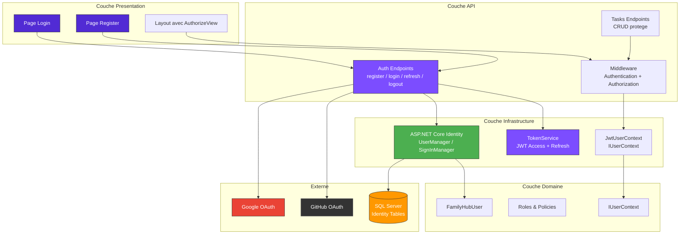
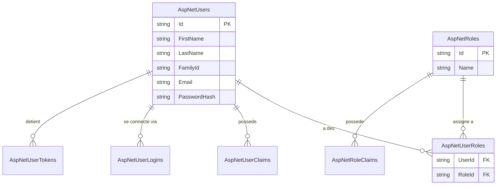
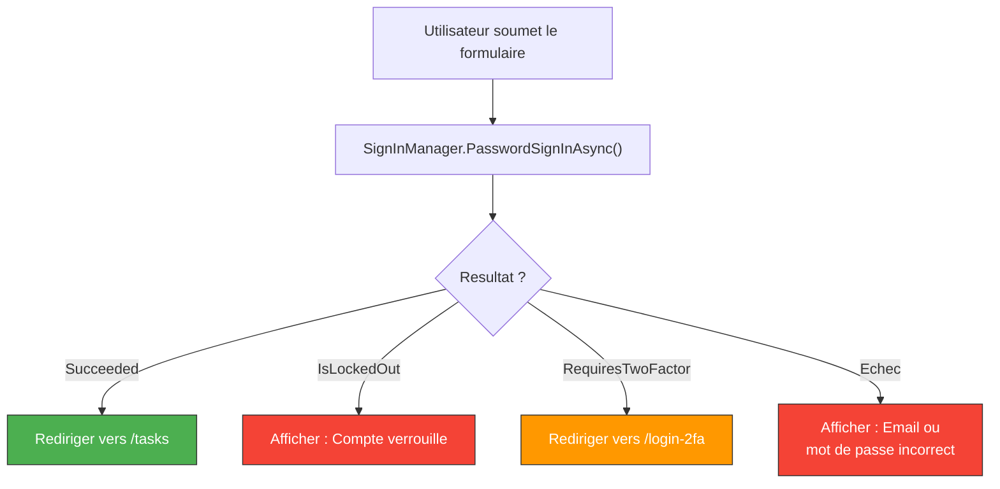
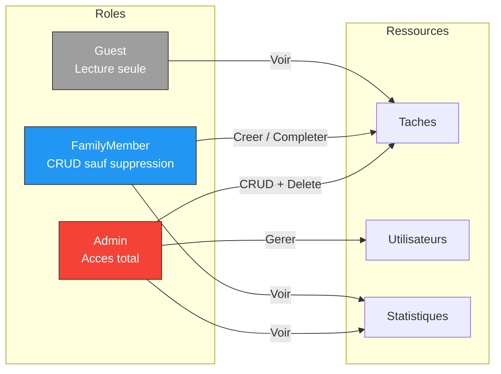
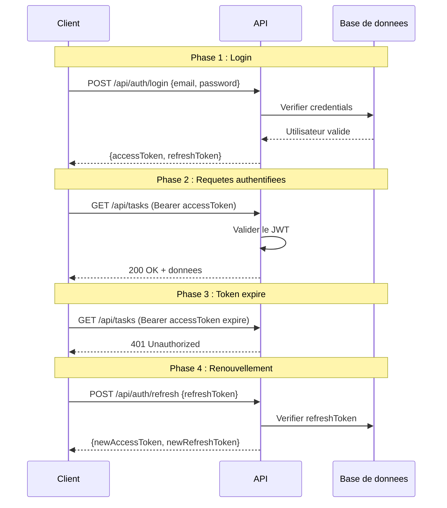
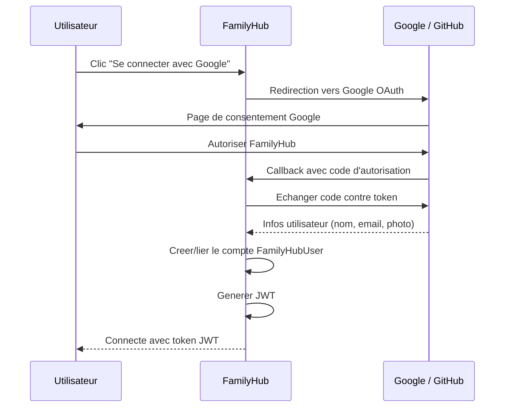
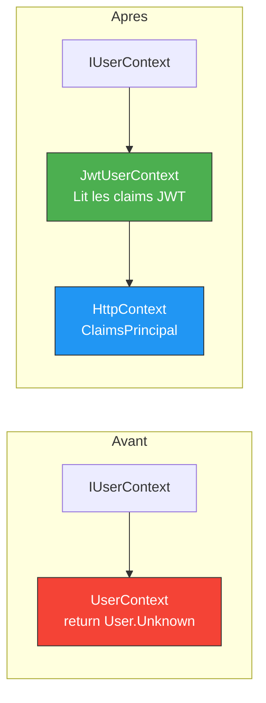
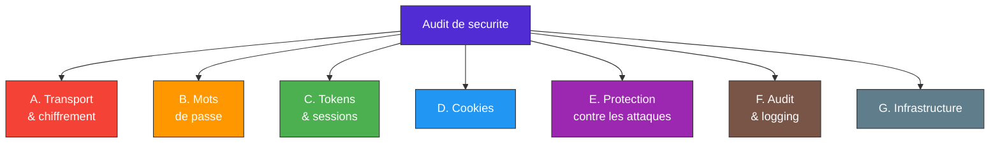

# Module 06 - Exercices : Authentification & Identity

<div align="center">

| | |
|---|---|
| **Difficulte globale** | :star: :star: :star: :star: Intermediaire a Avance |
| **Duree totale estimee** | :clock3: 3-4 heures |
| **Prerequis** | FamilyHub fonctionnel (Modules 01-05), SQL Server / LocalDB, C# & ASP.NET Core |

</div>

---

## :dart: Ce que vous allez construire

A la fin de ce module, vous aurez securise FamilyHub avec un systeme d'authentification complet. Seuls les utilisateurs connectes pourront acceder aux fonctionnalites, et les actions seront restreintes selon les roles (Admin vs FamilyMember).



### Vue d'ensemble des exercices

| # | Exercice | Difficulte | Points |
|:-:|----------|:----------:|:------:|
| 1 | Mise en place d'ASP.NET Core Identity | :star::star: | /15 |
| 2 | Pages de Login et Register en Blazor | :star::star: | /15 |
| 3 | Autorisation basee sur les roles | :star::star::star: | /15 |
| 4 | Authentification JWT pour l'API | :star::star::star: | /20 |
| 5 | Login externe (Google / GitHub) | :star::star::star: | /10 |
| 6 | Implementer IUserContext avec les vrais claims | :star::star::star: | /15 |
| 7 | Audit de securite - Checklist | :star::star: | /10 |

### Packages NuGet necessaires

```bash
dotnet add package Microsoft.AspNetCore.Identity.EntityFrameworkCore
dotnet add package Microsoft.AspNetCore.Authentication.JwtBearer
dotnet add package System.IdentityModel.Tokens.Jwt
dotnet add package Microsoft.AspNetCore.Authentication.Google
dotnet add package AspNet.Security.OAuth.GitHub
```

---

## Exercice 1 : Mise en place d'ASP.NET Core Identity

<div align="center">

| | |
|---|---|
| **Difficulte** | :star::star: Moyen |
| **Duree estimee** | :clock3: 30-40 minutes |
| **Objectif** | Configurer ASP.NET Core Identity dans le projet FamilyHub pour gerer les utilisateurs et les roles |
| **Points** | /15 |

</div>

### Etapes

#### - [ ] Etape 1/6 -- Creer l'utilisateur personnalise

Creez la classe `FamilyHubUser` dans le projet Domain :

```csharp
// File: src/Domain/Users/FamilyHubUser.cs
using Microsoft.AspNetCore.Identity;

namespace FamilyHub.Domain.Users;

public class FamilyHubUser : IdentityUser
{
    // TODO : Ajouter les proprietes suivantes :
    // - FirstName (string, requis)
    // - LastName (string, requis)
    // - FamilyId (string?, optionnel)
    // - FullName (propriete calculee : FirstName + " " + LastName)
}
```

**Questions :**
- Pourquoi heriter d'`IdentityUser` plutot que de creer notre propre classe ?
- Quelles proprietes sont deja fournies par `IdentityUser` ?

<details>
<summary>:bulb: Indice</summary>

`IdentityUser` fournit deja : `Id`, `UserName`, `Email`, `PasswordHash`, `PhoneNumber`, `TwoFactorEnabled`, `LockoutEnd`, `AccessFailedCount`, etc. Heriter de cette classe vous evite de re-implementer toute la gestion des mots de passe, du verrouillage, et des tokens.

</details>

#### - [ ] Etape 2/6 -- Modifier le DbContext

Modifiez `ApplicationDbContext` pour heriter d'`IdentityDbContext<FamilyHubUser>` au lieu de `DbContext`.

> **Attention** : N'oubliez pas d'appeler `base.OnModelCreating(modelBuilder)` dans la methode `OnModelCreating` ! Sans cet appel, les tables Identity ne seront pas creees.

```csharp
// File: src/Infrastructure/Database/ApplicationDbContext.cs
// TODO : Modifier l'heritage et ajouter l'appel a base.OnModelCreating
```

<details>
<summary>:bulb: Indice</summary>

```csharp
public class ApplicationDbContext : IdentityDbContext<FamilyHubUser>
{
    protected override void OnModelCreating(ModelBuilder modelBuilder)
    {
        base.OnModelCreating(modelBuilder);  // CRUCIAL !
        // ... vos configurations existantes
    }
}
```

</details>

#### - [ ] Etape 3/6 -- Configurer Identity dans le DI container

Dans `ServiceCollectionExtensions.cs` (ou `Program.cs`), ajoutez la configuration Identity :

```csharp
// File: src/Infrastructure/ServiceCollectionExtensions.cs (ou src/Api/Program.cs)
// TODO : Configurer Identity avec ces regles :
// - Mot de passe : minimum 8 caracteres, au moins 1 majuscule, 1 chiffre
// - Verrouillage : 5 tentatives max, verrouillage de 15 minutes
// - Email unique obligatoire
// - Ajouter EntityFrameworkStores et DefaultTokenProviders
```

<details>
<summary>:bulb: Indice -- structure de la configuration</summary>

```csharp
services.AddIdentity<FamilyHubUser, IdentityRole>(options =>
{
    // Password
    options.Password.RequiredLength = 8;
    options.Password.RequireDigit = true;
    options.Password.RequireUppercase = true;
    // ... completer

    // Lockout
    options.Lockout.MaxFailedAccessAttempts = 5;
    // ... completer

    // User
    options.User.RequireUniqueEmail = true;
})
.AddEntityFrameworkStores<ApplicationDbContext>()
.AddDefaultTokenProviders();
```

</details>

#### - [ ] Etape 4/6 -- Ajouter le middleware

Dans `Program.cs`, ajoutez les middlewares d'authentification et d'autorisation **dans le bon ordre**.

```csharp
// File: src/Api/Program.cs
// TODO : Ajouter UseAuthentication() et UseAuthorization()
// QUESTION : Quel middleware doit etre appele en premier et pourquoi ?
```

> **Note** : `UseAuthentication()` doit **toujours** etre appele avant `UseAuthorization()`. L'authentification identifie **qui** est l'utilisateur, l'autorisation verifie **ce qu'il a le droit de faire**. Il faut savoir qui on est avant de verifier les permissions.

#### - [ ] Etape 5/6 -- Creer la migration et mettre a jour la BDD

```bash
dotnet ef migrations add AddIdentity -p src/Infrastructure -s src/Api
dotnet ef database update -p src/Infrastructure -s src/Api
```

### Resultat attendu

> Apres la migration, ouvrez SQL Server Object Explorer et verifiez que les tables suivantes existent :

- [ ] AspNetUsers
- [ ] AspNetRoles
- [ ] AspNetUserRoles
- [ ] AspNetUserClaims
- [ ] AspNetRoleClaims
- [ ] AspNetUserLogins
- [ ] AspNetUserTokens



#### - [ ] Etape 6/6 -- Initialiser les roles

Creez une classe `SeedData` qui initialise les roles au demarrage :

```csharp
// File: src/Infrastructure/Database/SeedData.cs
// TODO : Creer les roles "Admin", "FamilyMember", "Guest"
// TODO : Creer un utilisateur admin par defaut (admin@familyhub.com / Admin123!)
// ATTENTION : Supprimer l'admin par defaut en production !
```

> **Attention** : L'utilisateur admin par defaut avec un mot de passe connu est une **faille de securite** en production. Utilisez-le uniquement pour le developpement et les tests.

<details>
<summary>:bulb: Indice -- structure du SeedData</summary>

```csharp
public static class SeedData
{
    public static async Task InitializeAsync(IServiceProvider serviceProvider)
    {
        var roleManager = serviceProvider.GetRequiredService<RoleManager<IdentityRole>>();
        var userManager = serviceProvider.GetRequiredService<UserManager<FamilyHubUser>>();

        // Creer les roles
        string[] roles = { "Admin", "FamilyMember", "Guest" };
        foreach (var role in roles)
        {
            if (!await roleManager.RoleExistsAsync(role))
                await roleManager.CreateAsync(new IdentityRole(role));
        }

        // Creer l'admin par defaut
        // ... completer
    }
}
```

</details>

### Livrable

- [ ] `FamilyHubUser` cree avec les proprietes personnalisees
- [ ] `ApplicationDbContext` herite d'`IdentityDbContext<FamilyHubUser>`
- [ ] Identity configure dans le DI container
- [ ] Middleware dans le bon ordre
- [ ] Migration creee et appliquee
- [ ] Tables Identity visibles dans la BDD
- [ ] Roles et admin par defaut initialises

---

## Exercice 2 : Pages de Login et Register en Blazor

<div align="center">

| | |
|---|---|
| **Difficulte** | :star::star: Moyen |
| **Duree estimee** | :clock3: 30-40 minutes |
| **Objectif** | Creer les composants Blazor pour l'inscription et la connexion des utilisateurs |
| **Points** | /15 |

</div>

### Etapes

#### - [ ] Etape 1/4 -- Page d'inscription (Register)

Creez un composant Blazor `Register.razor` avec :

```razor
@* File: Pages/Register.razor *@
@page "/register"

@* TODO : Creer un formulaire avec les champs suivants : *@
@* - Prenom (requis, max 50 caracteres) *@
@* - Nom (requis, max 50 caracteres) *@
@* - Email (requis, format email valide) *@
@* - Mot de passe (requis, min 8 caracteres) *@
@* - Confirmation du mot de passe (doit correspondre) *@
@* - Bouton "S'inscrire" *@

@* TODO : Dans le code-behind : *@
@* - Utiliser UserManager<FamilyHubUser>.CreateAsync() *@
@* - Assigner le role "FamilyMember" par defaut *@
@* - Connecter l'utilisateur automatiquement apres l'inscription *@
@* - Rediriger vers /tasks *@
@* - Afficher les erreurs de validation (mot de passe trop court, email existe deja, etc.) *@
```

**Regles de validation a implementer :**

| Champ | Regles |
|-------|--------|
| Email | Format valide, unique |
| Mot de passe | Minimum 8 caracteres, 1 majuscule, 1 chiffre |
| Confirmation | Doit correspondre au mot de passe |
| Prenom et nom | Requis, max 50 caracteres |

<details>
<summary>:bulb: Indice -- structure du formulaire Blazor</summary>

```razor
<EditForm Model="registerModel" OnValidSubmit="HandleRegister">
    <DataAnnotationsValidator />
    <ValidationSummary />

    <div class="mb-3">
        <label for="firstName" class="form-label">Prenom</label>
        <InputText id="firstName" @bind-Value="registerModel.FirstName" class="form-control" />
        <ValidationMessage For="@(() => registerModel.FirstName)" />
    </div>
    <!-- ... autres champs ... -->
</EditForm>
```

</details>

#### - [ ] Etape 2/4 -- Page de connexion (Login)

Creez un composant Blazor `Login.razor` avec :

```razor
@* File: Pages/Login.razor *@
@page "/login"

@* TODO : Creer un formulaire avec : *@
@* - Email *@
@* - Mot de passe *@
@* - Case a cocher "Se souvenir de moi" *@
@* - Bouton "Se connecter" *@
@* - Lien vers /register *@

@* TODO : Gerer les cas suivants : *@
@* - Connexion reussie -> rediriger vers /tasks *@
@* - Compte verrouille -> afficher "Compte verrouille, reessayez dans X minutes" *@
@* - 2FA requis -> rediriger vers /login-2fa *@
@* - Echec -> afficher "Email ou mot de passe incorrect" *@
@* IMPORTANT : Message GENERIQUE pour ne pas reveler si l'email existe *@
```

> **Attention** : Le message d'erreur en cas d'echec de connexion doit etre **generique** : "Email ou mot de passe incorrect". Ne jamais afficher "Cet email n'existe pas" ou "Le mot de passe est incorrect" -- cela permet a un attaquant de deviner si un email est enregistre.



#### - [ ] Etape 3/4 -- Composant de deconnexion

```razor
@* File: Shared/LogoutButton.razor *@
@* TODO : Creer un bouton/lien de deconnexion qui : *@
@* - Appelle SignInManager.SignOutAsync() *@
@* - Redirige vers la page de login *@
```

#### - [ ] Etape 4/4 -- Layout avec etat d'authentification

Modifiez le layout principal pour afficher l'etat de connexion :

```razor
@* File: Shared/MainLayout.razor *@
@* TODO : Utiliser <AuthorizeView> pour afficher : *@
@* - Si connecte : "Bienvenue, [Prenom] !" + bouton Deconnexion *@
@* - Si non connecte : liens Login et Register *@
```

<details>
<summary>:bulb: Indice -- utilisation d'AuthorizeView</summary>

```razor
<AuthorizeView>
    <Authorized>
        <span>Bienvenue, @context.User.FindFirst(ClaimTypes.GivenName)?.Value !</span>
        <!-- Bouton Deconnexion -->
    </Authorized>
    <NotAuthorized>
        <a href="/login">Se connecter</a>
        <a href="/register">S'inscrire</a>
    </NotAuthorized>
</AuthorizeView>
```

</details>

### Resultat attendu

> Apres cet exercice, vous devriez pouvoir :
> - Creer un nouveau compte via la page `/register`
> - Vous connecter via la page `/login`
> - Voir votre prenom affiche dans le layout
> - Vous deconnecter et etre redirige vers `/login`

### Livrable

- [ ] Page Register fonctionnelle avec validation
- [ ] Page Login fonctionnelle avec gestion des erreurs
- [ ] Bouton de deconnexion
- [ ] Layout affichant l'etat de connexion
- [ ] Messages d'erreur generiques (ne pas reveler si l'email existe)

### Tests manuels

| Scenario | Resultat attendu |
|----------|:---------------:|
| Inscription avec email valide | Succes, redirection vers /tasks |
| Inscription avec email deja utilise | Erreur affichee |
| Inscription avec mot de passe faible | Erreur de validation |
| Login avec credentials valides | Succes, redirection vers /tasks |
| Login avec mauvais mot de passe | "Email ou mot de passe incorrect" |
| Login apres 5 echecs | "Compte verrouille" |
| Deconnexion | Redirection vers /login |

---

## Exercice 3 : Autorisation basee sur les roles

<div align="center">

| | |
|---|---|
| **Difficulte** | :star::star::star: Avance |
| **Duree estimee** | :clock3: 30-40 minutes |
| **Objectif** | Implementer un systeme de roles pour distinguer les administrateurs des membres de la famille |
| **Points** | /15 |

</div>

### Etapes

#### - [ ] Etape 1/5 -- Definir les roles et leurs permissions

| Action | Admin | FamilyMember | Guest |
|--------|:-----:|:-----------:|:-----:|
| Voir les taches | :white_check_mark: | :white_check_mark: | :white_check_mark: |
| Creer une tache | :white_check_mark: | :white_check_mark: | :x: |
| Completer une tache | :white_check_mark: | :white_check_mark: | :x: |
| Supprimer une tache | :white_check_mark: | :x: | :x: |
| Gerer les utilisateurs | :white_check_mark: | :x: | :x: |
| Voir les statistiques | :white_check_mark: | :white_check_mark: | :x: |



#### - [ ] Etape 2/5 -- Configurer les policies d'autorisation

```csharp
// File: src/Api/Program.cs
services.AddAuthorization(options =>
{
    // Policy "AdminOnly" : role Admin requis
    // TODO

    // Policy "FamilyMember" : role Admin OU FamilyMember
    // TODO

    // Policy "CanCreateTasks" : role Admin ou FamilyMember
    // TODO

    // Policy "CanDeleteTasks" : role Admin uniquement
    // TODO

    // Policy "SameFamily" : l'utilisateur doit avoir le claim "FamilyId"
    // TODO
});
```

<details>
<summary>:bulb: Indice -- syntaxe des policies</summary>

```csharp
options.AddPolicy("AdminOnly", policy =>
    policy.RequireRole("Admin"));

options.AddPolicy("FamilyMember", policy =>
    policy.RequireRole("Admin", "FamilyMember"));

options.AddPolicy("CanCreateTasks", policy =>
    policy.RequireRole("Admin", "FamilyMember"));

options.AddPolicy("CanDeleteTasks", policy =>
    policy.RequireRole("Admin"));

options.AddPolicy("SameFamily", policy =>
    policy.RequireClaim("FamilyId"));
```

</details>

#### - [ ] Etape 3/5 -- Proteger les endpoints API

Modifiez `TasksEndpoint.cs` pour appliquer les policies :

```csharp
// File: src/Api/Endpoints/TasksEndpoint.cs
// TODO : Appliquer les autorisations suivantes :
// GET /tasks -> Authentifie seulement (tous les roles)
// POST /tasks -> Policy "CanCreateTasks"
// PUT /tasks/{id}/complete -> Policy "FamilyMember"
// DELETE /tasks/{id} -> Policy "CanDeleteTasks"
```

#### - [ ] Etape 4/5 -- Creer un Authorization Handler personnalise

Implementez un handler qui verifie que l'utilisateur ne peut modifier que les taches de sa propre famille :

```csharp
// File: src/Api/Authorization/SameFamilyHandler.cs
// TODO : Creer SameFamilyRequirement et SameFamilyHandler
// Le handler doit :
// 1. Recuperer le FamilyId de l'utilisateur depuis les claims
// 2. Recuperer le FamilyId de la tache
// 3. Autoriser seulement si les FamilyId correspondent
// 4. Les Admins ont toujours acces (bypass)
```

<details>
<summary>:bulb: Indice -- structure d'un Authorization Handler</summary>

```csharp
public class SameFamilyRequirement : IAuthorizationRequirement { }

public class SameFamilyHandler : AuthorizationHandler<SameFamilyRequirement>
{
    protected override Task HandleRequirementAsync(
        AuthorizationHandlerContext context,
        SameFamilyRequirement requirement)
    {
        // Admin bypass
        if (context.User.IsInRole("Admin"))
        {
            context.Succeed(requirement);
            return Task.CompletedTask;
        }

        var userFamilyId = context.User.FindFirst("FamilyId")?.Value;
        // ... completer la verification
    }
}
```

</details>

#### - [ ] Etape 5/5 -- Proteger les pages Blazor

```razor
@* File: Pages/Todos.razor *@
@* TODO : Ajouter [Authorize] aux pages qui necessitent une connexion *@
@* TODO : Ajouter [Authorize(Roles = "Admin")] a la page d'administration *@
@* TODO : Utiliser <AuthorizeView> pour afficher/cacher des boutons selon le role *@

@* Exemple : *@
<AuthorizeView Roles="Admin">
    <Authorized>
        <button @onclick="DeleteTask">Supprimer</button>
    </Authorized>
</AuthorizeView>
```

### Resultat attendu

> Apres cet exercice :
> - Un Admin peut tout faire (CRUD complet + gestion des utilisateurs)
> - Un FamilyMember peut voir, creer et completer des taches, mais pas supprimer
> - Un Guest ne peut que consulter les taches
> - Un utilisateur ne peut modifier que les taches de sa propre famille

### Livrable

- [ ] Policies d'autorisation configurees
- [ ] Endpoints proteges avec les bonnes policies
- [ ] Authorization handler personnalise pour la meme famille
- [ ] Pages Blazor protegees avec `[Authorize]`
- [ ] Boutons affiches/caches selon le role

### Tests manuels

| Scenario | Resultat attendu |
|----------|:---------------:|
| Admin accede a GET /tasks | 200 OK |
| FamilyMember accede a GET /tasks | 200 OK |
| Non connecte accede a GET /tasks | 401 Unauthorized |
| Admin supprime une tache | 200 OK |
| FamilyMember supprime une tache | 403 Forbidden |
| Guest cree une tache | 403 Forbidden |

---

## Exercice 4 : Authentification JWT pour l'API

<div align="center">

| | |
|---|---|
| **Difficulte** | :star::star::star: Avance |
| **Duree estimee** | :clock3: 40-50 minutes |
| **Objectif** | Implementer l'authentification par JWT pour securiser l'API REST de FamilyHub |
| **Points** | /20 |

</div>

### Ce que vous allez construire



### Etapes

#### - [ ] Etape 1/6 -- Configuration JWT

```json
// File: src/Api/appsettings.json
{
  "Jwt": {
    "SecretKey": "???",     // Au moins 32 caracteres !
    "Issuer": "???",
    "Audience": "???",
    "AccessTokenExpirationMinutes": 30,
    "RefreshTokenExpirationDays": 7
  }
}
```

> **Attention** : La `SecretKey` ne doit **JAMAIS** etre dans le code source en production ! Utilisez `dotnet user-secrets` en developpement et un Key Vault (Azure Key Vault, AWS Secrets Manager) en production.

```bash
# Stocker la cle dans user-secrets (developpement uniquement)
cd src/Api
dotnet user-secrets init
dotnet user-secrets set "Jwt:SecretKey" "VotreCleSecreteDauMoins32Caracteres!"
```

#### - [ ] Etape 2/6 -- Creer le TokenService

```csharp
// File: src/Api/Services/TokenService.cs
public class TokenService
{
    // TODO : Methode GenerateAccessToken(FamilyHubUser user, IList<string> roles)
    // - Creer les claims : NameIdentifier, Name, Email, GivenName, Surname, Role, FamilyId
    // - Signer avec HMAC-SHA256
    // - Expiration : 30 minutes
    // - Retourner le token sous forme de string

    // TODO : Methode GenerateRefreshToken()
    // - Generer 64 bytes aleatoires avec RandomNumberGenerator
    // - Retourner en Base64
}
```

<details>
<summary>:bulb: Indice -- generation d'un JWT</summary>

```csharp
var claims = new List<Claim>
{
    new(ClaimTypes.NameIdentifier, user.Id),
    new(ClaimTypes.Email, user.Email!),
    new(ClaimTypes.GivenName, user.FirstName),
    // ... ajouter les roles
};

var key = new SymmetricSecurityKey(Encoding.UTF8.GetBytes(secretKey));
var creds = new SigningCredentials(key, SecurityAlgorithms.HmacSha256);

var token = new JwtSecurityToken(
    issuer: issuer,
    audience: audience,
    claims: claims,
    expires: DateTime.UtcNow.AddMinutes(30),
    signingCredentials: creds
);

return new JwtSecurityTokenHandler().WriteToken(token);
```

</details>

#### - [ ] Etape 3/6 -- Creer l'entite RefreshToken

```csharp
// File: src/Domain/Users/RefreshToken.cs
public class RefreshToken
{
    // TODO : Proprietes :
    // - Id (Guid)
    // - Token (string)
    // - UserId (string, FK vers FamilyHubUser)
    // - ExpiresAt (DateTime)
    // - CreatedAt (DateTime)
    // - IsRevoked (bool)
}
// TODO : Ajouter DbSet<RefreshToken> au DbContext
// TODO : Creer la migration
```

#### - [ ] Etape 4/6 -- Creer les endpoints d'authentification

```csharp
// File: src/Api/Endpoints/AuthEndpoint.cs
// TODO : Creer les endpoints suivants :

// POST /api/auth/register
// - Creer l'utilisateur avec UserManager
// - Assigner le role "FamilyMember"
// - Generer les tokens
// - Sauvegarder le refresh token en BDD
// - Retourner les tokens dans la reponse

// POST /api/auth/login
// - Verifier les credentials avec SignInManager
// - Gerer le verrouillage (lockoutOnFailure: true)
// - Generer les tokens
// - Sauvegarder le refresh token en BDD
// - Retourner les tokens

// POST /api/auth/refresh
// - Verifier le refresh token en BDD (existe, non expire, non revoque)
// - Revoquer l'ancien refresh token
// - Generer de nouveaux tokens
// - Sauvegarder le nouveau refresh token

// POST /api/auth/logout
// - Revoquer tous les refresh tokens de l'utilisateur
// - Supprimer le cookie d'access token
```

> **Astuce** : La strategie de **rotation des refresh tokens** (revoquer l'ancien, emettre un nouveau a chaque refresh) ameliore la securite. Si un refresh token est vole, il ne pourra etre utilise qu'une seule fois avant d'etre revoque.

#### - [ ] Etape 5/6 -- Configurer la validation JWT

```csharp
// File: src/Api/Program.cs
// TODO : Configurer AddAuthentication + AddJwtBearer
// - Valider la signature (IssuerSigningKey)
// - Valider l'issuer
// - Valider l'audience
// - Valider la duree de vie (lifetime)
// - ClockSkew de 1 minute maximum
```

<details>
<summary>:bulb: Indice -- configuration de la validation</summary>

```csharp
builder.Services.AddAuthentication(options =>
{
    options.DefaultAuthenticateScheme = JwtBearerDefaults.AuthenticationScheme;
    options.DefaultChallengeScheme = JwtBearerDefaults.AuthenticationScheme;
})
.AddJwtBearer(options =>
{
    options.TokenValidationParameters = new TokenValidationParameters
    {
        ValidateIssuer = true,
        ValidIssuer = builder.Configuration["Jwt:Issuer"],
        ValidateAudience = true,
        ValidAudience = builder.Configuration["Jwt:Audience"],
        ValidateLifetime = true,
        ValidateIssuerSigningKey = true,
        IssuerSigningKey = new SymmetricSecurityKey(
            Encoding.UTF8.GetBytes(builder.Configuration["Jwt:SecretKey"]!)),
        ClockSkew = TimeSpan.FromMinutes(1)
    };
});
```

</details>

#### - [ ] Etape 6/6 -- Tester avec Scalar / Postman

Creez un fichier de test pour verifier chaque scenario :

```
1. POST /api/auth/register -> Obtenir les tokens
2. GET /api/tasks (sans token) -> 401
3. GET /api/tasks (avec access token) -> 200
4. Attendre l'expiration du token -> 401
5. POST /api/auth/refresh -> Nouveaux tokens
6. GET /api/tasks (avec nouveau token) -> 200
7. POST /api/auth/logout -> Succes
8. POST /api/auth/refresh (apres logout) -> 401
```

### Resultat attendu

> Apres cet exercice :
> - Le register retourne un access token JWT + un refresh token
> - Les endpoints proteges refusent les requetes sans token (401)
> - Le refresh token permet de renouveler un access token expire
> - Le logout revoque tous les refresh tokens de l'utilisateur

### Livrable

- [ ] Configuration JWT dans appsettings.json
- [ ] SecretKey stockee dans user-secrets (pas dans le code !)
- [ ] TokenService genere access et refresh tokens
- [ ] Entite RefreshToken avec migration
- [ ] Endpoints register, login, refresh, logout
- [ ] Validation JWT configuree dans le middleware
- [ ] Tests avec Scalar/Postman reussis

---

## Exercice 5 : Login externe (Google / GitHub)

<div align="center">

| | |
|---|---|
| **Difficulte** | :star::star::star: Avance |
| **Duree estimee** | :clock3: 30-40 minutes |
| **Objectif** | Permettre aux utilisateurs de se connecter avec leur compte Google ou GitHub |
| **Points** | /10 |

</div>

### Ce que vous allez construire



### Etapes

#### - [ ] Etape 1/5 -- Creer les credentials chez les fournisseurs

**Google :**
1. Aller sur https://console.cloud.google.com
2. Creer un projet "FamilyHub Dev"
3. Activer l'API "Google Identity" (dans APIs & Services > Library)
4. Aller dans Credentials > Create Credentials > OAuth 2.0 Client ID
5. Type : Web application
6. Authorized redirect URIs : `https://localhost:5001/signin-google`
7. Copier le Client ID et Client Secret

**GitHub :**
1. Aller dans Settings > Developer Settings > OAuth Apps
2. New OAuth App
3. Application name : "FamilyHub Dev"
4. Homepage URL : `https://localhost:5001`
5. Authorization callback URL : `https://localhost:5001/signin-github`
6. Copier le Client ID et Client Secret

> **Astuce** : Les captures d'ecran des interfaces Google Cloud Console et GitHub Developer Settings evoluent regulierement. Concentrez-vous sur les champs demandes plutot que sur l'emplacement exact des boutons.

#### - [ ] Etape 2/5 -- Stocker les secrets en securite

```bash
# NE JAMAIS mettre les secrets dans le code source !
cd src/Api
dotnet user-secrets init
dotnet user-secrets set "Authentication:Google:ClientId" "votre-client-id"
dotnet user-secrets set "Authentication:Google:ClientSecret" "votre-secret"
dotnet user-secrets set "Authentication:GitHub:ClientId" "votre-client-id"
dotnet user-secrets set "Authentication:GitHub:ClientSecret" "votre-secret"
```

> **Attention** : Si vous commitez accidentellement un secret, considerez-le comme compromis. Regenerez-le immediatement chez le fournisseur, meme si vous faites un `git revert`.

#### - [ ] Etape 3/5 -- Configurer les providers

```csharp
// File: src/Api/Program.cs
builder.Services.AddAuthentication()
    .AddGoogle(options =>
    {
        // TODO : Configurer ClientId, ClientSecret depuis la configuration
        // TODO : Ajouter les scopes "profile" et "email"
        // TODO : Mapper les claims Google vers nos claims
    })
    .AddGitHub(options =>
    {
        // TODO : Configurer ClientId, ClientSecret
        // TODO : Ajouter le scope "user:email"
    });
```

<details>
<summary>:bulb: Indice -- configuration Google</summary>

```csharp
.AddGoogle(options =>
{
    options.ClientId = builder.Configuration["Authentication:Google:ClientId"]!;
    options.ClientSecret = builder.Configuration["Authentication:Google:ClientSecret"]!;
    options.Scope.Add("profile");
    options.Scope.Add("email");
    options.ClaimActions.MapJsonKey(ClaimTypes.GivenName, "given_name");
    options.ClaimActions.MapJsonKey(ClaimTypes.Surname, "family_name");
})
```

</details>

#### - [ ] Etape 4/5 -- Creer les endpoints d'authentification externe

```csharp
// File: src/Api/Endpoints/AuthEndpoint.cs (ajout)
// TODO : Creer les endpoints suivants :

// GET /api/auth/external/{provider}
// - Construire les proprietes de challenge (redirect URL, provider)
// - Retourner un ChallengeResult qui redirige vers Google/GitHub

// GET /api/auth/external/callback
// - Recuperer les infos de l'utilisateur depuis ExternalLoginInfo
// - Verifier si l'utilisateur existe deja (par email ou par login externe)
// - Si nouveau : creer le compte FamilyHubUser avec les infos du provider
// - Si existant : lier le login externe au compte existant
// - Generer les tokens JWT
// - Rediriger vers l'application Blazor
```

#### - [ ] Etape 5/5 -- Ajouter les boutons de login externe dans Blazor

```razor
@* File: Pages/Login.razor (ajout en bas du formulaire) *@
<hr />
<h5>Ou connectez-vous avec :</h5>
<a href="/api/auth/external/Google" class="btn btn-outline-danger me-2">
    Se connecter avec Google
</a>
<a href="/api/auth/external/GitHub" class="btn btn-outline-dark">
    Se connecter avec GitHub
</a>
```

### Resultat attendu

> Apres cet exercice :
> - Des boutons "Se connecter avec Google" et "Se connecter avec GitHub" apparaissent sur la page de login
> - Un clic redirige vers le fournisseur OAuth
> - Apres consentement, l'utilisateur est redirige vers FamilyHub avec un compte cree/lie
> - Un JWT est genere comme pour un login classique

### Livrable

- [ ] Credentials Google creees et stockees dans user-secrets
- [ ] Credentials GitHub creees et stockees dans user-secrets
- [ ] Providers Google et GitHub configures
- [ ] Endpoint de challenge externe fonctionnel
- [ ] Endpoint de callback qui cree/lie le compte
- [ ] Boutons de login externe dans la page Login
- [ ] Test : connexion via Google reussie
- [ ] Test : connexion via GitHub reussie

### Questions de reflexion

1. Pourquoi ne faut-il JAMAIS commiter les ClientSecret dans le code source ?
2. Que se passe-t-il si un utilisateur se connecte avec Google et qu'un compte avec le meme email existe deja ?
3. Comment gerer le cas ou l'utilisateur revoque l'acces de FamilyHub dans les parametres Google ?

<details>
<summary>:bulb: Indice pour la question 2</summary>

C'est un scenario important a gerer : vous pouvez soit lier automatiquement les comptes quand l'email correspond (apres verification que l'email est verifie chez le provider), soit demander a l'utilisateur de se connecter d'abord avec son mot de passe puis lier le provider. La premiere option est plus simple, la seconde plus securisee.

</details>

---

## Exercice 6 : Implementer IUserContext avec les vrais claims

<div align="center">

| | |
|---|---|
| **Difficulte** | :star::star::star: Avance |
| **Duree estimee** | :clock3: 25-35 minutes |
| **Objectif** | Connecter l'interface `IUserContext` existante aux vrais claims de l'utilisateur authentifie |
| **Points** | /15 |

</div>

### Contexte

Dans le projet actuel, `IUserContext` retourne toujours `User.Unknown` :

```csharp
// File: src/Domain/Users/IUserContext.cs
public interface IUserContext
{
    User CurrentUser { get; }
}

// File: src/Api/Services/UserContext.cs (implementation actuelle)
public class UserContext : IUserContext
{
    public User CurrentUser => User.Unknown; // Toujours inconnu !
}
```



### Etapes

#### - [ ] Etape 1/6 -- Creer JwtUserContext

```csharp
// File: src/Api/Services/JwtUserContext.cs
public class JwtUserContext : IUserContext
{
    // TODO : Injecter IHttpContextAccessor

    public User CurrentUser
    {
        get
        {
            // TODO :
            // 1. Recuperer le ClaimsPrincipal depuis HttpContext
            // 2. Verifier si l'utilisateur est authentifie
            // 3. Si non authentifie -> retourner User.Unknown
            // 4. Si authentifie -> extraire les claims :
            //    - ClaimTypes.NameIdentifier -> User.Id
            //    - ClaimTypes.GivenName -> User.FirstName
            //    - ClaimTypes.Surname -> User.LastName
            //    - ClaimTypes.Role -> User.Roles (mapper vers l'enum Role)
            //    - "SubscriptionLevel" -> User.SubscriptionLevel
            //    - "Country" -> User.Country
            // 5. Retourner le User construit

            // BONUS : Ajouter du caching pour ne pas reconstruire
            // le User a chaque appel dans la meme requete
        }
    }
}
```

<details>
<summary>:bulb: Indice -- extraction des claims</summary>

```csharp
var principal = _httpContextAccessor.HttpContext?.User;
if (principal?.Identity?.IsAuthenticated != true)
    return User.Unknown;

var id = principal.FindFirst(ClaimTypes.NameIdentifier)?.Value ?? "";
var firstName = principal.FindFirst(ClaimTypes.GivenName)?.Value ?? "";
var lastName = principal.FindFirst(ClaimTypes.Surname)?.Value ?? "";
var roleClaims = principal.FindAll(ClaimTypes.Role).Select(c => c.Value);
// ... mapper les roles vers l'enum
```

</details>

#### - [ ] Etape 2/6 -- Mapper les roles des claims vers l'enum Role

```csharp
// Rappel : l'enum Role existante
[Flags]
public enum Role
{
    None = 0,
    Administrator = 1,
    Contributor = 2
}

// TODO : Mapper les roles ASP.NET Identity vers notre enum :
// "Admin" -> Role.Administrator
// "FamilyMember" -> Role.Contributor
// "Guest" -> Role.None

// QUESTION : Pourquoi est-ce que Role est un [Flags] enum ?
// QUESTION : Comment un utilisateur peut-il avoir plusieurs roles ?
```

<details>
<summary>:bulb: Indice -- pourquoi [Flags] ?</summary>

L'attribut `[Flags]` permet de combiner les roles avec l'operateur `|` (OR binaire). Un utilisateur peut etre a la fois `Administrator` et `Contributor` :

```csharp
var roles = Role.None;
foreach (var roleClaim in roleClaims)
{
    roles |= roleClaim switch
    {
        "Admin" => Role.Administrator,
        "FamilyMember" => Role.Contributor,
        _ => Role.None
    };
}
```

</details>

#### - [ ] Etape 3/6 -- Enregistrer JwtUserContext dans le DI

```csharp
// File: src/Infrastructure/ServiceCollectionExtensions.cs
// AVANT : services.AddScoped<IUserContext, UserContext>();
// APRES : services.AddScoped<IUserContext, JwtUserContext>();
// N'oubliez pas : services.AddHttpContextAccessor();
```

> **Note** : `AddHttpContextAccessor()` est indispensable pour que `IHttpContextAccessor` soit disponible dans le conteneur DI. Sans lui, `JwtUserContext` recevra `null` et ne pourra pas lire les claims.

#### - [ ] Etape 4/6 -- Ajouter les claims personnalises lors de la generation du token

```csharp
// File: src/Api/Services/TokenService.cs (modification)
var claims = new List<Claim>
{
    new(ClaimTypes.NameIdentifier, user.Id),
    new(ClaimTypes.GivenName, user.FirstName),
    new(ClaimTypes.Surname, user.LastName),
    new(ClaimTypes.Email, user.Email!),
    // TODO : Ajouter les roles
    // TODO : Ajouter FamilyId si present
    // TODO : Ajouter SubscriptionLevel si present
    // TODO : Ajouter Country si present
};
```

#### - [ ] Etape 5/6 -- Verifier l'integration

Creez un endpoint de test qui retourne les informations de l'utilisateur courant :

```csharp
// File: src/Api/Endpoints/UserEndpoint.cs
app.MapGet("/api/me", (IUserContext userContext) =>
{
    var user = userContext.CurrentUser;
    return Results.Ok(new
    {
        user.Id,
        user.FirstName,
        user.LastName,
        Roles = user.Roles.ToString(),
        user.SubscriptionLevel,
        user.Country,
        IsAuthenticated = user != User.Unknown
    });
}).RequireAuthorization();
```

#### - [ ] Etape 6/6 -- Verifier que les handlers utilisent le vrai utilisateur

Ajoutez un log dans un handler existant pour prouver que l'utilisateur est reel :

```csharp
// File: src/Application/Handlers/CreateTaskItemHandler.cs
public class CreateTaskItemHandler : ICommandHandler<CreateTaskItem, Result>
{
    private readonly IUserContext _userContext;
    private readonly ILogger<CreateTaskItemHandler> _logger;

    public async ValueTask<Result> Handle(CreateTaskItem command, CancellationToken ct)
    {
        _logger.LogInformation(
            "Tache creee par {UserId} ({UserName})",
            _userContext.CurrentUser.Id,
            _userContext.CurrentUser.FirstName);
        // ...
    }
}
```

### Resultat attendu

> Apres cet exercice :
> - L'endpoint `GET /api/me` retourne les vraies informations de l'utilisateur connecte
> - Les handlers logguent l'identite reelle de l'utilisateur
> - `IUserContext.CurrentUser` ne retourne plus `User.Unknown` pour les utilisateurs authentifies

### Livrable

- [ ] `JwtUserContext` implemente et fonctionnel
- [ ] Mapping des roles vers l'enum `Role`
- [ ] Enregistrement correct dans le DI
- [ ] Claims personnalises ajoutes dans le token
- [ ] Endpoint `/api/me` retourne les bonnes informations
- [ ] Les handlers logguent le vrai utilisateur

### Test de validation

```bash
# 1. Se connecter et obtenir un token
POST /api/auth/login
{ "email": "admin@familyhub.com", "password": "Admin123!" }

# 2. Appeler /api/me avec le token
GET /api/me
Authorization: Bearer eyJ...

# Resultat attendu :
{
    "id": "guid-de-ladmin",
    "firstName": "Admin",
    "lastName": "FamilyHub",
    "roles": "Administrator",
    "isAuthenticated": true
}

# 3. Creer une tache et verifier les logs
POST /api/tasks
# Les logs doivent afficher :
# "Tache creee par guid-de-ladmin (Admin)"
```

---

## Exercice 7 : Audit de securite - Checklist

<div align="center">

| | |
|---|---|
| **Difficulte** | :star::star: Moyen |
| **Duree estimee** | :clock3: 30-40 minutes |
| **Objectif** | Realiser un audit de securite complet de FamilyHub pour identifier et corriger les vulnerabilites potentielles |
| **Points** | /10 |

</div>

### Instructions

Cet exercice est une **revue de securite**. Pour chaque point de la checklist, vous devez :
1. Verifier si la protection est en place
2. Si elle ne l'est pas, l'implementer
3. Documenter votre decision dans le tableau de resultat



### Checklist de securite

---

#### A. Transport et chiffrement

| # | Verification | Statut | Action requise |
|---|-------------|:------:|----------------|
| A1 | HTTPS est force (UseHttpsRedirection) | - [ ] | |
| A2 | HSTS est active en production | - [ ] | |
| A3 | Les certificats TLS sont valides | - [ ] | |
| A4 | Aucun secret n'est dans le code source | - [ ] | |
| A5 | Les secrets sont dans user-secrets (dev) ou Key Vault (prod) | - [ ] | |

```csharp
// File: src/Api/Program.cs

// TODO A1 : Verifier que cette ligne est presente
app.UseHttpsRedirection();

// TODO A2 : Ajouter HSTS (HTTP Strict Transport Security)
if (!app.Environment.IsDevelopment())
{
    app.UseHsts();
}

// TODO A4 : Rechercher les secrets hardcodes
// Utilisez une recherche dans le code : "password", "secret", "key", "connectionstring"
// Tout secret trouve doit etre deplace vers user-secrets ou les variables d'environnement
```

> **Astuce** : Utilisez `git log -p --all -S 'password' --` pour rechercher dans l'historique Git si des secrets ont ete commites par le passe.

---

#### B. Mots de passe

| # | Verification | Statut | Action requise |
|---|-------------|:------:|----------------|
| B1 | Les mots de passe sont hashes (pas en clair) | - [ ] | |
| B2 | Politique de mot de passe forte configuree | - [ ] | |
| B3 | Verrouillage de compte apres 5 echecs | - [ ] | |
| B4 | Messages d'erreur generiques (pas de fuite d'info) | - [ ] | |

```csharp
// File: src/Infrastructure/ServiceCollectionExtensions.cs

// TODO B2 : Verifier la configuration des mots de passe
options.Password.RequiredLength = ???;        // Minimum recommande ?
options.Password.RequireDigit = ???;
options.Password.RequireUppercase = ???;
options.Password.RequireNonAlphanumeric = ???;

// TODO B4 : Verifier que le message de login echoue est generique
// BON : "Email ou mot de passe incorrect"
// MAUVAIS : "Cet email n'existe pas" ou "Le mot de passe est incorrect"
// QUESTION : Pourquoi est-ce important ?
```

<details>
<summary>:bulb: Indice -- pourquoi des messages generiques ?</summary>

Un message specifique comme "Cet email n'existe pas" permet a un attaquant d'enumerer les comptes existants. Avec un message generique, il ne sait pas si c'est l'email ou le mot de passe qui est incorrect. C'est une protection contre les attaques d'enumeration de comptes.

</details>

---

#### C. Tokens et sessions

| # | Verification | Statut | Action requise |
|---|-------------|:------:|----------------|
| C1 | Access token a une duree courte (< 60 min) | - [ ] | |
| C2 | Refresh token est stocke en BDD et revocable | - [ ] | |
| C3 | Le logout revoque les refresh tokens | - [ ] | |
| C4 | Les tokens contiennent les bons claims | - [ ] | |
| C5 | La cle de signature JWT est suffisamment longue (32+ car) | - [ ] | |

```csharp
// File: src/Api/Services/TokenService.cs

// TODO C1 : Verifier l'expiration du token
expires: DateTime.UtcNow.AddMinutes(???)  // Combien de minutes ?

// TODO C5 : Verifier la longueur de la cle
var key = configuration["Jwt:SecretKey"];
if (key.Length < 32)
    throw new InvalidOperationException("La cle JWT est trop courte !");
```

---

#### D. Cookies

| # | Verification | Statut | Action requise |
|---|-------------|:------:|----------------|
| D1 | Cookies marques HttpOnly | - [ ] | |
| D2 | Cookies marques Secure | - [ ] | |
| D3 | Cookies marques SameSite=Strict (ou Lax) | - [ ] | |
| D4 | Duree de vie des cookies raisonnable | - [ ] | |

```csharp
// File: src/Api/Program.cs

// TODO : Implementer si ce n'est pas deja fait
services.ConfigureApplicationCookie(options =>
{
    options.Cookie.HttpOnly = true;
    options.Cookie.SecurePolicy = CookieSecurePolicy.Always;
    options.Cookie.SameSite = SameSiteMode.Strict;
    options.ExpireTimeSpan = TimeSpan.FromHours(???);
});
```

> **Note** : `HttpOnly` empeche JavaScript d'acceder au cookie (protection XSS). `Secure` force l'envoi uniquement via HTTPS. `SameSite=Strict` protege contre les attaques CSRF.

---

#### E. Protection contre les attaques

| # | Verification | Statut | Action requise |
|---|-------------|:------:|----------------|
| E1 | Rate limiting configure sur /login | - [ ] | |
| E2 | Protection CSRF active | - [ ] | |
| E3 | CORS configure strictement | - [ ] | |
| E4 | Headers de securite presents (CSP, X-Frame-Options) | - [ ] | |
| E5 | Validation des entrees (FluentValidation) | - [ ] | |

```csharp
// File: src/Api/Program.cs

// TODO E1 : Implementer le rate limiting
builder.Services.AddRateLimiter(options =>
{
    options.AddFixedWindowLimiter("login", limiterOptions =>
    {
        limiterOptions.PermitLimit = ???;    // Combien de tentatives ?
        limiterOptions.Window = TimeSpan.FromMinutes(???);  // Par minute ?
    });
    options.RejectionStatusCode = 429; // Too Many Requests
});

// TODO E3 : Configurer CORS
builder.Services.AddCors(options =>
{
    options.AddPolicy("FamilyHubPolicy", policy =>
    {
        policy.WithOrigins("https://familyhub.com") // Domaines autorises
              .AllowAnyHeader()
              .AllowAnyMethod()
              .AllowCredentials();
    });
});

// TODO E4 : Ajouter les headers de securite
app.Use(async (context, next) =>
{
    context.Response.Headers.Append("X-Content-Type-Options", "nosniff");
    context.Response.Headers.Append("X-Frame-Options", "DENY");
    context.Response.Headers.Append("X-XSS-Protection", "1; mode=block");
    context.Response.Headers.Append("Referrer-Policy", "strict-origin-when-cross-origin");
    await next();
});
```

<details>
<summary>:bulb: Indice -- valeurs recommandees pour le rate limiting</summary>

Pour un endpoint de login, des valeurs raisonnables sont :
- **PermitLimit** : 5-10 tentatives
- **Window** : 1-5 minutes

Cela permet de bloquer les attaques par force brute tout en laissant un utilisateur legitime se tromper quelques fois.

</details>

---

#### F. Audit et logging

| # | Verification | Statut | Action requise |
|---|-------------|:------:|----------------|
| F1 | Les connexions reussies sont loguees | - [ ] | |
| F2 | Les connexions echouees sont loguees | - [ ] | |
| F3 | Les verrouillages de compte sont logues | - [ ] | |
| F4 | Les changements de mot de passe sont logues | - [ ] | |
| F5 | Les logs ne contiennent PAS de mots de passe | - [ ] | |

```csharp
// File: src/Api/Endpoints/AuthEndpoint.cs

// TODO : Implementer l'audit logging
// IMPORTANT : Ne JAMAIS logger le mot de passe, meme en cas d'echec !

// BON :
_logger.LogWarning("Login echoue pour {Email} depuis {IP}", email, ipAddress);

// MAUVAIS :
_logger.LogWarning("Login echoue pour {Email} avec mot de passe {Password}", email, password);
```

> **Attention** : Logger un mot de passe (meme en cas d'echec) est une faille de securite grave. Les fichiers de logs sont souvent moins proteges que la base de donnees et peuvent etre accessibles a de nombreuses personnes.

---

#### G. Infrastructure

| # | Verification | Statut | Action requise |
|---|-------------|:------:|----------------|
| G1 | Le endpoint /api/auth n'expose pas d'infos de debug en production | - [ ] | |
| G2 | Les pages d'erreur ne revelent pas de details techniques | - [ ] | |
| G3 | Le mode developpement est desactive en production | - [ ] | |
| G4 | Les packages NuGet sont a jour (pas de vulnerabilites connues) | - [ ] | |

```bash
# TODO G4 : Verifier les vulnerabilites des packages
dotnet list package --vulnerable
dotnet list package --outdated
```

### Resultat attendu

> Apres cet exercice, vous devriez avoir :
> - Un tableau de synthese complet avec le statut de chaque verification
> - Toutes les corrections appliquees (ou documentees si non applicables)
> - Une comprehension claire des bonnes pratiques de securite web

### Livrable

Remplissez le tableau de synthese :

| Categorie | Points verifies | Points OK | Points a corriger |
|-----------|:--------------:|:---------:|:-----------------:|
| A. Transport | 5 | /5 | |
| B. Mots de passe | 4 | /4 | |
| C. Tokens | 5 | /5 | |
| D. Cookies | 4 | /4 | |
| E. Attaques | 5 | /5 | |
| F. Audit | 5 | /5 | |
| G. Infrastructure | 4 | /4 | |
| **Total** | **32** | **/32** | |

### Questions de reflexion finales

1. Quelle est la difference entre authentification et autorisation ? Donnez un exemple concret dans FamilyHub.
2. Pourquoi utilise-t-on un algorithme LENT (bcrypt, PBKDF2) pour hasher les mots de passe ?
3. Expliquez pourquoi un access token JWT a une courte duree de vie.
4. Pourquoi ne faut-il pas stocker les tokens dans `localStorage` ?
5. Quel est l'avantage d'OAuth 2.0 par rapport a un login/mot de passe classique ?
6. Dans quel scenario utiliseriez-vous Duende IdentityServer plutot qu'un simple ASP.NET Core Identity ?
7. Pourquoi le message d'erreur de login doit-il etre generique ("Email ou mot de passe incorrect") ?
8. Expliquez le flux de renouvellement des tokens (refresh token flow).

<details>
<summary>:bulb: Indices pour les questions de reflexion</summary>

**Q1** : L'**authentification** c'est "Qui etes-vous ?" (login). L'**autorisation** c'est "Avez-vous le droit ?" (permissions). Exemple : un FamilyMember est authentifie, mais il n'est pas autorise a supprimer une tache.

**Q2** : Un algorithme lent rend les attaques par force brute impraticables. Si le hash prend 100ms, il faut ~115 jours pour tester 100 millions de combinaisons, contre ~1 seconde avec SHA-256.

**Q4** : `localStorage` est accessible a tout code JavaScript sur la page, y compris du code malveillant injecte via XSS. Un cookie `HttpOnly` est inaccessible a JavaScript.

</details>

---

## :trophy: Recapitulatif & Bareme

### Bareme

| Exercice | Points | Criteres |
|----------|:------:|----------|
| 1. Identity Setup | /15 | Configuration correcte, migration, seed data |
| 2. Login/Register | /15 | Pages fonctionnelles, validation, UX |
| 3. Roles & Policies | /15 | Policies correctes, handler personnalise |
| 4. JWT API | /20 | Tokens, endpoints, refresh flow |
| 5. Login externe | /10 | Au moins 1 provider fonctionnel |
| 6. IUserContext | /15 | Integration correcte, claims mappes |
| 7. Audit securite | /10 | Checklist completee, corrections appliquees |
| **Total** | **/100** | |

### Criteres bonus (+5 points chacun)

- Implementation de la 2FA (Two-Factor Authentication)
- Tests unitaires pour TokenService et JwtUserContext
- Implementation du flux de reinitialisation de mot de passe
- Documentation de l'API avec Scalar incluant l'authentification

### Checklist finale -- Ce que vous avez accompli

- [ ] Configure ASP.NET Core Identity avec utilisateurs et roles personnalises
- [ ] Cree les pages Login et Register avec validation complete
- [ ] Implemente un systeme d'autorisation basee sur les roles avec policies
- [ ] Securise l'API avec des tokens JWT (access + refresh)
- [ ] Ajoute le login externe via Google et/ou GitHub
- [ ] Connecte `IUserContext` aux vrais claims de l'utilisateur authentifie
- [ ] Realise un audit de securite complet avec corrections
- [ ] Compris les bonnes pratiques de securite : HTTPS, CORS, rate limiting, headers de securite
- [ ] Maitrise le flux de renouvellement des tokens (refresh token flow)
- [ ] Sait stocker les secrets en toute securite (user-secrets / Key Vault)
